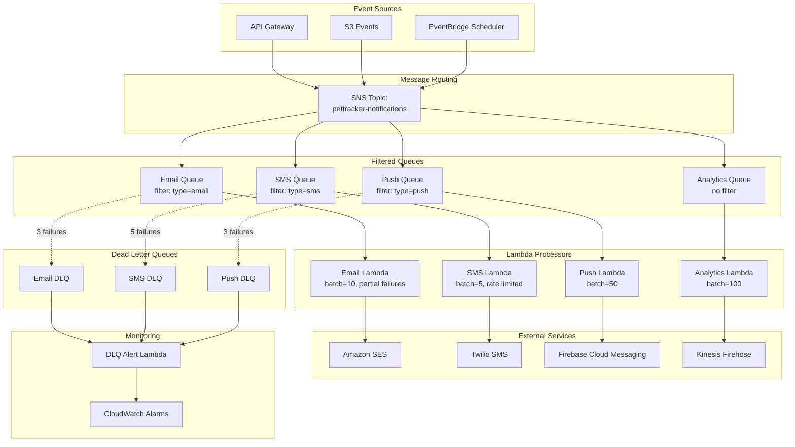

# Alex's Solution: Reliable Notifications

## The Transformation

Three weeks ago, PetTracker's notification system was a disaster. On National Pet Day, 38,000 notifications were lost. Users were furious. The #PetTrackerFail hashtag trended nationally.

Today, Alex deploys the new messaging architecture. It's National Cat Day - traffic is 15x normal. This time, everything works flawlessly.

"Zero messages lost," Alex reports to the team. "We've processed 127,000 notifications so far, and the oldest message in any queue is 3 seconds old."

## The Complete Architecture



## Before and After Comparison

| Metric | Before (Direct Calls) | After (Messaging) |
|--------|----------------------|-------------------|
| **API Response Time** | 800-1200ms | 15ms |
| **Message Loss Rate** | 76% under load | 0% |
| **Daily Capacity** | ~50,000 | 500,000+ |
| **Recovery from Failure** | Manual intervention | Automatic retry |
| **Infrastructure** | 4 EC2 instances (24/7) | Lambda (pay per use) |
| **Monthly Cost** | ~$800 | ~$150 |
| **Time to Add New Channel** | 2 weeks | 1 hour |

## The Infrastructure-as-Code

Alex uses SAM to deploy the entire system:

```yaml
# template.yaml
AWSTemplateFormatVersion: '2010-09-09'
Transform: AWS::Serverless-2016-10-31
Description: PetTracker Notification System

Parameters:
  Environment:
    Type: String
    Default: production

Resources:
  # SNS Topic - Central message router
  NotificationTopic:
    Type: AWS::SNS::Topic
    Properties:
      TopicName: !Sub pettracker-notifications-${Environment}
      KmsMasterKeyId: !Ref NotificationKey

  # Email Queue with DLQ
  EmailQueue:
    Type: AWS::SQS::Queue
    Properties:
      QueueName: !Sub pettracker-email-${Environment}
      VisibilityTimeout: 180
      KmsMasterKeyId: !Ref NotificationKey
      RedrivePolicy:
        deadLetterTargetArn: !GetAtt EmailDLQ.Arn
        maxReceiveCount: 3

  EmailDLQ:
    Type: AWS::SQS::Queue
    Properties:
      QueueName: !Sub pettracker-email-dlq-${Environment}
      MessageRetentionPeriod: 1209600  # 14 days

  EmailQueuePolicy:
    Type: AWS::SQS::QueuePolicy
    Properties:
      Queues: [!Ref EmailQueue]
      PolicyDocument:
        Statement:
          - Effect: Allow
            Principal:
              Service: sns.amazonaws.com
            Action: sqs:SendMessage
            Resource: !GetAtt EmailQueue.Arn
            Condition:
              ArnEquals:
                aws:SourceArn: !Ref NotificationTopic

  EmailSubscription:
    Type: AWS::SNS::Subscription
    Properties:
      TopicArn: !Ref NotificationTopic
      Protocol: sqs
      Endpoint: !GetAtt EmailQueue.Arn
      FilterPolicy:
        notification_type: [email]
      RawMessageDelivery: true

  # Email Processor Lambda
  EmailProcessor:
    Type: AWS::Serverless::Function
    Properties:
      FunctionName: !Sub pettracker-email-processor-${Environment}
      Handler: email_processor.handler
      Runtime: python3.11
      Timeout: 30
      MemorySize: 256
      Events:
        SQSEvent:
          Type: SQS
          Properties:
            Queue: !GetAtt EmailQueue.Arn
            BatchSize: 10
            MaximumBatchingWindowInSeconds: 5
            FunctionResponseTypes:
              - ReportBatchItemFailures
      Policies:
        - SESBulkTemplatedCrudPolicy:
            IdentityName: pettracker.com
        - KMSDecryptPolicy:
            KeyId: !Ref NotificationKey

  # SMS Queue (similar structure)
  SMSQueue:
    Type: AWS::SQS::Queue
    Properties:
      QueueName: !Sub pettracker-sms-${Environment}
      VisibilityTimeout: 180
      RedrivePolicy:
        deadLetterTargetArn: !GetAtt SMSDLQ.Arn
        maxReceiveCount: 5  # More retries for SMS rate limits

  SMSDLQ:
    Type: AWS::SQS::Queue
    Properties:
      QueueName: !Sub pettracker-sms-dlq-${Environment}

  SMSSubscription:
    Type: AWS::SNS::Subscription
    Properties:
      TopicArn: !Ref NotificationTopic
      Protocol: sqs
      Endpoint: !GetAtt SMSQueue.Arn
      FilterPolicy:
        notification_type: [sms]
        priority:
          - numeric: ['>=', 2]  # Only priority 2+ get SMS
      RawMessageDelivery: true

  # Push Queue
  PushQueue:
    Type: AWS::SQS::Queue
    Properties:
      QueueName: !Sub pettracker-push-${Environment}
      VisibilityTimeout: 60
      RedrivePolicy:
        deadLetterTargetArn: !GetAtt PushDLQ.Arn
        maxReceiveCount: 3

  PushDLQ:
    Type: AWS::SQS::Queue

  PushSubscription:
    Type: AWS::SNS::Subscription
    Properties:
      TopicArn: !Ref NotificationTopic
      Protocol: sqs
      Endpoint: !GetAtt PushQueue.Arn
      FilterPolicy:
        notification_type: [push]
      RawMessageDelivery: true

  # Analytics Queue (receives everything)
  AnalyticsQueue:
    Type: AWS::SQS::Queue
    Properties:
      QueueName: !Sub pettracker-analytics-${Environment}
      VisibilityTimeout: 300

  AnalyticsSubscription:
    Type: AWS::SNS::Subscription
    Properties:
      TopicArn: !Ref NotificationTopic
      Protocol: sqs
      Endpoint: !GetAtt AnalyticsQueue.Arn
      # No filter policy - receives all messages
      RawMessageDelivery: true

  # KMS Key for encryption
  NotificationKey:
    Type: AWS::KMS::Key
    Properties:
      Description: PetTracker notification encryption
      EnableKeyRotation: true
      KeyPolicy:
        Version: '2012-10-17'
        Statement:
          - Sid: Enable IAM
            Effect: Allow
            Principal:
              AWS: !Sub arn:aws:iam::${AWS::AccountId}:root
            Action: kms:*
            Resource: '*'
          - Sid: Allow SNS
            Effect: Allow
            Principal:
              Service: sns.amazonaws.com
            Action:
              - kms:Decrypt
              - kms:GenerateDataKey*
            Resource: '*'

  # DLQ Monitor
  DLQMonitor:
    Type: AWS::Serverless::Function
    Properties:
      FunctionName: !Sub pettracker-dlq-monitor-${Environment}
      Handler: dlq_monitor.handler
      Runtime: python3.11
      Events:
        EmailDLQ:
          Type: SQS
          Properties:
            Queue: !GetAtt EmailDLQ.Arn
            BatchSize: 1
        SMSDLQ:
          Type: SQS
          Properties:
            Queue: !GetAtt SMSDLQ.Arn
            BatchSize: 1
        PushDLQ:
          Type: SQS
          Properties:
            Queue: !GetAtt PushDLQ.Arn
            BatchSize: 1

Outputs:
  TopicArn:
    Value: !Ref NotificationTopic
    Export:
      Name: !Sub ${AWS::StackName}-TopicArn
```

## The Publishing Service

```python
# notification_service.py
import boto3
import json
from typing import Optional, List
from datetime import datetime

class NotificationService:
    def __init__(self, topic_arn: str):
        self.sns = boto3.client('sns')
        self.topic_arn = topic_arn

    def send_notification(
        self,
        notification_type: str,
        recipient: str,
        content: str,
        subject: Optional[str] = None,
        priority: int = 1,
        metadata: Optional[dict] = None
    ) -> str:
        """
        Send a notification through the messaging system.

        Args:
            notification_type: 'email', 'sms', or 'push'
            recipient: Email address, phone number, or device token
            content: Notification content
            subject: Optional subject (for email)
            priority: 1-5 (higher = more important)
            metadata: Additional data for processing

        Returns:
            Message ID
        """
        message = {
            'type': notification_type,
            'recipient': recipient,
            'content': content,
            'subject': subject,
            'priority': priority,
            'metadata': metadata or {},
            'timestamp': datetime.utcnow().isoformat()
        }

        attributes = {
            'notification_type': {
                'DataType': 'String',
                'StringValue': notification_type
            },
            'priority': {
                'DataType': 'Number',
                'StringValue': str(priority)
            }
        }

        response = self.sns.publish(
            TopicArn=self.topic_arn,
            Message=json.dumps(message),
            MessageAttributes=attributes
        )

        return response['MessageId']

    def send_vaccination_reminder(
        self,
        user_email: str,
        user_phone: Optional[str],
        pet_name: str,
        vaccine: str,
        due_date: str
    ) -> List[str]:
        """Send vaccination reminder via multiple channels."""
        message_ids = []

        content = f"Hi! {pet_name}'s {vaccine} vaccination is due on {due_date}. " \
                  f"Schedule an appointment with your vet soon!"

        # Always send email
        message_ids.append(self.send_notification(
            notification_type='email',
            recipient=user_email,
            content=content,
            subject=f"Vaccination Reminder for {pet_name}",
            priority=2
        ))

        # SMS only if phone provided and priority is high
        if user_phone:
            message_ids.append(self.send_notification(
                notification_type='sms',
                recipient=user_phone,
                content=f"PetTracker: {pet_name}'s {vaccine} due {due_date}",
                priority=2
            ))

        return message_ids

    def send_emergency_alert(
        self,
        user_email: str,
        user_phone: str,
        device_token: str,
        pet_name: str,
        alert_message: str
    ) -> List[str]:
        """Send urgent alert to all channels."""
        message_ids = []

        # All channels for emergencies
        for channel, recipient in [
            ('email', user_email),
            ('sms', user_phone),
            ('push', device_token)
        ]:
            message_ids.append(self.send_notification(
                notification_type=channel,
                recipient=recipient,
                content=alert_message,
                subject=f"URGENT: Alert for {pet_name}",
                priority=5  # Highest priority
            ))

        return message_ids

# Usage
notification_service = NotificationService(
    topic_arn='arn:aws:sns:us-east-1:123456789012:pettracker-notifications'
)

# Send vaccination reminder
notification_service.send_vaccination_reminder(
    user_email='owner@example.com',
    user_phone='+1234567890',
    pet_name='Max',
    vaccine='Rabies',
    due_date='March 30, 2024'
)
```

## Monitoring Dashboard

Alex creates a CloudWatch dashboard:

```python
# Create comprehensive dashboard
cloudwatch = boto3.client('cloudwatch')

dashboard_body = {
    "widgets": [
        {
            "type": "metric",
            "properties": {
                "title": "Messages Published",
                "metrics": [
                    ["AWS/SNS", "NumberOfMessagesPublished",
                     "TopicName", "pettracker-notifications"]
                ],
                "period": 60,
                "stat": "Sum"
            }
        },
        {
            "type": "metric",
            "properties": {
                "title": "Queue Depths",
                "metrics": [
                    ["AWS/SQS", "ApproximateNumberOfMessagesVisible",
                     "QueueName", "pettracker-email"],
                    ["...", "pettracker-sms"],
                    ["...", "pettracker-push"]
                ],
                "period": 60,
                "stat": "Average"
            }
        },
        {
            "type": "metric",
            "properties": {
                "title": "DLQ Messages",
                "metrics": [
                    ["AWS/SQS", "ApproximateNumberOfMessagesVisible",
                     "QueueName", "pettracker-email-dlq"],
                    ["...", "pettracker-sms-dlq"],
                    ["...", "pettracker-push-dlq"]
                ],
                "period": 60,
                "stat": "Sum"
            }
        },
        {
            "type": "metric",
            "properties": {
                "title": "Lambda Processing",
                "metrics": [
                    ["AWS/Lambda", "Invocations", "FunctionName", "email-processor"],
                    ["...", "Errors", "FunctionName", "email-processor"]
                ]
            }
        }
    ]
}

cloudwatch.put_dashboard(
    DashboardName='PetTracker-Notifications',
    DashboardBody=json.dumps(dashboard_body)
)
```

## Lessons Learned

Alex documents the key insights for the team:

### 1. Decouple First

> "If we had started with messaging, National Pet Day would have been a success instead of a disaster. Adding queues later was more work than building with them from the start."

### 2. Right Tool for Each Job

| Pattern | Use Case |
|---------|----------|
| **SQS Standard** | High throughput, at-least-once OK |
| **SQS FIFO** | Order matters, exactly-once needed |
| **SNS Topic** | Fan-out to multiple consumers |
| **SNS + SQS** | Reliable fan-out with buffering |
| **Lambda + SQS** | Serverless message processing |

### 3. Plan for Failure

> "Dead letter queues aren't optional. Every queue needs one. We caught a bad JSON serialization bug in production because failed messages went to DLQ instead of disappearing."

### 4. Monitor Everything

> "The ApproximateAgeOfOldestMessage metric saved us. We caught a processing bottleneck before users noticed because that metric spiked."

### 5. Security from Day One

> "Jordan was right - we should have encrypted from the start. Retrofitting encryption was straightforward, but we had unencrypted messages in transit for months."

## Chapter Summary

In this chapter, you learned:

- **SQS** provides reliable message queuing for decoupling services
- **SNS** enables pub/sub messaging for fan-out patterns
- **Standard vs FIFO** queues serve different use cases
- **Dead letter queues** capture failed messages for investigation
- **Message filtering** routes messages to appropriate handlers
- **Lambda integration** enables serverless message processing
- **Security** requires encryption and proper access policies

## What's Next

With the notification system solid, Alex turns attention to real-time event processing. In the next chapter, you'll learn about **Amazon EventBridge** for building event-driven architectures that react to changes across AWS services and custom applications.

## Quick Reference

### Key SQS Limits

| Limit | Standard | FIFO |
|-------|----------|------|
| Message size | 256 KB | 256 KB |
| Retention | 4 days (1 min - 14 days) | Same |
| Visibility timeout | 30s (0 - 12 hours) | Same |
| Throughput | Unlimited | 300/3000/70K |
| In-flight messages | 120,000 | 20,000 |

### Key SNS Limits

| Limit | Value |
|-------|-------|
| Message size | 256 KB |
| Topics per account | 100,000 |
| Subscriptions per topic | 12,500,000 |
| Filter policy size | 150 KB |

### Essential CLI Commands

```terminal
# Create queue
$ aws sqs create-queue --queue-name my-queue

# Send message
$ aws sqs send-message --queue-url URL --message-body "hello"

# Receive messages
$ aws sqs receive-message --queue-url URL --wait-time-seconds 20

# Create topic
$ aws sns create-topic --name my-topic

# Publish message
$ aws sns publish --topic-arn ARN --message "hello"

# Subscribe queue to topic
$ aws sns subscribe --topic-arn ARN --protocol sqs --notification-endpoint QUEUE_ARN
```

---

*Congratulations! You've mastered AWS messaging with SQS and SNS. Take the chapter quiz to test your knowledge, then continue to EventBridge for event-driven architectures.*

---
*v1.0*
