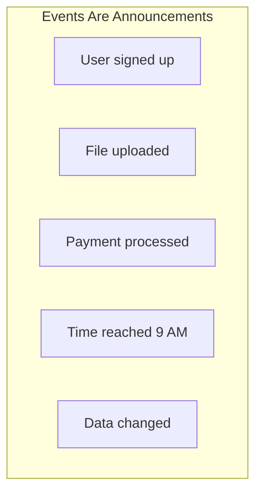
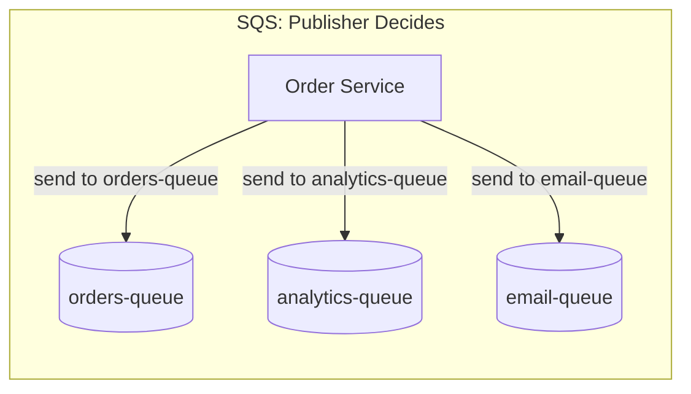
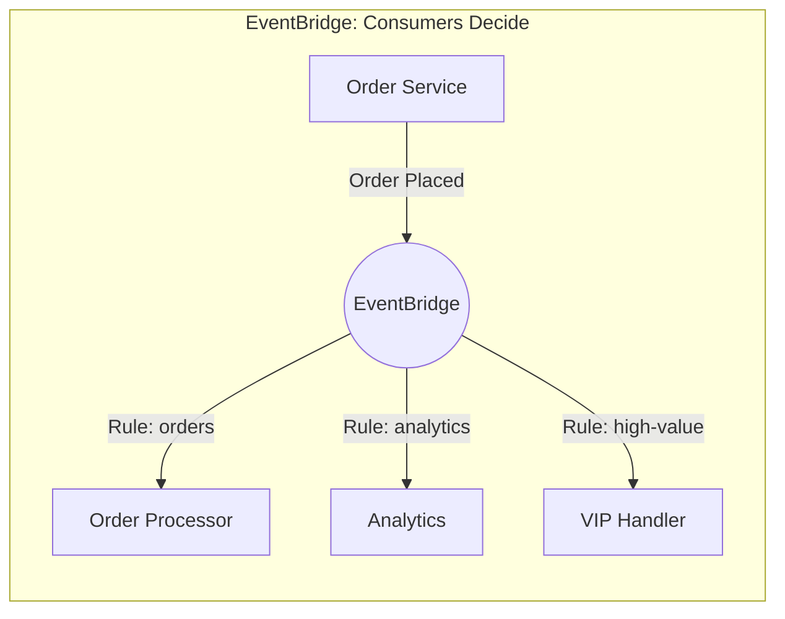
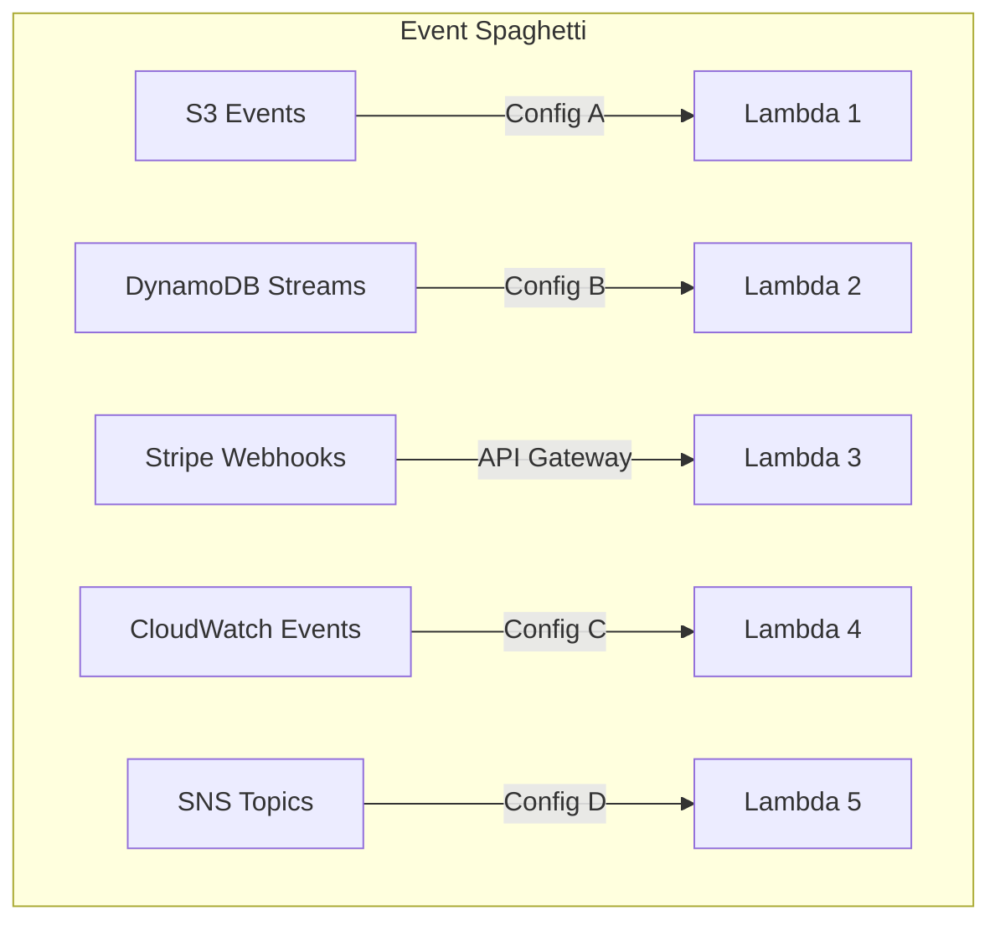
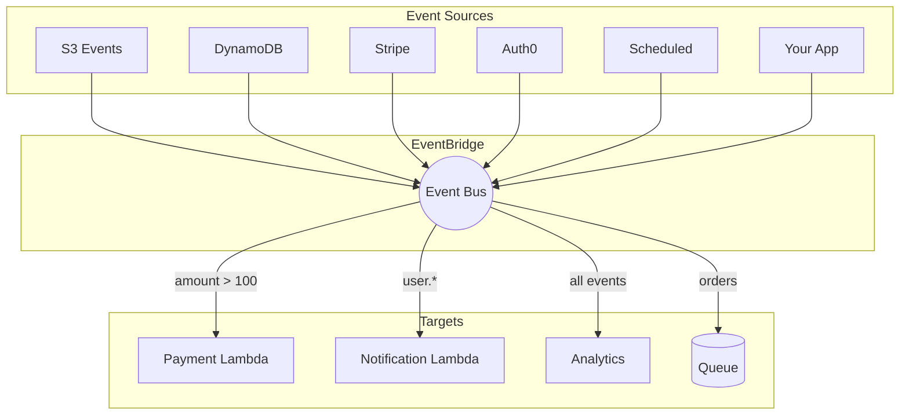
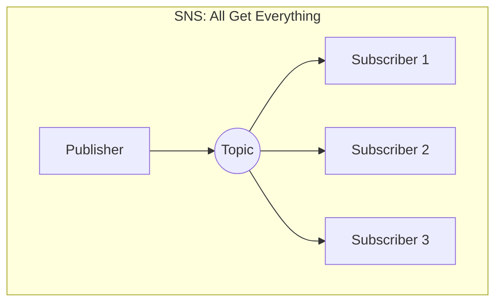
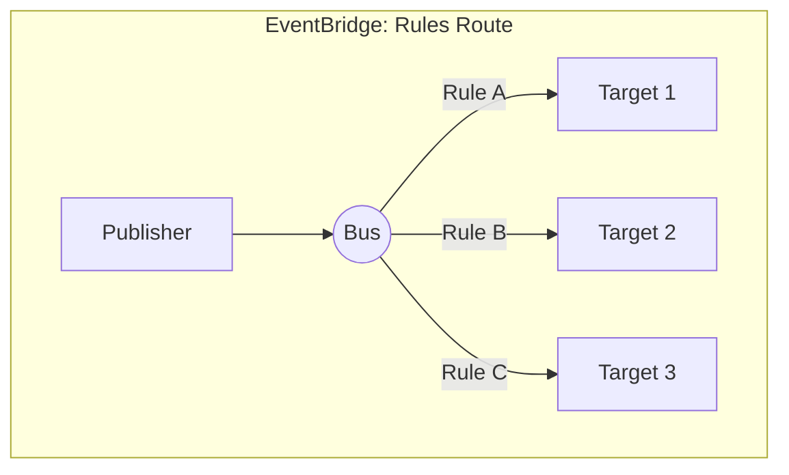

# EventBridge: The Event Router That Changes Everything

## What is an Event?

**An event is simply a record that something happened.**

Think about it this way: when you get a text notification on your phone, that's triggered by an event. Someone sent you a message - that's an event. Your alarm went off - that's an event. Your package was delivered - that's an event. The notification doesn't tell you what to DO about it - it just informs you that something occurred, and YOU decide whether to act on it.

:::floating:right:1/2


This "announce and let others decide" pattern is fundamental to understanding EventBridge. The phone doesn't know if you'll read the message immediately, ignore it, or delete it without looking. It just delivers the notification. The same principle applies to software events - the system that generates the event doesn't know or care who's listening or what they'll do with the information.
:::

In software, events appear everywhere:
- **User signs up** → that's an event (the authentication service announces it)
- **File uploaded to S3** → that's an event (S3 announces it automatically)
- **Payment processed by Stripe** → that's an event (Stripe sends a webhook)
- **EC2 instance stopped** → that's an event (AWS announces infrastructure changes)
- **It's 9 AM** → that's an event (time-based events trigger scheduled work)

What makes events powerful is that the service generating the event doesn't need to know who cares about it. When a user signs up, the authentication service doesn't need code for "tell the email service, tell analytics, tell the welcome-flow service." It just announces "a user signed up" and moves on. Any service that cares can listen for that announcement.

An event is typically a small JSON message describing what happened:

```json
{
    "source": "pettracker.users",
    "detail-type": "User Signed Up",
    "time": "2024-03-23T10:30:00Z",
    "detail": {
        "userId": "user-123",
        "email": "alex@pettracker.com",
        "plan": "premium"
    }
}
```

Notice the structure here: `source` tells you WHO generated this event (the users service), `detail-type` tells you WHAT happened (a signup), `time` tells you WHEN, and `detail` contains the specifics. This consistent structure - which every EventBridge event follows - is what makes filtering and routing possible. You can write rules like "give me all events from pettracker.users" or "give me all User Signed Up events where the plan is premium."

**Why do events matter?** Instead of services calling each other directly ("hey, do this!"), services can announce what happened ("this happened") and let other services decide if they care. This creates loosely-coupled systems that are easier to maintain and scale. When you need to add a new feature - say, sending a Slack notification when premium users sign up - you don't touch the authentication service at all. You just create a new listener for that event. The authentication service doesn't change, doesn't redeploy, doesn't even know the Slack integration exists.

---

## "But Why Not Just Use SQS?"

If you already know SQS, you might wonder: why do I need EventBridge? Can't I just send messages to queues?

Here's the fundamental difference:

**With SQS**, you (the publisher) decide where messages go:
- "Put this order in the `orders-queue`"
- "Send this notification to `email-queue`"
- You hardcode the destination. You own the routing decision.

**With EventBridge**, you announce what happened and let consumers decide:
- "An order was placed" (you don't know or care who's listening)
- "A user signed up" (whoever wants it can subscribe)
- Consumers create rules to get events they care about.

:::floating:right:2/3


With SQS, the Order Service must know about every consumer. If marketing wants order events, you change the Order Service code to also send to `marketing-queue`. Every new consumer means a code change and deployment.
:::

:::floating:left:2/3


With EventBridge, the Order Service just announces "Order Placed." Marketing wants these events? They create a rule - no Order Service changes needed. The publisher is completely decoupled from consumers.
:::

**The fundamental shift:** With SQS, the publisher must know about every consumer. With EventBridge, the publisher just announces events - consumers subscribe to what they want.

| Aspect | SQS | EventBridge |
|--------|-----|-------------|
| **Who decides routing?** | Publisher | Consumer (via rules) |
| **Adding a new consumer** | Change publisher code | Create a rule (no publisher changes) |
| **Filtering** | Consumer reads all, filters in code | Rules filter before delivery |
| **Publisher knowledge** | Must know all destinations | Just announces events |

**Use SQS when:**
- You have a specific queue for a specific purpose
- Point-to-point: one producer, one consumer
- You want durable message storage with visibility timeout

**Use EventBridge when:**
- Multiple services might care about an event
- You want consumers to self-subscribe without publisher changes
- You need content-based filtering before delivery
- You're integrating events from multiple sources (AWS, SaaS, custom)

---

## The Problem: Event Spaghetti

Alex at PetTracker learned about events the hard way.

After building a successful app with 50,000 active users, events were coming from everywhere:
- **S3** sends events when files are uploaded (12,000 photo uploads per day)
- **DynamoDB** sends events when data changes (200,000 record updates daily)
- **Stripe** sends webhooks when payments process (3,000 subscription events monthly)
- **Auth0** sends events when users log in (15,000 login events daily)
- **CloudWatch** triggers scheduled events (47 scheduled jobs)
- **The app itself** generates custom events (order completions, pet profile updates)

Each source had its own integration pattern. S3 triggers a Lambda one way - you configure bucket notifications pointing to a Lambda ARN. DynamoDB Streams work completely differently - you create an Event Source Mapping that polls the stream. Stripe needs an API Gateway webhook endpoint that you build yourself. CloudWatch Events uses yet another format with its own rule syntax.

:::floating:right:1/2


The diagram shows what Alex was managing - five different configuration patterns, five different debugging paths, five different ways things could silently break.
:::

When something broke at 2 AM - specifically, subscription renewals stopped processing and 847 customers received incorrect "payment failed" emails despite successful Stripe charges - Alex had to trace through five different integration patterns to find the bug. The Stripe webhook was working. The Lambda was processing. But the downstream DynamoDB Stream consumer had silently failed due to an IAM permission change two weeks earlier. Messages piled up. Silent failure.

There was no single place to see what events were flowing through the system. No way to filter events before they triggered Lambdas - every S3 upload invoked the photo processor, even thumbnails and temp files (wasting $340/month in unnecessary Lambda invocations). No way to replay events after a bug was fixed - those 847 incorrect notifications couldn't be automatically corrected.

"This is impossible to maintain," Alex said. "Every new integration adds more complexity. Last month, marketing wanted real-time signup events. Adding that took 4 hours, three deployments, and we broke the email service in the process."

---

## How You'd Solve This Without EventBridge

Before EventBridge, you'd handle each event source separately. Let's look at what this actually involves - because understanding the pain makes the solution click.

### For S3 Events → Lambda

When a file is uploaded to S3, you want to process it. The "simple" approach is S3 bucket notifications, which trigger a Lambda directly.

```yaml
# S3 bucket notification configuration
S3Bucket:
  Type: AWS::S3::Bucket
  Properties:
    NotificationConfiguration:
      LambdaConfigurations:
        - Event: s3:ObjectCreated:*
          Function: !GetAtt ProcessUploadFunction.Arn
          Filter:
            S3Key:
              Rules:
                - Name: prefix
                  Value: uploads/
                - Name: suffix
                  Value: .jpg
```

This configuration tells S3 "when any object is created in the uploads/ folder with a .jpg extension, invoke this Lambda." Seems reasonable.

**The problem:** S3 filtering is extremely limited - only prefix and suffix matching. You cannot filter by file size, content type, or any metadata. So your Lambda runs for EVERY .jpg upload, including 10KB thumbnails that don't need processing, profile photos that go through a different pipeline, and test files that developers upload. In PetTracker's case, 70% of Lambda invocations immediately returned after checking file size - pure waste at $0.20 per million invocations.

### For DynamoDB Changes → Lambda

When data changes in DynamoDB, you often need to react - update a cache, notify users, trigger workflows. DynamoDB Streams capture these changes.

```yaml
# DynamoDB Streams event source mapping
StreamMapping:
  Type: AWS::Lambda::EventSourceMapping
  Properties:
    EventSourceArn: !GetAtt Table.StreamArn
    FunctionName: !Ref ProcessChangesFunction
    StartingPosition: TRIM_HORIZON
    BatchSize: 100
    FilterCriteria:
      Filters:
        - Pattern: '{"eventName": ["INSERT"]}'
```

Notice this is a completely different configuration pattern. Instead of the resource (DynamoDB) calling Lambda, you create a "mapping" that polls the stream. The `StartingPosition` determines where to start reading. `FilterCriteria` was added in 2022 but offers much weaker filtering than EventBridge patterns.

**The problem:** DynamoDB Streams have a 24-hour retention period. If your consumer Lambda fails or falls behind, events older than 24 hours disappear forever - no archive, no replay. Also, the record format is different from everything else - DynamoDB's weird `{"S": "value"}` type wrappers that you have to unwrap in your code.

### For Stripe Webhooks → Lambda

Third-party services like Stripe can't push directly to Lambda. You need to build an HTTP endpoint they can call - which means API Gateway.

```yaml
# API Gateway + Lambda for webhooks (simplified - actual config is 50+ lines)
StripeWebhookApi:
  Type: AWS::ApiGateway::RestApi
  Properties:
    Name: stripe-webhooks

StripeResource:
  Type: AWS::ApiGateway::Resource
  Properties:
    RestApiId: !Ref StripeWebhookApi
    ParentId: !GetAtt StripeWebhookApi.RootResourceId
    PathPart: stripe

StripeMethod:
  Type: AWS::ApiGateway::Method
  Properties:
    RestApiId: !Ref StripeWebhookApi
    ResourceId: !Ref StripeResource
    HttpMethod: POST
    AuthorizationType: NONE
    Integration:
      Type: AWS_PROXY
      IntegrationHttpMethod: POST
      Uri: !Sub arn:aws:apigateway:${AWS::Region}:lambda:path/...
```

This is just the infrastructure. Your Lambda also needs to verify Stripe's webhook signature (security), handle all event types in one function (routing), manage retries (Stripe will retry on 5xx errors), and deal with the fact that API Gateway has a 29-second timeout.

**The problem:** You're building custom infrastructure for EVERY third-party service - Stripe, Auth0, Datadog, Twilio. Each has different authentication (Stripe uses signature headers, Auth0 uses tokens), different payload formats, different retry logic. For PetTracker, this meant 400+ lines of webhook handling code across 4 different API Gateway endpoints.

### Why This Approach Hurts

| Pain Point | Impact | Real Example |
|------------|--------|--------------|
| **Different configs** | Learn 5+ integration patterns | New developer takes 2 weeks to understand event flow |
| **No central visibility** | Check 5 dashboards to understand flow | 2 AM debugging requires opening 8 browser tabs |
| **Filtering happens late** | Lambda runs, checks if it cares, often does nothing | 70% of photo Lambda invocations wasted ($340/month) |
| **Adding subscribers is hard** | New consumer = code changes + deployment | Marketing signup events took 4 hours, broke email |
| **No replay** | Bug fixed? Too bad, events are gone | 847 incorrect notifications couldn't be corrected |

---

## How EventBridge Solves This

"What you need," Sam said, looking at Alex's tangled architecture diagram, "is a single event bus. One place where all events flow through."

EventBridge is a serverless event bus - a central router where ALL events flow through.

:::floating:right:2/3


Instead of five different integration patterns, everything flows through one bus. Rules examine each event and route it to the right targets. One configuration model, one debugging path, one monitoring dashboard.
:::

### How It Works

1. **Events arrive** from any source (AWS services, SaaS apps, your code)
2. **Rules filter** based on event content ("only Stripe payments over $100")
3. **Events route** to one or more targets (Lambda, SQS, SNS, HTTP, etc.)

That's it. Events in → rules filter → events out to the right places.

### The Core Concepts

**Event Bus**: The highway where events travel. AWS provides a default bus; you can create custom buses for different environments or applications.

**Rules**: Traffic cops that examine each event. "Does this event match my pattern? If yes, send to my targets."

**Patterns**: The matching criteria. Can filter on any field in the event - source, type, or any nested value in the detail.

**Targets**: Where matching events go. Lambda, SQS, SNS, Step Functions, API endpoints, other event buses, and more.

### The Code Transformation

Before EventBridge, Alex had hundreds of lines of configuration across multiple services. After:

```python
import boto3

# Publish an event - ONE pattern for all events
events = boto3.client('events')

events.put_events(Entries=[{
    'Source': 'pettracker.orders',
    'DetailType': 'Order Placed',
    'Detail': json.dumps({
        'orderId': 'order-123',
        'amount': 149.99,
        'customerId': 'cust-456'
    }),
    'EventBusName': 'default'
}])
```

That's it. The order service announces what happened. It doesn't know or care who's listening. Anyone who wants order events creates a rule - no changes to this code ever.

### The Before and After

| Aspect | Without EventBridge | With EventBridge |
|--------|---------------------|------------------|
| **Integration patterns** | 5+ different configs | 1 unified pattern |
| **Visibility** | Check multiple dashboards | One event bus view |
| **Filtering** | In Lambda code (after invocation) | Before invocation (save $) |
| **Adding subscribers** | Code changes + deploy | Create a rule (no code) |
| **Third-party events** | Custom webhook handlers | Native partner integration |
| **Event replay** | Not possible | Built-in archive + replay |

---

## What Makes EventBridge Different from SNS?

"Wait," Maya asked, "how is this different from SNS? That routes messages too."

Great question. They serve different purposes:

**SNS** is designed for simple pub/sub fan-out. You publish to a topic, all subscribers get the message. Filtering is basic (message attributes only).

**EventBridge** is designed for intelligent event routing. You publish to a bus, rules examine the content, only matching targets receive events.

:::floating:left:1/2


With SNS, you publish to a topic and all subscribers receive a copy. You can filter on message attributes, but not on the message body content.
:::

:::floating:right:1/2


With EventBridge, rules examine the full event content. Only matching events reach each target. You can filter on any nested field, do numeric comparisons, and use complex patterns.
:::

| Feature | SNS | EventBridge |
|---------|-----|-------------|
| **Best for** | Simple fan-out to multiple subscribers | Content-based routing |
| **Filtering** | Basic (message attributes) | Powerful (any field, numeric comparisons) |
| **AWS integration** | Manual setup | 200+ services automatic |
| **SaaS integration** | Via API Gateway | Native partner events |
| **Archive/Replay** | Not available | Built-in |
| **Schema discovery** | Not available | Automatic |

**When to use SNS:** You want to broadcast a message to multiple subscribers without complex filtering.

**When to use EventBridge:** You need to route events based on content, integrate with multiple sources, or want built-in archiving.

**Use both together:** SNS topic as an EventBridge target for fan-out after filtering.

---

## The Power of Pattern Matching

EventBridge patterns can match on any part of the event:

```json
{
  "source": ["pettracker.payments"],
  "detail-type": ["Payment Completed"],
  "detail": {
    "amount": [{ "numeric": [">", 100] }],
    "country": ["US", "CA"],
    "status": [{ "anything-but": ["refunded"] }]
  }
}
```

This rule matches payments over $100 from US or Canada that aren't refunded. The Lambda only runs for matching events - no wasted invocations.

**Pattern capabilities:**
- **Exact match**: `"source": ["aws.s3"]`
- **Multiple values**: `"country": ["US", "CA", "UK"]`
- **Prefix**: `"key": [{"prefix": "uploads/"}]`
- **Numeric**: `"amount": [{"numeric": [">", 100, "<=", 1000]}]`
- **Exists**: `"metadata": [{"exists": true}]`
- **Anything-but**: `"status": [{"anything-but": ["cancelled"]}]`

For PetTracker, this meant the photo processing Lambda went from handling all 12,000 daily uploads to only the 3,600 that actually needed processing. A 70% reduction in Lambda invocations, saving $340/month.

---

## What You'll Learn in This Chapter

| Skill | What You'll Learn | Why It Matters |
|-------|-------------------|----------------|
| **Event Buses** | Default, custom, cross-account | Separate production/dev, share events across accounts |
| **Rules & Patterns** | Content-based filtering | Only trigger what you need, save Lambda costs |
| **AWS Integration** | Native events from 200+ services | React to S3, EC2, CodePipeline without setup |
| **Custom Events** | Publish your own events | Integrate your app into the event ecosystem |
| **Scheduler** | Cron and rate expressions | Replace CloudWatch Events with more features |
| **Pipes** | Point-to-point integration | ETL pipelines with filtering and enrichment |
| **Archive & Replay** | Store and reprocess events | Disaster recovery, debugging |

### Chapter Roadmap

**Deep Dives (Expanding on this overview):**
1. **Events Deep Dive** - Event envelope, schemas, versioning patterns
2. **The Problem in Detail** - Real code showing manual integration pain
3. **EventBridge Architecture** - How it works under the hood

**Core Features:**
4. **Event Buses** - Default, custom, cross-account sharing
5. **Rules and Targets** - Routing and delivery
6. **Event Patterns** - Advanced filtering techniques

**Integrations:**
7. **AWS Service Integration** - Native events from 200+ services
8. **Custom Events** - Publishing from your applications
9. **SaaS Partner Integration** - Stripe, Auth0, Datadog, etc.

**Advanced Features:**
10. **EventBridge Scheduler** - Time-based triggers
11. **EventBridge Pipes** - Point-to-point with transformation
12. **Input Transformation** - Reshaping event data
13. **Archive and Replay** - Never lose an event
14. **Security** - IAM, resource policies, encryption

**Conclusion:**
15. **Alex's Solution** - The unified event architecture

---

## Why This Matters for the Exam

The DVA-C02 exam tests EventBridge frequently. Expect:

- **4-6 direct questions** about EventBridge concepts
- **Architecture questions** where EventBridge is the solution
- **Comparison questions** (EventBridge vs SNS vs SQS)

| Exam Topic | What They Ask |
|------------|---------------|
| **Event Buses** | Default vs custom, cross-account access patterns |
| **Rules** | Pattern matching syntax, multiple targets per rule |
| **Patterns** | Numeric comparisons, prefix/suffix, anything-but |
| **Scheduler** | Cron vs rate expressions, one-time schedules |
| **Archive** | Retention settings, replay for disaster recovery |
| **vs SNS** | When to use each, can they work together |

---

*Ready to go deeper? Start with **Events Deep Dive** to explore event structures, schemas, and patterns that the overview only touched on. Or jump to any sub-chapter based on what you need.*

---
*v1.0*
