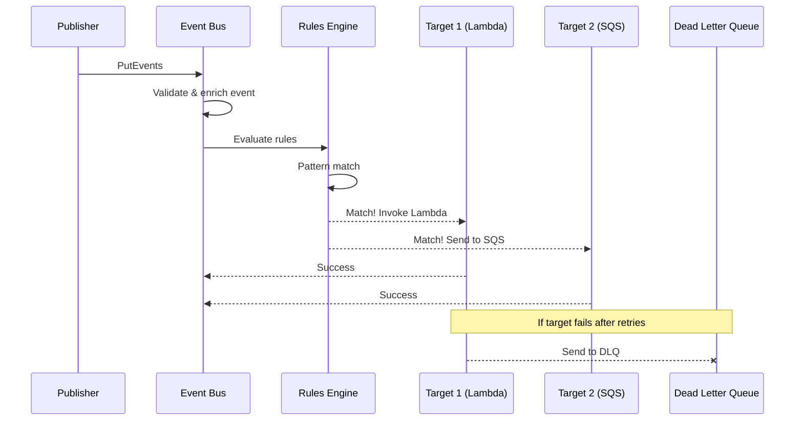
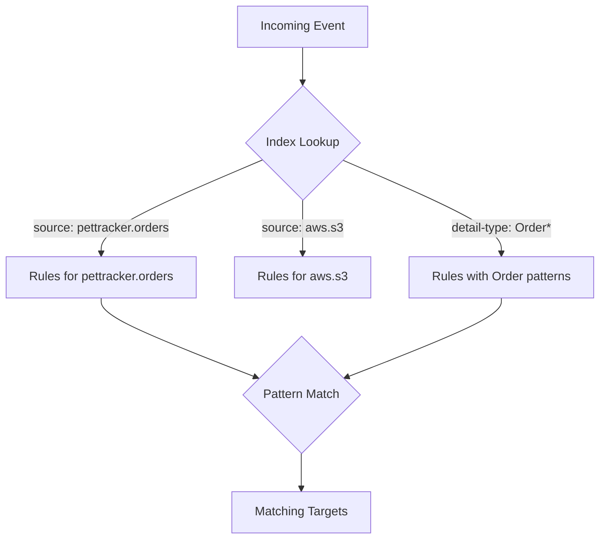
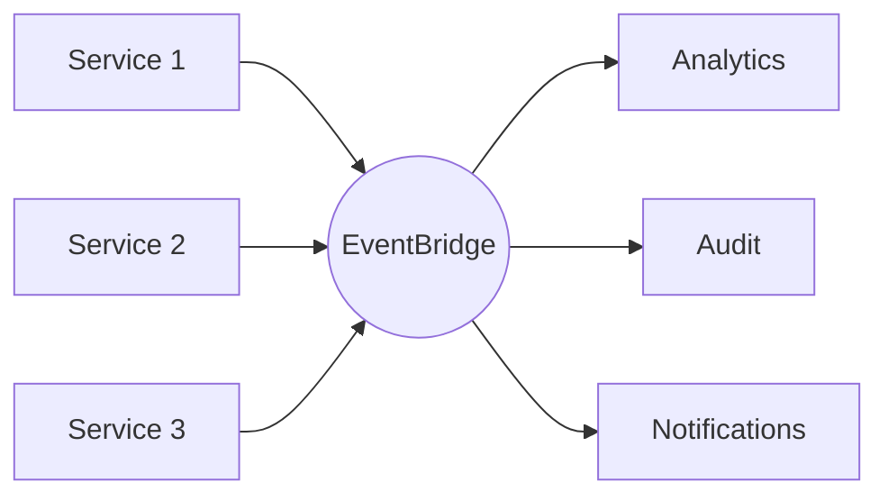
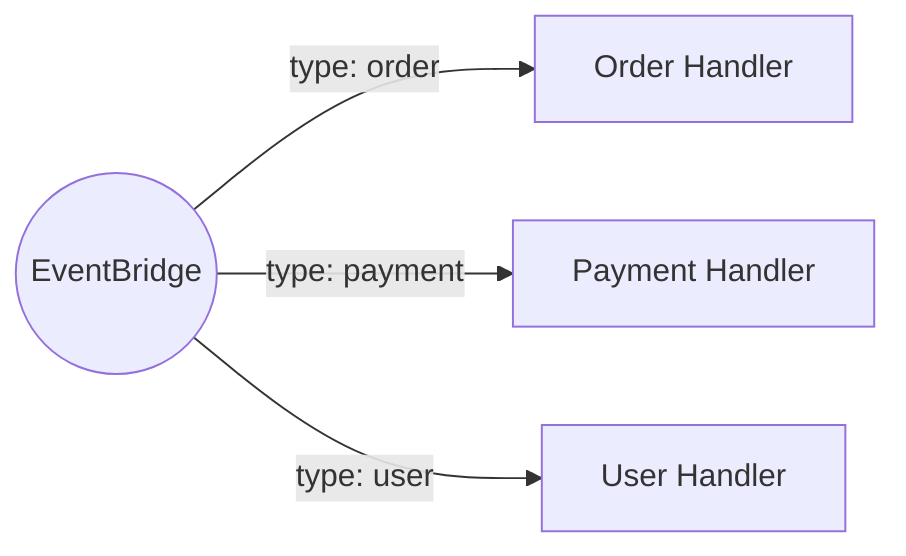
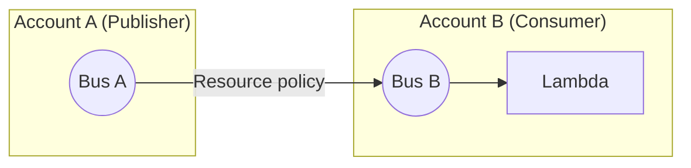
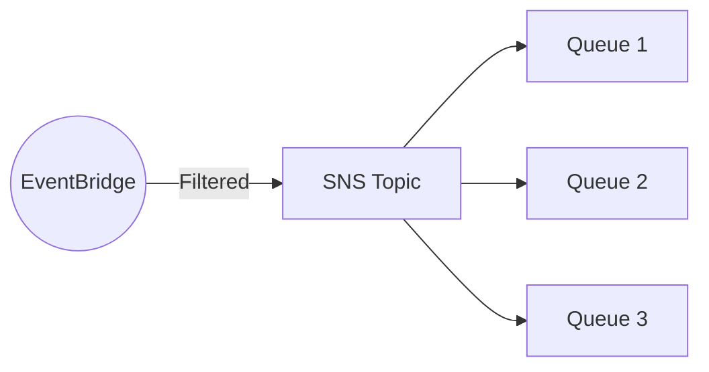

# EventBridge Architecture: How It Works Under the Hood

## What the Main Page Introduced

The main page explained the mental model shift: **with SQS, publishers decide where messages go; with EventBridge, consumers decide what they want.** It showed EventBridge as a central event bus where events flow in, rules filter them, and targets receive matching events.

Now let's understand the architecture that makes this "consumer-decides" model work and why the design decisions matter.

## Going Deeper

In this sub-chapter, we'll explore:
1. **The event flow** - What happens when you publish an event
2. **Rules engine** - How pattern matching works at scale
3. **Targets and delivery** - Guarantees, retries, and transformations
4. **Limits and quotas** - What you need to know
5. **Design patterns** - Common architectures with EventBridge

---

## The Event Flow: From Publisher to Consumer

When you publish an event to EventBridge, here's what happens:



### Step 1: Event Ingestion

```python
import boto3

events = boto3.client('events')

response = events.put_events(
    Entries=[
        {
            'Source': 'pettracker.orders',
            'DetailType': 'Order Completed',
            'Detail': json.dumps({
                'orderId': 'order-123',
                'total': 99.99
            }),
            'EventBusName': 'default'
        }
    ]
)
```

EventBridge:
1. **Validates** the event structure
2. **Enriches** with account, region, time, unique ID
3. **Persists** the event (for potential archiving)
4. **Acknowledges** back to publisher

**Key insight:** The `put_events` call is synchronous but fast. EventBridge acknowledges receipt before target delivery. This decouples publishers from consumers.

### Step 2: Rule Evaluation

Every rule attached to the bus is evaluated against the incoming event:

```json
// Rule: "high-value-orders"
{
  "source": ["pettracker.orders"],
  "detail-type": ["Order Completed"],
  "detail": {
    "total": [{"numeric": [">=", 100]}]
  }
}
```

The rules engine:
1. **Indexes rules** by source and detail-type for fast lookup
2. **Evaluates patterns** against matching rules
3. **Collects all matching rules** (an event can match multiple rules)

**Performance:** EventBridge can evaluate thousands of rules in milliseconds. The filtering happens inside AWS infrastructure, not in your code.

### Step 3: Target Invocation

For each matching rule, EventBridge invokes the configured targets:

```yaml
Targets:
  - Id: process-high-value
    Arn: arn:aws:lambda:...:process-high-value
  - Id: notify-sales
    Arn: arn:aws:sns:...:sales-notifications
  - Id: audit-log
    Arn: arn:aws:sqs:...:audit-queue
```

**One rule can have up to 5 targets.** All targets receive the same event (after optional transformation).

---

## The Rules Engine: Pattern Matching at Scale

### How Patterns Are Indexed

EventBridge doesn't evaluate every rule against every event. It uses indexing:



This is why filtering by `source` and `detail-type` is most efficient - EventBridge can skip irrelevant rules entirely.

### Pattern Complexity and Performance

Simple patterns are fast:

```json
{"source": ["pettracker.orders"]}
```

Complex patterns still work but require more evaluation:

```json
{
  "source": ["pettracker.orders"],
  "detail": {
    "items": {
      "price": [{"numeric": [">", 100]}],
      "category": [{"prefix": "premium-"}]
    }
  }
}
```

**Best practice:** Put common filters (source, detail-type) first. Use specific patterns rather than catch-all rules.

### Pattern Operators Deep Dive

| Operator | Example | Matches |
|----------|---------|---------|
| **Exact** | `["value"]` | Only "value" |
| **Prefix** | `[{"prefix": "prod-"}]` | "prod-123", "prod-abc" |
| **Suffix** | `[{"suffix": ".jpg"}]` | "photo.jpg", "123.jpg" |
| **Numeric** | `[{"numeric": [">", 100]}]` | 101, 500, 1000000 |
| **Numeric range** | `[{"numeric": [">=", 0, "<", 100]}]` | 0 to 99 |
| **Exists** | `[{"exists": true}]` | Field is present |
| **Anything-but** | `[{"anything-but": ["test"]}]` | Everything except "test" |
| **Wildcard** | `[{"wildcard": "user-*-admin"}]` | user-123-admin, user-abc-admin |

### Content Filtering vs Array Matching

For arrays, patterns match if ANY element matches:

```json
// Event
{
  "detail": {
    "tags": ["urgent", "billing", "customer-123"]
  }
}

// Pattern - matches because "urgent" is in the array
{
  "detail": {
    "tags": ["urgent"]
  }
}
```

**Gotcha:** You can't match "array contains BOTH urgent AND billing" with a single pattern. You'd need two rules or match on a derived field.

---

## Targets and Delivery Guarantees

### Supported Targets

| Target | Use Case | Considerations |
|--------|----------|----------------|
| **Lambda** | Event processing | Cold start latency |
| **SQS** | Buffering, fan-out | Messages can be batched |
| **SNS** | Notifications, further fan-out | 256KB message limit |
| **Step Functions** | Workflows | Standard vs Express |
| **Kinesis** | Streaming analytics | Partition key selection |
| **API Gateway** | HTTP endpoints | Response not captured |
| **API Destinations** | External APIs | Rate limiting, auth |
| **EventBridge Bus** | Cross-account, archive | Event modification possible |
| **CloudWatch Logs** | Audit, debugging | All events logged |

### Retry Behavior

When a target invocation fails:

```
Attempt 1: Invoke target
  ↓ (failure)
Wait: exponential backoff
Attempt 2: Invoke target
  ↓ (failure)
Wait: longer backoff
...
Attempt 185: Invoke target
  ↓ (failure)
Send to Dead Letter Queue (if configured)
```

**Default retry policy:**
- Max attempts: 185 over 24 hours
- Backoff: Exponential with jitter
- Max event age: 24 hours

**Custom retry policy:**

```yaml
Target:
  Arn: arn:aws:lambda:...:my-function
  RetryPolicy:
    MaximumRetryAttempts: 3
    MaximumEventAgeInSeconds: 3600  # 1 hour
  DeadLetterConfig:
    Arn: arn:aws:sqs:...:dlq
```

### Dead Letter Queues

Always configure a DLQ for production workloads:

```yaml
DeadLetterQueue:
  Type: AWS::SQS::Queue
  Properties:
    QueueName: eventbridge-dlq
    MessageRetentionPeriod: 1209600  # 14 days

EventBridgeRule:
  Type: AWS::Events::Rule
  Properties:
    Targets:
      - Id: my-target
        Arn: !GetAtt MyFunction.Arn
        DeadLetterConfig:
          Arn: !GetAtt DeadLetterQueue.Arn
```

DLQ messages include:
- Original event
- Error message
- Rule ARN
- Target ARN
- Retry attempt count

---

## Input Transformation

Before delivering to targets, you can transform the event:

### InputPath - Select Part of Event

```json
{
  "InputPath": "$.detail"
}
```

Target receives only the `detail` portion, not the full envelope.

### InputTransformer - Reshape the Event

```yaml
InputTransformer:
  InputPathsMap:
    orderId: "$.detail.orderId"
    total: "$.detail.total"
    time: "$.time"
  InputTemplate: |
    {
      "message": "Order <orderId> completed for $<total>",
      "timestamp": "<time>",
      "type": "order_notification"
    }
```

**Use cases:**
- Format messages for SNS/Slack notifications
- Extract only needed fields for Lambda
- Add static values not in the original event

---

## Limits and Quotas

### Key Limits to Know

| Resource | Limit | Notes |
|----------|-------|-------|
| Event size | 256 KB | Compressed payload |
| Events per PutEvents | 10 | Batch multiple events |
| PutEvents requests/sec | 10,000+ | Soft limit, can increase |
| Rules per bus | 300 | Soft limit |
| Targets per rule | 5 | Design consideration |
| Event buses per account | 100 | Usually enough |

### Throttling Behavior

If you exceed limits:

```python
try:
    response = events.put_events(Entries=entries)
except events.exceptions.ThrottlingException:
    # Implement exponential backoff
    time.sleep(backoff_time)
    retry()
```

**Best practice:** Use the `FailedEntryCount` in the response to handle partial failures:

```python
response = events.put_events(Entries=entries)
if response['FailedEntryCount'] > 0:
    for i, entry in enumerate(response['Entries']):
        if 'ErrorCode' in entry:
            # This specific event failed - retry it
            failed_events.append(entries[i])
```

---

## Design Patterns

### Pattern 1: Event Aggregator

Multiple sources → one bus → multiple consumers



**When to use:** Centralizing events from microservices

### Pattern 2: Event Router

Content-based routing to specialized handlers



**When to use:** Replacing complex Lambda routing logic

### Pattern 3: Cross-Account Events



**When to use:** Multi-account architectures, organizational event sharing

### Pattern 4: EventBridge + SNS Fan-Out



**When to use:** EventBridge filters, then SNS broadcasts to many consumers

---

## Did You Know?

**Did you know?** EventBridge uses a "claim check" pattern internally for efficiency. Large events are stored separately in AWS-managed storage, and the bus passes references rather than copying the full payload for each target. This is why the 256KB limit is actually compressed size - EventBridge compresses before checking the limit. It also explains why EventBridge can deliver the same event to multiple targets without multiplying storage costs.

**Here's something interesting:** Rules are evaluated in parallel, not sequentially. When an event arrives that matches 5 different rules, all 5 targets are invoked simultaneously, not one after another. This parallel evaluation is why EventBridge can handle thousands of rules without the latency increasing linearly. It also means you shouldn't rely on any particular order of target invocation - if Target A must complete before Target B runs, use Step Functions or explicit sequencing.

**One more thing:** EventBridge Scheduler (covered in a later sub-chapter) is actually a separate service from EventBridge Rules with schedule expressions. They look similar but have different limits, pricing, and capabilities. Scheduler supports one-time schedules (`at()` expressions), time zones, and flexible windows - features that rule-based scheduling lacks. For new scheduled workloads, prefer Scheduler; rules-based scheduling is effectively legacy.

---

## Exam Tips

**Key points for DVA-C02:**

1. **Delivery guarantee**: At least once (events may be delivered multiple times)
2. **Target limit**: 5 targets per rule
3. **Retry behavior**: Up to 185 attempts over 24 hours by default
4. **Cross-account**: Requires resource policy on the target bus

**Common exam patterns:**

> "An application needs to route events to different Lambda functions based on event content..."
> → EventBridge rules with content-based patterns

> "Events must be processed exactly once..."
> → EventBridge provides at-least-once; implement idempotency in consumer

> "Events need to be sent to another AWS account..."
> → Cross-account event bus with resource policy

---

## Quick Reference

| Concept | Description |
|---------|-------------|
| **Event Bus** | Central routing channel for events |
| **Rule** | Pattern + targets; evaluated against all events |
| **Target** | Destination for matching events (Lambda, SQS, etc.) |
| **Input Transformation** | Reshape events before delivery |
| **DLQ** | Destination for events that fail all retries |
| **At-least-once** | Events may be delivered multiple times |

---

## Key Takeaways

- **EventBridge evaluates rules efficiently** using indexing by source and detail-type. This means filtering by these fields first is fast, while patterns that skip them have to check against all rules. Always include source and detail-type in your patterns when possible.

- **Delivery is asynchronous** - when you call `put_events`, EventBridge acknowledges receipt immediately, then delivers to targets in the background. Publishers never wait for consumers. This decoupling is why EventBridge scales so well - the producer and consumer are completely independent.

- **At-least-once delivery** means events might arrive twice (network hiccups, retries). Every consumer must be idempotent - processing the same event twice should produce the same result. Use the event `id` for deduplication if your business logic can't naturally handle duplicates.

- **Always configure DLQs** for production workloads. Without a Dead Letter Queue, events that fail all retry attempts simply disappear. With a DLQ, you can investigate failures, fix bugs, and reprocess. The few cents per month for an SQS DLQ is nothing compared to lost events.

- **Input transformation** lets you reshape events before they reach targets - extracting fields, adding static values, reformatting. This eliminates "adapter Lambdas" that just reshape data. If your Lambda's first 10 lines are pulling fields out of the event, use InputTransformer instead.

- **5 targets per rule** is a hard limit. Need more? Use SNS as a target for fan-out, or create multiple rules with the same pattern. The SNS approach is cleaner when you have many identical consumers.

---

*Next: **Event Buses** - Let's get hands-on with creating and managing default, custom, and cross-account event buses.*

