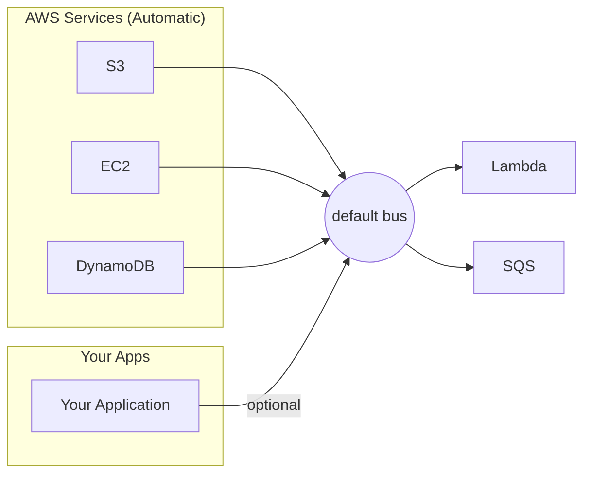
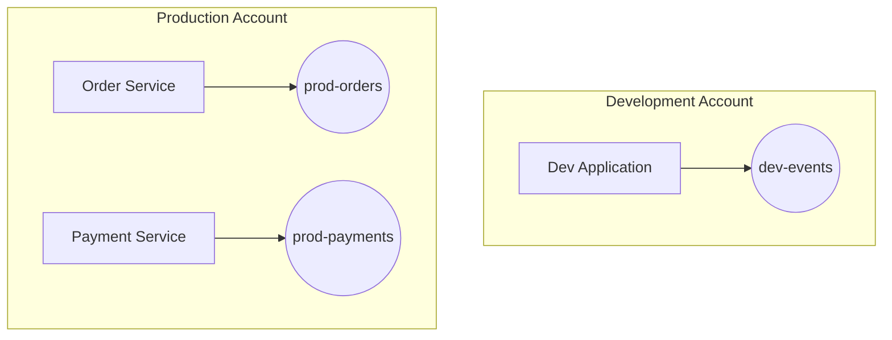
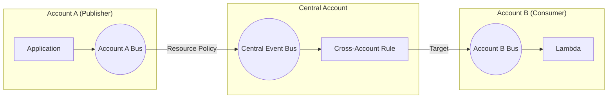
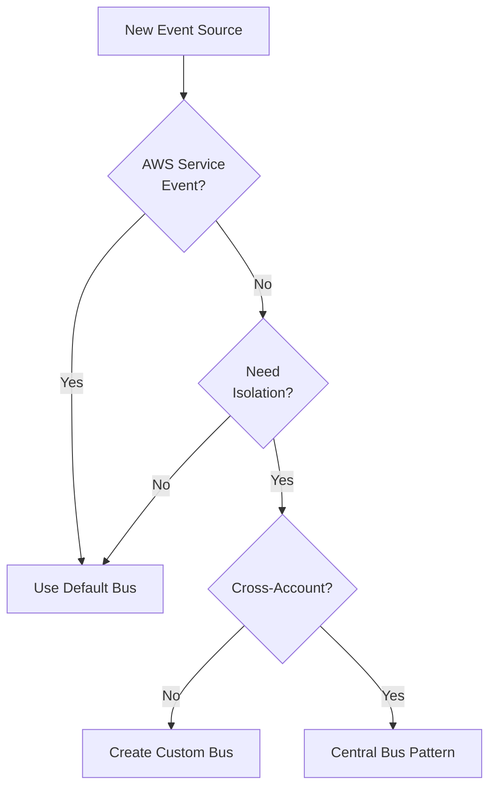

# Event Buses: The Highways for Your Events

## What the Main Page Introduced

The main page explained that EventBridge uses event buses as central routers where all events flow through. It established the mental model: **with EventBridge, consumers decide what they want** by creating rules on the bus. Now let's explore the different types of buses and when to use each.

## Going Deeper

In this sub-chapter, we'll explore:
1. **The default event bus** - What it is and when to use it
2. **Custom event buses** - Isolation and organization
3. **Cross-account event buses** - Sharing events across AWS accounts
4. **Event bus policies** - Controlling who can publish and subscribe
5. **Choosing the right bus** - Decision framework

---

## The Default Event Bus

Every AWS account has a default event bus named `default`. This is where AWS services automatically send their events.



### What Goes to the Default Bus Automatically

| Service | Event Types |
|---------|-------------|
| **S3** | Object Created, Object Deleted, Object Restore |
| **EC2** | Instance State Change, Spot Instance Interruption |
| **ECS** | Task State Change, Container Instance State |
| **CodePipeline** | Pipeline Execution State Change |
| **CloudWatch Alarms** | State Change (OK, ALARM, INSUFFICIENT_DATA) |
| **Health** | Service events and scheduled changes |

### When to Use the Default Bus

**Use the default bus when:**
- Reacting to AWS service events (S3, EC2, etc.)
- Simple applications without complex event routing
- Getting started with EventBridge

**Don't use the default bus when:**
- You need to isolate environments (dev/staging/prod)
- Multiple teams share an account and need separation
- You want fine-grained access control per bus

---

## Custom Event Buses

Custom buses provide isolation and organization for your events.

### Creating a Custom Bus

**AWS Console:**
```
EventBridge → Event buses → Create event bus
```

**CloudFormation:**

```yaml
Resources:
  OrdersEventBus:
    Type: AWS::Events::EventBus
    Properties:
      Name: pettracker-orders

  PaymentsEventBus:
    Type: AWS::Events::EventBus
    Properties:
      Name: pettracker-payments
```

**CLI:**

```bash
aws events create-event-bus --name pettracker-orders
```

### Publishing to a Custom Bus

```python
import boto3
import json

events = boto3.client('events')

response = events.put_events(
    Entries=[
        {
            'Source': 'pettracker.orders',
            'DetailType': 'Order Completed',
            'Detail': json.dumps({
                'orderId': 'order-123',
                'total': 99.99
            }),
            'EventBusName': 'pettracker-orders'  # Custom bus!
        }
    ]
)
```

### Organizing with Multiple Buses



**Common patterns:**
- **By environment:** `dev-events`, `staging-events`, `prod-events`
- **By domain:** `orders-bus`, `payments-bus`, `users-bus`
- **By team:** `team-alpha-bus`, `team-beta-bus`

---

## Cross-Account Event Buses

EventBridge can route events between AWS accounts - essential for enterprise architectures.

### The Pattern: Central Event Bus



### Setting Up Cross-Account Publishing

**Step 1: Create resource policy on the central bus**

```json
{
  "Version": "2012-10-17",
  "Statement": [
    {
      "Sid": "AllowAccountAToPublish",
      "Effect": "Allow",
      "Principal": {
        "AWS": "arn:aws:iam::111111111111:root"
      },
      "Action": "events:PutEvents",
      "Resource": "arn:aws:events:us-east-1:999999999999:event-bus/central-bus"
    }
  ]
}
```

**Step 2: Publisher sends to the central bus**

```python
# From Account A (111111111111)
events.put_events(
    Entries=[{
        'Source': 'accountA.orders',
        'DetailType': 'Order Completed',
        'Detail': json.dumps({'orderId': '123'}),
        'EventBusName': 'arn:aws:events:us-east-1:999999999999:event-bus/central-bus'
    }]
)
```

### Setting Up Cross-Account Consumption

**Step 1: Create a rule that targets another account's bus**

```yaml
CrossAccountRule:
  Type: AWS::Events::Rule
  Properties:
    EventBusName: central-bus
    EventPattern:
      source:
        - "accountA.orders"
    Targets:
      - Id: SendToAccountB
        Arn: arn:aws:events:us-east-1:222222222222:event-bus/accountB-bus
        RoleArn: !GetAtt CrossAccountRole.Arn
```

**Step 2: Account B creates a resource policy allowing Central to send**

```json
{
  "Version": "2012-10-17",
  "Statement": [
    {
      "Sid": "AllowCentralAccountToSend",
      "Effect": "Allow",
      "Principal": {
        "AWS": "arn:aws:iam::999999999999:root"
      },
      "Action": "events:PutEvents",
      "Resource": "arn:aws:events:us-east-1:222222222222:event-bus/accountB-bus"
    }
  ]
}
```

---

## Event Bus Policies

Control who can publish events and create rules on your bus.

### Policy Types

| Policy Type | Controls | Applied To |
|-------------|----------|------------|
| **Resource Policy** | Who can `PutEvents` to the bus | The event bus itself |
| **IAM Policy** | What actions a principal can perform | IAM users/roles |

### Resource Policy Example

```json
{
  "Version": "2012-10-17",
  "Statement": [
    {
      "Sid": "AllowSpecificServicesToPublish",
      "Effect": "Allow",
      "Principal": {
        "Service": "s3.amazonaws.com"
      },
      "Action": "events:PutEvents",
      "Resource": "arn:aws:events:us-east-1:123456789012:event-bus/my-bus",
      "Condition": {
        "StringEquals": {
          "aws:SourceAccount": "123456789012"
        }
      }
    },
    {
      "Sid": "AllowPartnerAccount",
      "Effect": "Allow",
      "Principal": {
        "AWS": "arn:aws:iam::987654321098:role/EventPublisher"
      },
      "Action": "events:PutEvents",
      "Resource": "arn:aws:events:us-east-1:123456789012:event-bus/my-bus"
    }
  ]
}
```

### IAM Policy for Event Publishers

```json
{
  "Version": "2012-10-17",
  "Statement": [
    {
      "Effect": "Allow",
      "Action": "events:PutEvents",
      "Resource": [
        "arn:aws:events:*:*:event-bus/orders-bus",
        "arn:aws:events:*:*:event-bus/payments-bus"
      ]
    }
  ]
}
```

---

## Choosing the Right Bus: Decision Framework



| Scenario | Recommendation |
|----------|----------------|
| React to S3 object uploads | Default bus |
| Isolate dev from prod events | Separate custom buses per environment |
| Multiple teams in one account | Custom bus per team |
| Central event hub for organization | Central bus with cross-account policies |
| Partner integration (Stripe, etc.) | Partner event buses (pre-configured) |

---

## Did You Know?

**Did you know?** The default event bus receives events from over 200 AWS services automatically - S3, EC2, ECS, CodePipeline, CloudWatch, and many more. You don't need to configure anything on the service side - those events are already flowing. You just create rules to react to them. This is different from SNS or SQS where you'd need to explicitly configure each service to publish. The default bus is like a pre-wired highway that's always running.

**Here's something interesting:** Custom event buses cost $1.00 per million custom events published. But events from AWS services to the default bus are free to publish - you only pay when rules match and invoke targets. This pricing model means there's no cost penalty for AWS services generating events; you only pay for what you actually consume. It also means heavy event producers (like S3 buckets with millions of uploads) don't generate EventBridge costs until you create rules that match those events.

**One more thing:** You can have up to 100 event buses per account (soft limit), which sounds like a lot until you consider multi-tenant architectures where you might want a bus per tenant. Need more? Request a limit increase through AWS Support. Most organizations use 3-10 buses: default for AWS events, one per environment (dev/staging/prod), and possibly one per domain (orders, payments, users).

---

## Exam Tips

**Key points for DVA-C02:**

1. **Default vs Custom**: AWS service events go to default; custom events can go to either
2. **Cross-account**: Requires resource policy on the receiving bus
3. **Cost**: Custom event publishing costs money; AWS service events to default are free

**Common exam patterns:**

> "Events from S3 aren't triggering the Lambda..."
> → Check the rule is on the default bus (where S3 sends events)

> "Team A shouldn't see Team B's events..."
> → Use separate custom event buses

> "Events need to flow from Account A to Account B..."
> → Cross-account pattern with resource policies

---

## Quick Reference

| Concept | Description |
|---------|-------------|
| **Default bus** | `default` - receives AWS service events automatically |
| **Custom bus** | Your own named bus for isolation/organization |
| **Resource policy** | Controls cross-account access to the bus |
| **Cross-account** | Events can flow between accounts via rules |

---

## Key Takeaways

- **Default bus** receives AWS service events automatically - over 200 services publish without you configuring anything. Use it for reacting to S3 uploads, EC2 state changes, CodePipeline completions, and more. Don't create custom buses for AWS events; they only go to the default bus.

- **Custom buses** provide isolation and organization. Separate by environment (dev/staging/prod), by team (orders-team-bus), or by domain (payments-bus). The key benefit: you can control who publishes to each bus via resource policies, and rules on one bus don't interfere with another.

- **Cross-account** patterns require resource policies on the receiving bus. The most common pattern is a "central event hub" in one account that other accounts publish to. Each account still has its own buses for internal events; cross-account is for shared/organizational events.

- **Cost consideration** - AWS service events to the default bus are free to publish; you only pay for targets. Custom events cost $1.00 per million. This pricing encourages using the default bus for AWS events while still making custom events affordable for most workloads.

- **The consumer-decides model** works because rules are attached to buses, not to publishers. A publisher sends an event and forgets about it. Any number of consumers can create rules to receive that event - today, tomorrow, or months later - without the publisher knowing or caring. This is the fundamental decoupling that makes EventBridge architectures maintainable.

---

*Next: **Rules and Targets** - Now that you understand where events flow, let's learn how to route them to the right destinations.*

