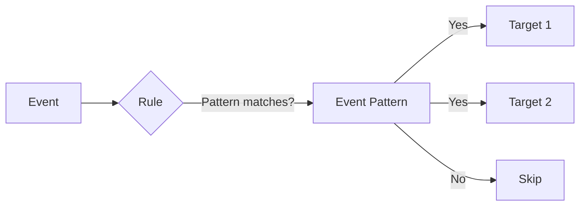
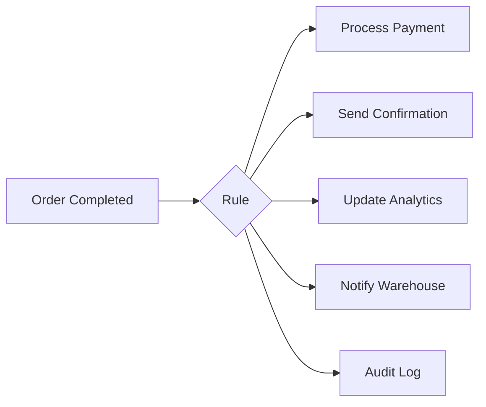
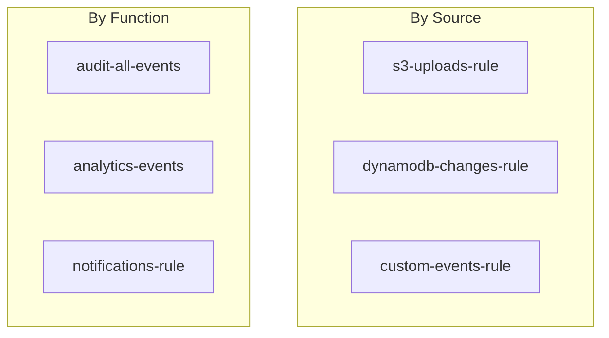

# Rules and Targets: Routing Events to Destinations

## What the Main Page Introduced

The main page explained that EventBridge rules are the "traffic cops" that examine each event and route matching events to targets. This is how **consumers decide what they want** - by creating rules with patterns. Now let's master the mechanics of rules and targets.

## Going Deeper

In this sub-chapter, we'll explore:
1. **Rule anatomy** - The structure and lifecycle
2. **Target types** - All 20+ destinations
3. **Multiple targets per rule** - Fan-out patterns
4. **Target configuration** - Invocation settings, permissions
5. **Managed vs custom rules** - When AWS creates rules for you
6. **Best practices** - Organizing and naming rules

---

## Rule Anatomy

A rule consists of:



### Rule Properties

| Property | Required | Description |
|----------|----------|-------------|
| **Name** | Yes | Unique identifier within the bus |
| **Event Bus** | Yes | Which bus to attach the rule to |
| **Event Pattern** | No* | JSON pattern for matching events |
| **Schedule Expression** | No* | Cron/rate expression for time-based |
| **State** | Yes | ENABLED or DISABLED |
| **Targets** | Yes | 1-5 destinations for matching events |

*Either Event Pattern OR Schedule Expression required, not both.

### Creating a Rule

**CloudFormation:**

```yaml
Resources:
  OrderCompletedRule:
    Type: AWS::Events::Rule
    Properties:
      Name: order-completed-to-analytics
      Description: Send completed orders to analytics
      EventBusName: !Ref OrdersEventBus
      State: ENABLED
      EventPattern:
        source:
          - "pettracker.orders"
        detail-type:
          - "Order Completed"
      Targets:
        - Id: AnalyticsLambda
          Arn: !GetAtt AnalyticsFunction.Arn
```

**CLI:**

```bash
aws events put-rule \
  --name order-completed-to-analytics \
  --event-bus-name orders-bus \
  --event-pattern '{"source": ["pettracker.orders"], "detail-type": ["Order Completed"]}' \
  --state ENABLED
```

---

## Target Types: Where Events Can Go

EventBridge supports 20+ target types. Here are the most important:

### Compute Targets

| Target | Use Case | Notes |
|--------|----------|-------|
| **Lambda** | Event processing | Most common target |
| **Step Functions** | Workflows | Standard or Express |
| **ECS Task** | Container jobs | Run task on trigger |
| **Batch Job** | Heavy processing | For compute-intensive work |
| **CodePipeline** | CI/CD | Trigger deployments |
| **CodeBuild** | Build jobs | Compile, test, package |

### Messaging Targets

| Target | Use Case | Notes |
|--------|----------|-------|
| **SQS** | Buffering, fan-out | Decouple processing |
| **SNS** | Notifications | Further fan-out |
| **Kinesis Data Streams** | Analytics | Real-time processing |
| **Kinesis Firehose** | Data lakes | S3, Redshift delivery |

### EventBridge Targets

| Target | Use Case | Notes |
|--------|----------|-------|
| **Event Bus** | Cross-account, archive | Forward events |
| **API Destination** | External HTTP APIs | With auth |

### Other Targets

| Target | Use Case | Notes |
|--------|----------|-------|
| **CloudWatch Logs** | Auditing | Log all events |
| **Systems Manager** | Operations | Run commands, automation |
| **EC2** | Direct actions | Stop, terminate, reboot |
| **Redshift** | Data warehouse | Execute SQL |

### Target Configuration Example

```yaml
Targets:
  # Lambda target
  - Id: ProcessOrder
    Arn: !GetAtt ProcessOrderFunction.Arn

  # SQS target with DLQ
  - Id: BackupQueue
    Arn: !GetAtt BackupQueue.Arn
    DeadLetterConfig:
      Arn: !GetAtt DeadLetterQueue.Arn

  # Step Functions target
  - Id: OrderWorkflow
    Arn: !Ref OrderStateMachine
    RoleArn: !GetAtt EventBridgeRole.Arn

  # API Destination target
  - Id: ExternalWebhook
    Arn: !GetAtt SlackApiDestination.Arn
    RoleArn: !GetAtt EventBridgeRole.Arn
    HttpParameters:
      HeaderParameters:
        Content-Type: application/json
```

---

## Multiple Targets: Fan-Out Pattern

One rule can have up to **5 targets**. All targets receive the event when the pattern matches.



### When to Use Multiple Targets

**Good use cases:**
- Same event needs different handlers (payment, notification, audit)
- Backup/redundancy (primary + backup queue)
- Cross-cutting concerns (logging, monitoring)

**Consider alternatives when:**
- You need more than 5 targets → use SNS for fan-out
- Different filtering per target → create multiple rules
- Conditional routing → use Step Functions

### Fan-Out with SNS

When you need more than 5 destinations:

```yaml
# Rule targets SNS
OrderRule:
  Type: AWS::Events::Rule
  Properties:
    EventPattern:
      source: ["pettracker.orders"]
    Targets:
      - Id: FanOut
        Arn: !Ref OrdersTopic

# SNS fans out to many subscribers
OrdersTopic:
  Type: AWS::SNS::Topic
  Properties:
    TopicName: orders-fanout

# Add as many subscribers as needed
Subscription1:
  Type: AWS::SNS::Subscription
  Properties:
    TopicArn: !Ref OrdersTopic
    Protocol: lambda
    Endpoint: !GetAtt Function1.Arn

# ... more subscriptions
```

---

## Target Permissions

Targets need permission to be invoked by EventBridge.

### Lambda Permissions

```yaml
LambdaInvokePermission:
  Type: AWS::Lambda::Permission
  Properties:
    FunctionName: !Ref ProcessOrderFunction
    Action: lambda:InvokeFunction
    Principal: events.amazonaws.com
    SourceArn: !GetAtt OrderCompletedRule.Arn
```

### Role-Based Targets

For targets like Step Functions, SQS, and API Destinations, use an IAM role:

```yaml
EventBridgeRole:
  Type: AWS::IAM::Role
  Properties:
    AssumeRolePolicyDocument:
      Version: "2012-10-17"
      Statement:
        - Effect: Allow
          Principal:
            Service: events.amazonaws.com
          Action: sts:AssumeRole
    Policies:
      - PolicyName: InvokeStepFunctions
        PolicyDocument:
          Version: "2012-10-17"
          Statement:
            - Effect: Allow
              Action: states:StartExecution
              Resource: !Ref OrderStateMachine
      - PolicyName: SendToSQS
        PolicyDocument:
          Version: "2012-10-17"
          Statement:
            - Effect: Allow
              Action: sqs:SendMessage
              Resource: !GetAtt OrderQueue.Arn
```

---

## Managed Rules

AWS services can create rules automatically. You'll see these in your EventBridge console.

### Examples of Managed Rules

| Creator | Rule Purpose |
|---------|--------------|
| **CloudWatch** | Alarm state changes |
| **CodePipeline** | Pipeline notifications |
| **AWS Health** | Account health events |
| **Scheduler** | Scheduled events |

**Important:** Don't delete managed rules unless you understand what created them and why.

### Identifying Managed Rules

```bash
# List all rules
aws events list-rules --event-bus-name default

# Managed rules often have patterns like:
# - aws.events.*
# - managed-*
# - Names containing service names
```

---

## Best Practices

### Naming Conventions

```
{source}-{event-type}-to-{target}

Examples:
- orders-completed-to-analytics
- s3-uploads-to-processor
- cron-daily-to-cleanup
```

### Organization Patterns



### Rule Design Guidelines

| Guideline | Reason |
|-----------|--------|
| **One rule per logical action** | Easier to debug and maintain |
| **Specific patterns first** | Reduce unnecessary target invocations |
| **Always configure DLQ** | Don't lose events on failure |
| **Use descriptions** | Document what the rule does |
| **Tag rules** | Enable cost tracking and organization |

### Anti-Patterns to Avoid

❌ **Catch-all rule with Lambda routing:**
```json
{"source": [{"prefix": ""}]}  // Matches everything!
```
Then routing in Lambda code. You're paying for invocations you don't need.

✅ **Specific rules per event type:**
```json
{"source": ["orders"], "detail-type": ["Order Completed"]}
```

---

## Did You Know?

**Did you know?** You can have up to 300 rules per event bus (soft limit). If you're approaching this, consider consolidating rules or using multiple buses.

**Here's something interesting:** When a rule has multiple targets, EventBridge invokes them in parallel, not sequentially. You can't control the order.

**One more thing:** Rule evaluation is free. You only pay when events match and invoke targets. So having many specific rules costs the same as one broad rule.

---

## Exam Tips

**Key points for DVA-C02:**

1. **Target limit**: 5 targets per rule maximum
2. **Permissions**: Lambda needs resource-based policy; others need IAM role
3. **Parallel invocation**: Multiple targets invoked simultaneously
4. **Rule evaluation**: Free; you pay for target invocations

**Common exam patterns:**

> "An event needs to trigger 10 different Lambda functions..."
> → Use SNS as target for fan-out beyond 5

> "Events should be processed in order..."
> → EventBridge doesn't guarantee order; use SQS FIFO or Kinesis

> "Rule isn't triggering Lambda..."
> → Check Lambda resource-based policy allows events.amazonaws.com

---

## Quick Reference

| Concept | Description |
|---------|-------------|
| **Rule** | Event pattern + targets attached to a bus |
| **Target** | Destination for matching events (Lambda, SQS, etc.) |
| **Fan-out** | One rule → multiple targets (max 5) |
| **Managed rule** | Created by AWS services automatically |
| **DLQ** | Dead letter queue for failed invocations |

---

## Key Takeaways

- **Rules are the routing logic** - event pattern determines what matches, targets determine where it goes
- **5 targets per rule max** - use SNS for more fan-out
- **Permissions vary by target** - Lambda uses resource policy, others use IAM role
- **Parallel invocation** - all targets receive the event simultaneously
- **Free rule evaluation** - you pay for matched events hitting targets, not for rules
- **Consumer-decides model** - consumers create rules to subscribe to events they want

---

*Next: **Event Patterns** - Now let's master the powerful pattern matching syntax that makes EventBridge filtering so flexible.*

