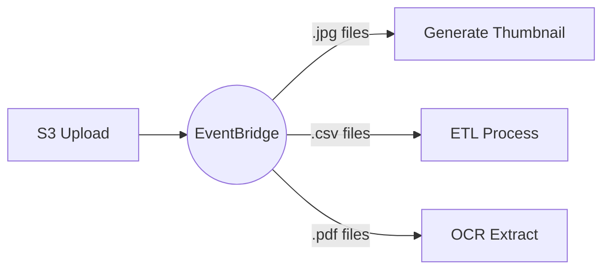
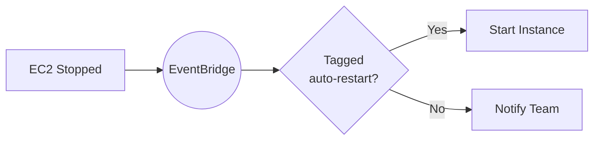
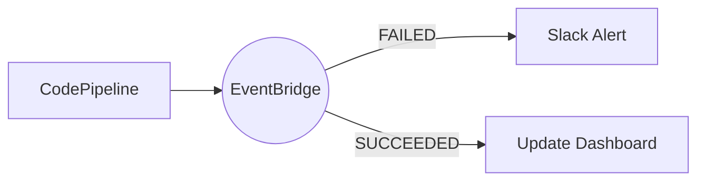
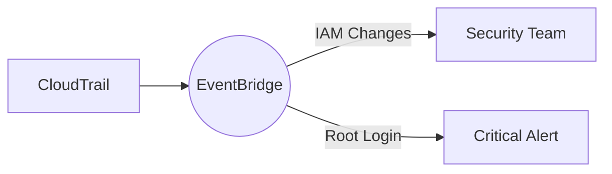

# AWS Service Integration: Events from 200+ Services

## What the Main Page Introduced

The main page explained that EventBridge receives events from AWS services automatically - no setup required. This is a key advantage over manual integration approaches. Now let's explore which services send events, what those events look like, and how to use them effectively.

## Going Deeper

In this sub-chapter, we'll explore:
1. **Which services send events** - The complete picture
2. **Event structure by service** - Real examples from S3, EC2, and more
3. **Enabling service events** - When setup IS required
4. **Common patterns** - Building automations with service events
5. **Service event gotchas** - What to watch out for

---

## Which Services Send Events?

Over 200 AWS services publish events to the default EventBridge bus. Here's a categorized overview:

### Compute Services

| Service | Event Types | Use Cases |
|---------|-------------|-----------|
| **EC2** | Instance state changes, Spot interruption | Auto-remediation, cost alerts |
| **Lambda** | None (Lambda triggers FROM events) | - |
| **ECS** | Task/service state changes | Deployment monitoring |
| **EKS** | Cluster events | Platform monitoring |
| **Batch** | Job state changes | Pipeline orchestration |

### Storage Services

| Service | Event Types | Use Cases |
|---------|-------------|-----------|
| **S3** | Object created/deleted/restored | Processing pipelines |
| **EBS** | Snapshot events, volume changes | Backup monitoring |
| **EFS** | Lifecycle events | Storage management |
| **Glacier** | Restore notifications | Archive workflows |

### Database Services

| Service | Event Types | Use Cases |
|---------|-------------|-----------|
| **RDS** | Instance events, snapshots, failover | DB monitoring |
| **DynamoDB** | None (use Streams instead) | - |
| **Aurora** | Cluster events, failover | HA monitoring |
| **ElastiCache** | Cluster events | Cache management |

### Developer Tools

| Service | Event Types | Use Cases |
|---------|-------------|-----------|
| **CodePipeline** | Pipeline/stage/action state | CI/CD notifications |
| **CodeBuild** | Build state changes | Build monitoring |
| **CodeDeploy** | Deployment state | Deployment tracking |
| **CodeCommit** | Repository events | Git automation |

### Management & Governance

| Service | Event Types | Use Cases |
|---------|-------------|-----------|
| **CloudWatch** | Alarm state changes | Alerting automation |
| **CloudTrail** | API activity (via Events) | Security monitoring |
| **Config** | Configuration changes | Compliance automation |
| **Health** | Service health events | Incident response |

---

## Real Event Examples

### S3 Object Created

When S3 event notifications are enabled and configured to send to EventBridge:

```json
{
  "version": "0",
  "id": "17793124-05d4-b198-2fde-7ededc63b103",
  "detail-type": "Object Created",
  "source": "aws.s3",
  "account": "123456789012",
  "time": "2024-03-23T10:30:00Z",
  "region": "us-east-1",
  "resources": ["arn:aws:s3:::my-bucket"],
  "detail": {
    "version": "0",
    "bucket": {
      "name": "my-bucket"
    },
    "object": {
      "key": "uploads/photo.jpg",
      "size": 1024000,
      "etag": "d41d8cd98f00b204e9800998ecf8427e",
      "sequencer": "00638C8E850DE8D832"
    },
    "request-id": "C3D13FE58DE4C810",
    "requester": "123456789012",
    "source-ip-address": "203.0.113.15",
    "reason": "PutObject"
  }
}
```

**Useful filter patterns:**

```json
// Only JPG uploads
{
  "source": ["aws.s3"],
  "detail-type": ["Object Created"],
  "detail": {
    "bucket": {"name": ["my-bucket"]},
    "object": {"key": [{"suffix": ".jpg"}]}
  }
}

// Files over 1MB
{
  "source": ["aws.s3"],
  "detail": {
    "object": {"size": [{"numeric": [">", 1048576]}]}
  }
}
```

### EC2 Instance State Change

```json
{
  "version": "0",
  "id": "ee376907-2647-4179-9203-343cfb3017a4",
  "detail-type": "EC2 Instance State-change Notification",
  "source": "aws.ec2",
  "account": "123456789012",
  "time": "2024-03-23T10:30:00Z",
  "region": "us-east-1",
  "resources": [
    "arn:aws:ec2:us-east-1:123456789012:instance/i-1234567890abcdef0"
  ],
  "detail": {
    "instance-id": "i-1234567890abcdef0",
    "state": "stopped"
  }
}
```

**Useful filter patterns:**

```json
// Instance stopped or terminated
{
  "source": ["aws.ec2"],
  "detail-type": ["EC2 Instance State-change Notification"],
  "detail": {
    "state": ["stopped", "terminated"]
  }
}
```

### CodePipeline Execution State Change

```json
{
  "version": "0",
  "id": "CWE-event-id",
  "detail-type": "CodePipeline Pipeline Execution State Change",
  "source": "aws.codepipeline",
  "account": "123456789012",
  "time": "2024-03-23T10:30:00Z",
  "region": "us-east-1",
  "resources": [
    "arn:aws:codepipeline:us-east-1:123456789012:my-pipeline"
  ],
  "detail": {
    "pipeline": "my-pipeline",
    "execution-id": "01234567-0123-0123-0123-012345678901",
    "state": "FAILED",
    "version": 1
  }
}
```

**Useful filter patterns:**

```json
// Pipeline failures
{
  "source": ["aws.codepipeline"],
  "detail-type": ["CodePipeline Pipeline Execution State Change"],
  "detail": {
    "state": ["FAILED"]
  }
}
```

### CloudWatch Alarm State Change

```json
{
  "version": "0",
  "id": "c4c1c1c9-6542-e61b-6ef0-8c4d36933a92",
  "detail-type": "CloudWatch Alarm State Change",
  "source": "aws.cloudwatch",
  "account": "123456789012",
  "time": "2024-03-23T10:30:00Z",
  "region": "us-east-1",
  "resources": [
    "arn:aws:cloudwatch:us-east-1:123456789012:alarm:High-CPU"
  ],
  "detail": {
    "alarmName": "High-CPU",
    "state": {
      "value": "ALARM",
      "reason": "Threshold Crossed: 1 datapoint was greater than the threshold",
      "timestamp": "2024-03-23T10:30:00.000+0000"
    },
    "previousState": {
      "value": "OK",
      "timestamp": "2024-03-23T10:25:00.000+0000"
    },
    "configuration": {
      "metrics": [...]
    }
  }
}
```

---

## Enabling Service Events

Most services send events automatically. Some require configuration:

### S3 → EventBridge (Requires Setup)

S3 must be explicitly configured to send events to EventBridge:

**Console:**
```
S3 → Bucket → Properties → Event notifications →
Amazon EventBridge → Enable
```

**CloudFormation:**

```yaml
S3Bucket:
  Type: AWS::S3::Bucket
  Properties:
    BucketName: my-bucket
    NotificationConfiguration:
      EventBridgeConfiguration:
        EventBridgeEnabled: true
```

**Why setup is needed:** S3 events are high-volume. AWS wants you to opt-in rather than surprise you with costs.

### CloudTrail → EventBridge

CloudTrail can send API call events to EventBridge:

```yaml
CloudTrail:
  Type: AWS::CloudTrail::Trail
  Properties:
    TrailName: my-trail
    IsMultiRegionTrail: true
    S3BucketName: !Ref TrailBucket
    # Events automatically go to EventBridge
```

Then filter by API call:

```json
{
  "source": ["aws.ec2"],
  "detail-type": ["AWS API Call via CloudTrail"],
  "detail": {
    "eventSource": ["ec2.amazonaws.com"],
    "eventName": ["RunInstances"]
  }
}
```

---

## Common Automation Patterns

### Pattern 1: S3 Upload Processing



```yaml
JpgProcessingRule:
  Type: AWS::Events::Rule
  Properties:
    EventPattern:
      source: ["aws.s3"]
      detail-type: ["Object Created"]
      detail:
        bucket: {name: ["uploads-bucket"]}
        object: {key: [{suffix: ".jpg"}]}
    Targets:
      - Id: ThumbnailGenerator
        Arn: !GetAtt ThumbnailFunction.Arn
```

### Pattern 2: EC2 Auto-Remediation



```yaml
AutoRestartRule:
  Type: AWS::Events::Rule
  Properties:
    EventPattern:
      source: ["aws.ec2"]
      detail-type: ["EC2 Instance State-change Notification"]
      detail:
        state: ["stopped"]
    Targets:
      - Id: RestartChecker
        Arn: !GetAtt AutoRestartFunction.Arn
```

### Pattern 3: CI/CD Notifications



```yaml
PipelineFailureRule:
  Type: AWS::Events::Rule
  Properties:
    EventPattern:
      source: ["aws.codepipeline"]
      detail-type: ["CodePipeline Pipeline Execution State Change"]
      detail:
        state: ["FAILED"]
    Targets:
      - Id: SlackNotification
        Arn: !Ref SlackApiDestination
        RoleArn: !GetAtt EventBridgeRole.Arn
```

### Pattern 4: Security Monitoring



```json
{
  "source": ["aws.iam"],
  "detail-type": ["AWS API Call via CloudTrail"],
  "detail": {
    "eventName": [
      "CreateUser",
      "DeleteUser",
      "AttachUserPolicy",
      "CreateAccessKey"
    ]
  }
}
```

---

## Service Event Gotchas

### Gotcha 1: Event Delivery Timing

AWS service events are **not instant**. Typical delays:

| Service | Typical Delay |
|---------|---------------|
| S3 | < 1 minute |
| EC2 | < 30 seconds |
| CodePipeline | Nearly instant |
| CloudTrail | 5-15 minutes |

Don't design systems that require sub-second reactions to service events.

### Gotcha 2: S3 Event Duplication

S3 events can occasionally be duplicated. Your handlers must be idempotent:

```python
def handler(event, context):
    s3_key = event['detail']['object']['key']

    # Check if already processed
    if is_already_processed(s3_key):
        return

    process(s3_key)
    mark_processed(s3_key)
```

### Gotcha 3: Event Schema Changes

AWS can add fields to events without warning. Don't fail on unexpected fields:

```python
# Bad - fails if new field added
def handler(event):
    expected_fields = ['source', 'detail-type', 'detail']
    assert set(event.keys()) == set(expected_fields)

# Good - tolerates new fields
def handler(event):
    source = event.get('source')
    detail = event.get('detail', {})
```

### Gotcha 4: Default Bus Only

AWS service events ONLY go to the default bus. You can't redirect them to a custom bus directly.

**Workaround:** Create a rule on the default bus that forwards to your custom bus:

```yaml
ForwardToCustomBus:
  Type: AWS::Events::Rule
  Properties:
    EventBusName: default
    EventPattern:
      source: ["aws.s3"]
    Targets:
      - Id: CustomBus
        Arn: !GetAtt MyCustomBus.Arn
```

---

## Did You Know?

**Did you know?** AWS Health events can tell you about upcoming maintenance windows, service disruptions, and scheduled changes. Create rules to get proactive alerts before issues affect you.

**Here's something interesting:** EC2 Spot interruption warnings give you 2 minutes notice before termination. Use EventBridge rules to gracefully drain work:

```json
{
  "source": ["aws.ec2"],
  "detail-type": ["EC2 Spot Instance Interruption Warning"]
}
```

**One more thing:** GuardDuty security findings are also EventBridge events. You can build automated security responses without additional integration.

---

## Exam Tips

**Key points for DVA-C02:**

1. **Default bus only**: AWS service events go to default bus only
2. **S3 requires setup**: Must enable EventBridge in S3 notification config
3. **CloudTrail detail-type**: "AWS API Call via CloudTrail"
4. **Event delivery**: Not instant - account for delays

**Common exam patterns:**

> "Process files uploaded to S3 based on extension..."
> → S3 to EventBridge with suffix pattern

> "Alert when EC2 instances stop unexpectedly..."
> → EC2 State Change to EventBridge to SNS/Lambda

> "Monitor for IAM policy changes..."
> → CloudTrail events via EventBridge

---

## Quick Reference

| Service | Source | Detail-Type Example |
|---------|--------|---------------------|
| S3 | `aws.s3` | `Object Created`, `Object Deleted` |
| EC2 | `aws.ec2` | `EC2 Instance State-change Notification` |
| CodePipeline | `aws.codepipeline` | `CodePipeline Pipeline Execution State Change` |
| CloudWatch | `aws.cloudwatch` | `CloudWatch Alarm State Change` |
| CloudTrail | `aws.{service}` | `AWS API Call via CloudTrail` |
| Health | `aws.health` | `AWS Health Event` |

---

## Key Takeaways

- **200+ services** send events automatically to the default bus
- **S3 requires opt-in** - enable EventBridge in bucket configuration
- **CloudTrail enables API monitoring** - "AWS API Call via CloudTrail" events
- **Events aren't instant** - design for eventual consistency
- **Idempotent handlers** - service events can occasionally duplicate
- **Consumer-decides model** - consumers filter service events with patterns; AWS services (publishers) don't need to know about your rules

---

*Next: **Custom Events** - Now let's learn how to publish your own events from your applications.*


---
*v2.0*
