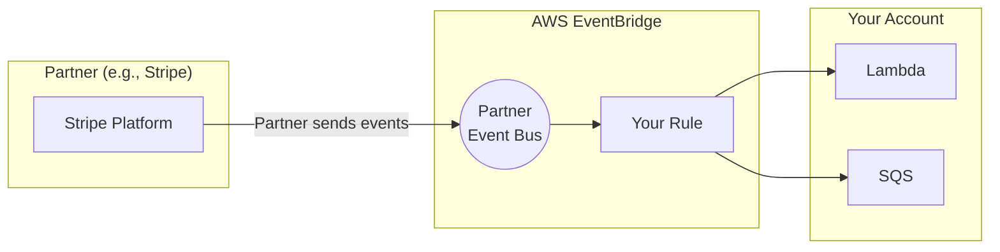
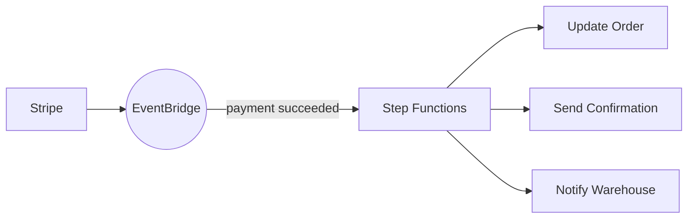
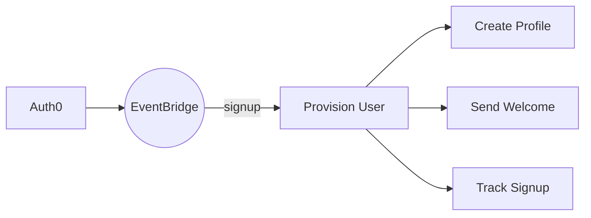
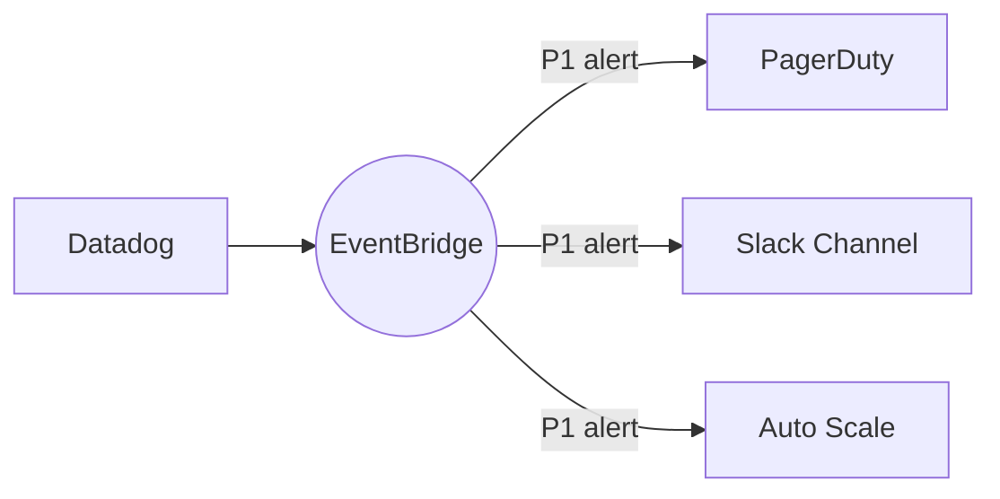

# SaaS Partner Integration: Stripe, Auth0, and Beyond

## What the Main Page Introduced

The main page mentioned that EventBridge can receive events from SaaS partners without custom webhook handlers. This extends the **consumer-decides** model to third-party services. Now let's see how partner integrations work and how to use them.

## Going Deeper

In this sub-chapter, we'll explore:
1. **How partner integrations work** - The architecture
2. **Setting up partner event sources** - Step by step
3. **Available partners** - Who's integrated
4. **Event examples** - What partner events look like
5. **Building on partner events** - Real patterns
6. **vs Custom webhooks** - When to use each

---

## How Partner Integrations Work

### The Architecture



**Key insight:** Partners send events directly to a dedicated partner event bus in your account. You don't need to:
- Set up API Gateway endpoints
- Handle webhook authentication
- Parse different payload formats
- Manage webhook retries

### Partner Event Buses vs Regular Buses

| Aspect | Partner Event Bus | Default/Custom Bus |
|--------|-------------------|-------------------|
| **Created by** | AWS when you connect partner | You |
| **Event source** | Partner only | AWS services, your apps |
| **Event format** | Standardized EventBridge envelope | Standardized |
| **Authentication** | Handled by AWS | N/A |

---

## Setting Up Partner Event Sources

### Step 1: Find the Partner

In EventBridge console:
```
EventBridge → Partner event sources → Browse partners
```

Or via CLI:
```bash
aws events list-event-sources
```

### Step 2: Set Up with the Partner

Each partner has a different setup flow. Example for Stripe:

1. **In Stripe Dashboard:**
   - Go to Developers → Webhooks
   - Click "Add destination" → "Amazon EventBridge"
   - Select AWS region and enter AWS account ID
   - Choose events to send

2. **In AWS Console:**
   - Go to EventBridge → Partner event sources
   - You'll see a pending event source from Stripe
   - Click "Associate with event bus"

### Step 3: Associate the Event Source

```bash
# List pending partner event sources
aws events list-partner-event-source-accounts \
  --event-source-name aws.partner/stripe.com/123456

# Associate with an event bus
aws events create-partner-event-source \
  --name aws.partner/stripe.com/123456
```

### Step 4: Create Rules

Once associated, create rules like any other bus:

```yaml
StripePaymentRule:
  Type: AWS::Events::Rule
  Properties:
    EventBusName: aws.partner/stripe.com/123456
    EventPattern:
      source:
        - "aws.partner/stripe.com"
      detail-type:
        - "payment_intent.succeeded"
    Targets:
      - Id: ProcessPayment
        Arn: !GetAtt PaymentFunction.Arn
```

---

## Available Partners

### Tier 1 Partners (Deep Integration)

| Partner | Event Types | Use Cases |
|---------|-------------|-----------|
| **Stripe** | Payments, subscriptions, invoices | Payment processing |
| **Auth0** | Logins, signups, MFA events | Identity events |
| **Datadog** | Alerts, monitors | Observability automation |
| **PagerDuty** | Incidents, alerts | Incident response |
| **Zendesk** | Tickets, users | Support automation |
| **Twilio** | Messages, calls | Communication events |
| **MongoDB** | Database triggers | Data sync |

### Tier 2 Partners

| Partner | Category |
|---------|----------|
| **New Relic** | Monitoring |
| **Sumo Logic** | Log analytics |
| **Segment** | Customer data |
| **SailPoint** | Identity governance |
| **Saviynt** | Security |

### Full Partner List

```bash
# See all available partners
aws events list-event-sources --name-prefix aws.partner
```

Or visit: AWS Console → EventBridge → Partner event sources

---

## Partner Event Examples

### Stripe: payment_intent.succeeded

```json
{
  "version": "0",
  "id": "abc123-def456",
  "detail-type": "payment_intent.succeeded",
  "source": "aws.partner/stripe.com",
  "account": "123456789012",
  "time": "2024-03-23T10:30:00Z",
  "region": "us-east-1",
  "resources": [],
  "detail": {
    "id": "pi_abc123",
    "object": "payment_intent",
    "amount": 9999,
    "currency": "usd",
    "status": "succeeded",
    "customer": "cus_xyz789",
    "metadata": {
      "order_id": "order-123"
    },
    "created": 1711187400
  }
}
```

**Pattern for high-value payments:**

```json
{
  "source": ["aws.partner/stripe.com"],
  "detail-type": ["payment_intent.succeeded"],
  "detail": {
    "amount": [{"numeric": [">=", 10000]}]
  }
}
```

### Auth0: Login Success

```json
{
  "version": "0",
  "id": "xyz789",
  "detail-type": "Login Success",
  "source": "aws.partner/auth0.com",
  "account": "123456789012",
  "time": "2024-03-23T10:30:00Z",
  "region": "us-east-1",
  "detail": {
    "date": "2024-03-23T10:30:00.000Z",
    "type": "s",
    "client_id": "abc123",
    "client_name": "PetTracker Web",
    "ip": "203.0.113.15",
    "user_agent": "Mozilla/5.0...",
    "user_id": "auth0|user123",
    "user_name": "alex@pettracker.com",
    "connection": "Username-Password-Authentication",
    "strategy": "auth0"
  }
}
```

**Pattern for suspicious logins:**

```json
{
  "source": ["aws.partner/auth0.com"],
  "detail-type": ["Login Success"],
  "detail": {
    "connection": [{"anything-but": ["Username-Password-Authentication"]}]
  }
}
```

### Datadog: Alert Triggered

```json
{
  "version": "0",
  "id": "alert123",
  "detail-type": "alert",
  "source": "aws.partner/datadog.com",
  "account": "123456789012",
  "time": "2024-03-23T10:30:00Z",
  "region": "us-east-1",
  "detail": {
    "alert_id": "12345",
    "alert_type": "metric alert",
    "alert_title": "High CPU on Production",
    "alert_status": "Triggered",
    "priority": "P1",
    "tags": ["env:production", "service:api"],
    "hostname": "api-server-1"
  }
}
```

---

## Building on Partner Events

### Pattern 1: Stripe Payment → Order Fulfillment



```yaml
PaymentSucceededRule:
  Type: AWS::Events::Rule
  Properties:
    EventBusName: aws.partner/stripe.com/123456
    EventPattern:
      detail-type: ["payment_intent.succeeded"]
    Targets:
      - Id: OrderFulfillment
        Arn: !Ref FulfillmentStateMachine
        RoleArn: !GetAtt EventBridgeRole.Arn
        InputTransformer:
          InputPathsMap:
            orderId: "$.detail.metadata.order_id"
            amount: "$.detail.amount"
            customer: "$.detail.customer"
          InputTemplate: |
            {
              "orderId": "<orderId>",
              "amount": <amount>,
              "stripeCustomer": "<customer>"
            }
```

### Pattern 2: Auth0 → User Provisioning



```python
def handle_auth0_signup(event, context):
    detail = event['detail']

    user_id = detail['user_id']
    email = detail['user_name']
    connection = detail['connection']

    # Create user profile in DynamoDB
    table.put_item(Item={
        'userId': user_id,
        'email': email,
        'authProvider': connection,
        'createdAt': datetime.now().isoformat()
    })

    # Send welcome email
    ses.send_email(
        Destination={'ToAddresses': [email]},
        Message={
            'Subject': {'Data': 'Welcome to PetTracker!'},
            'Body': {'Text': {'Data': f'Hi {email}, welcome aboard!'}}
        }
    )
```

### Pattern 3: Datadog Alert → Incident Response



---

## Partner Events vs Custom Webhooks

### When to Use Partner Integration

✅ **Use partner integration when:**
- Partner is in the EventBridge partner list
- You want standardized event format
- You need reliable delivery with retries
- You want to filter events before processing
- You're already using EventBridge

### When to Use Custom Webhooks

✅ **Use custom webhooks when:**
- Partner isn't an EventBridge partner
- You need sub-second latency (partner integration adds latency)
- You need to respond synchronously to the webhook
- You have very specific authentication requirements

### Comparison

| Aspect | Partner Integration | Custom Webhook |
|--------|---------------------|----------------|
| **Setup effort** | Low (click through) | Medium (API Gateway + Lambda) |
| **Authentication** | Handled by AWS | You implement |
| **Event format** | Standardized | Varies by partner |
| **Filtering** | EventBridge patterns | Lambda code |
| **Retries** | Built-in | You implement |
| **Latency** | Seconds | Sub-second |
| **Cost** | EventBridge pricing | API Gateway + Lambda |

---

## Handling Partner Event Quirks

### Quirk 1: Different Detail-Type Per Event

Partners use different detail-types for each event type:

```json
// Stripe uses the Stripe event type
{"detail-type": "payment_intent.succeeded"}
{"detail-type": "customer.subscription.created"}
{"detail-type": "invoice.paid"}

// Auth0 uses descriptive names
{"detail-type": "Login Success"}
{"detail-type": "Signup Success"}
{"detail-type": "Failed Login"}
```

**Pattern for multiple Stripe events:**

```json
{
  "source": ["aws.partner/stripe.com"],
  "detail-type": [
    "payment_intent.succeeded",
    "payment_intent.payment_failed"
  ]
}
```

### Quirk 2: Partner Event Delays

Partner events can have delays:

| Partner | Typical Delay |
|---------|---------------|
| Stripe | < 10 seconds |
| Auth0 | < 30 seconds |
| Datadog | < 1 minute |

Don't design systems that require instant reaction to partner events.

### Quirk 3: Deduplication

Partners may occasionally send duplicate events. Use the event ID for deduplication:

```python
def handler(event, context):
    event_id = event['id']

    # Check if already processed
    existing = table.get_item(Key={'eventId': event_id})
    if 'Item' in existing:
        return {'statusCode': 200, 'body': 'Already processed'}

    # Process the event
    process(event)

    # Mark as processed
    table.put_item(Item={'eventId': event_id, 'processedAt': datetime.now().isoformat()})
```

---

## Did You Know?

**Did you know?** You can have multiple partner event sources from the same partner. This is useful for separating test vs production Stripe accounts.

**Here's something interesting:** Partner event buses are created in YOUR account. You control the rules and targets - the partner just sends events.

**One more thing:** Some partners (like Stripe) let you choose which events to send. Only enable what you need to reduce noise and cost.

---

## Exam Tips

**Key points for DVA-C02:**

1. **Partner event buses**: Created when you associate a partner event source
2. **Format**: Standard EventBridge envelope with partner payload in detail
3. **Rules work the same**: Same pattern matching as any event bus
4. **Authentication**: Handled by AWS, not you

**Common exam patterns:**

> "Process Stripe payment events without managing webhooks..."
> → EventBridge partner integration

> "Need to filter partner events by amount before processing..."
> → Use EventBridge rule with numeric pattern

> "Real-time reaction to third-party events..."
> → Consider latency; partner events aren't instant

---

## Quick Reference

| Step | Action |
|------|--------|
| 1 | Find partner in EventBridge console |
| 2 | Configure in partner dashboard |
| 3 | Associate event source in AWS |
| 4 | Create rules on partner bus |
| 5 | Add targets (Lambda, SQS, etc.) |

---

## Key Takeaways

- **Partner integration removes webhook complexity** - no custom handlers needed
- **Standard EventBridge envelope** - partner payload in the `detail` field
- **Same pattern matching** - filter partner events like any other
- **Built-in reliability** - AWS handles retries and delivery
- **Not instant** - expect seconds to minutes of delay
- **Consumer-decides model extends to partners** - you create rules to subscribe to partner events without touching the partner's configuration

---

*Next: **EventBridge Scheduler** - Let's explore time-based event triggering beyond simple cron jobs.*


---
*v1.0*
