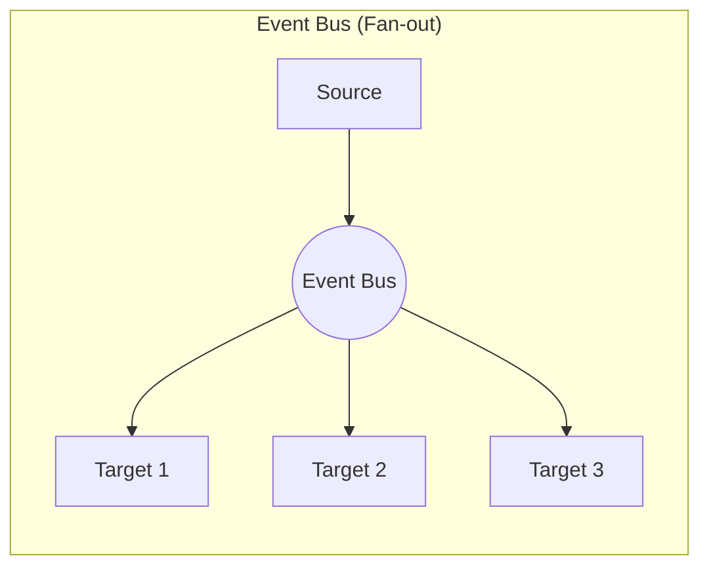
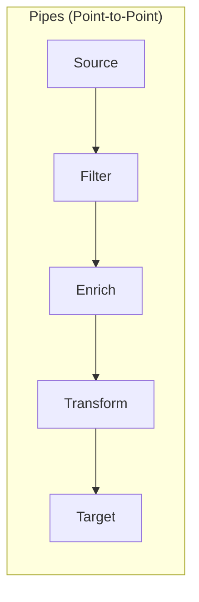
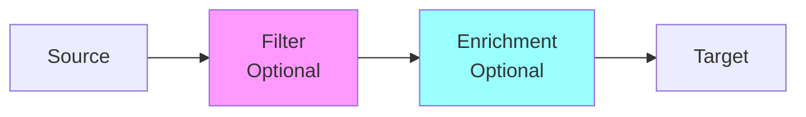
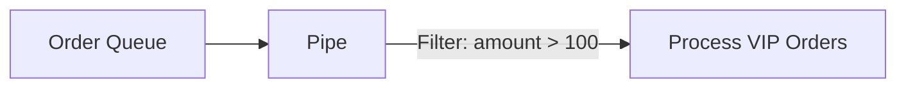
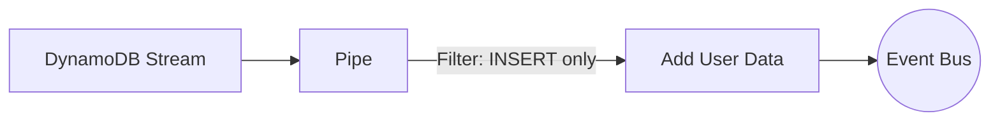
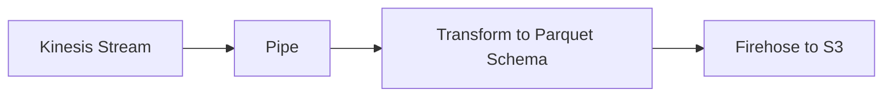
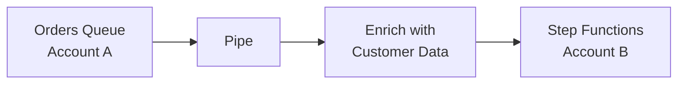

# EventBridge Pipes: Point-to-Point Integration

## What the Main Page Introduced

The main page focused on the event bus model where consumers subscribe via rules. EventBridge Pipes is different - it's for **point-to-point** integration with filtering, enrichment, and transformation built in. Think of it as a serverless ETL pipeline for events.

## Going Deeper

In this sub-chapter, we'll explore:
1. **Pipes vs Event Bus** - When to use each
2. **Pipe anatomy** - Source, filter, enrichment, target
3. **Supported sources and targets** - What can connect
4. **Filtering and transformation** - Processing inline
5. **Enrichment** - Adding data from external sources
6. **Real-world patterns** - Common use cases

---

## Pipes vs Event Bus

### The Key Difference





| Aspect | Event Bus | Pipes |
|--------|-----------|-------|
| **Pattern** | Pub/sub, fan-out | Point-to-point |
| **Consumers** | Many (via rules) | One per pipe |
| **Filtering** | In rules | In pipe |
| **Enrichment** | Lambda in between | Built-in |
| **Sources** | PutEvents, AWS services | SQS, Kinesis, DynamoDB Streams, Kafka |
| **Batching** | No | Yes |

### When to Use Pipes

**Use Pipes when:**
- Reading from SQS, Kinesis, DynamoDB Streams, or Kafka
- You need to enrich events before delivery
- You want built-in batching
- Point-to-point with transformation

**Use Event Bus when:**
- Multiple consumers need the same events
- Publishing custom events
- AWS service event reactions
- Partner integrations

---

## Pipe Anatomy

A pipe has four stages:



### 1. Source (Required)

Where events come from:

| Source | Description |
|--------|-------------|
| **SQS** | Standard or FIFO queues |
| **Kinesis Data Streams** | Real-time streaming |
| **DynamoDB Streams** | Change data capture |
| **Amazon MQ** | ActiveMQ/RabbitMQ |
| **Apache Kafka** | MSK or self-managed |

### 2. Filter (Optional)

Keep only events you want:

```json
{
  "body": {
    "eventType": ["ORDER_CREATED"],
    "amount": [{"numeric": [">", 100]}]
  }
}
```

### 3. Enrichment (Optional)

Add data from external sources:

| Enrichment | Use Case |
|------------|----------|
| **Lambda** | Any custom logic |
| **Step Functions** | Complex workflows |
| **API Gateway** | External APIs |
| **API Destination** | Third-party services |

### 4. Target (Required)

Where to deliver:

| Target | Description |
|--------|-------------|
| **Lambda** | Event processing |
| **Step Functions** | Workflows |
| **EventBridge Bus** | Fan-out |
| **Kinesis Streams** | Streaming |
| **Firehose** | Data lakes |
| **SQS** | Queue handoff |
| **SNS** | Notifications |
| **ECS Task** | Container jobs |
| **API Gateway** | HTTP endpoints |
| **API Destination** | External services |

---

## Creating a Pipe

### Console

```
EventBridge → Pipes → Create pipe
```

### CloudFormation

```yaml
OrderProcessingPipe:
  Type: AWS::Pipes::Pipe
  Properties:
    Name: order-processing-pipe
    Description: Process orders from SQS to Lambda

    Source: !GetAtt OrderQueue.Arn
    SourceParameters:
      SqsQueueParameters:
        BatchSize: 10
        MaximumBatchingWindowInSeconds: 30

    FilterCriteria:
      Filters:
        - Pattern: '{"body": {"eventType": ["ORDER_CREATED"]}}'

    Enrichment: !GetAtt EnrichmentFunction.Arn
    EnrichmentParameters:
      InputTemplate: '{"orderId": <$.body.orderId>}'

    Target: !GetAtt ProcessOrderFunction.Arn
    TargetParameters:
      LambdaFunctionParameters:
        InvocationType: REQUEST_RESPONSE

    RoleArn: !GetAtt PipeRole.Arn
```

### SDK (Python)

```python
import boto3

pipes = boto3.client('pipes')

pipes.create_pipe(
    Name='order-processing',
    Source='arn:aws:sqs:us-east-1:123456789012:orders',
    SourceParameters={
        'SqsQueueParameters': {
            'BatchSize': 10,
            'MaximumBatchingWindowInSeconds': 30
        }
    },
    FilterCriteria={
        'Filters': [
            {'Pattern': '{"body": {"eventType": ["ORDER_CREATED"]}}'}
        ]
    },
    Target='arn:aws:lambda:us-east-1:123456789012:function:process-order',
    RoleArn='arn:aws:iam::123456789012:role/PipeRole'
)
```

---

## Filtering in Pipes

### Filter Syntax

Same pattern matching as EventBridge rules:

```json
{
  "body": {
    "eventType": ["ORDER_CREATED", "ORDER_UPDATED"],
    "amount": [{"numeric": [">=", 100]}],
    "status": [{"anything-but": ["CANCELLED"]}]
  }
}
```

### Source-Specific Fields

**SQS:**
```json
{
  "body": {...},           // Message body (parsed JSON)
  "messageId": [...],
  "messageAttributes": {
    "eventType": {
      "stringValue": [...]
    }
  }
}
```

**DynamoDB Streams:**
```json
{
  "eventName": ["INSERT", "MODIFY"],
  "dynamodb": {
    "NewImage": {
      "status": {
        "S": ["ACTIVE"]
      }
    }
  }
}
```

**Kinesis:**
```json
{
  "data": {...},           // Base64-decoded, parsed JSON
  "partitionKey": [...]
}
```

### Filter Efficiency

Filtering happens BEFORE Lambda invocation:

```
Without filter: 1000 messages → 1000 Lambda invocations
With filter: 1000 messages → 100 matching → 100 Lambda invocations
```

**Cost savings:** You only pay for matched events.

---

## Enrichment

Enrichment adds data from external sources before delivery.

### Lambda Enrichment

```yaml
EnrichmentFunction:
  Type: AWS::Lambda::Function
  Properties:
    FunctionName: enrich-order
    Handler: index.handler
    Code:
      ZipFile: |
        def handler(events, context):
            enriched = []
            for event in events:
                order_id = event['orderId']
                # Lookup customer details
                customer = get_customer(event['customerId'])
                event['customerName'] = customer['name']
                event['customerTier'] = customer['tier']
                enriched.append(event)
            return enriched

Pipe:
  Properties:
    Enrichment: !GetAtt EnrichmentFunction.Arn
    EnrichmentParameters:
      InputTemplate: '{"orderId": <$.body.orderId>, "customerId": <$.body.customerId>}'
```

### API Gateway Enrichment

Call an existing API for data:

```yaml
EnrichmentParameters:
  HttpParameters:
    PathParameterValues:
      - $.body.customerId
    HeaderParameters:
      Authorization: "Bearer ${token}"
```

### When to Use Enrichment

| Scenario | Use Enrichment? |
|----------|-----------------|
| Add customer name to order | ✅ Yes |
| Complex business logic | ❌ Do in target Lambda |
| Multiple API calls | ❌ Too slow |
| Lookup from cache/DB | ✅ Yes |

---

## Input Transformation

Transform the event before delivery to target:

### InputTemplate

```yaml
TargetParameters:
  InputTemplate: |
    {
      "orderId": <$.body.orderId>,
      "total": <$.body.amount>,
      "customerEmail": <$.enrichment.email>,
      "processedAt": <aws.pipes.event.ingestion-time>
    }
```

### Available Variables

| Variable | Description |
|----------|-------------|
| `$.body` | Message body |
| `$.enrichment` | Enrichment response |
| `<aws.pipes.event.ingestion-time>` | When pipe received event |
| `<aws.pipes.pipe-arn>` | Pipe ARN |
| `<aws.pipes.pipe-name>` | Pipe name |

---

## Real-World Patterns

### Pattern 1: SQS to Lambda with Filtering



```yaml
VIPOrderPipe:
  Type: AWS::Pipes::Pipe
  Properties:
    Source: !GetAtt OrderQueue.Arn
    SourceParameters:
      SqsQueueParameters:
        BatchSize: 10
    FilterCriteria:
      Filters:
        - Pattern: '{"body": {"amount": [{"numeric": [">", 100]}]}}'
    Target: !GetAtt VIPProcessFunction.Arn
    RoleArn: !GetAtt PipeRole.Arn
```

### Pattern 2: DynamoDB to EventBridge



```yaml
NewUserPipe:
  Type: AWS::Pipes::Pipe
  Properties:
    Source: !GetAtt UsersTable.StreamArn
    SourceParameters:
      DynamoDBStreamParameters:
        StartingPosition: LATEST
        BatchSize: 100
    FilterCriteria:
      Filters:
        - Pattern: '{"eventName": ["INSERT"]}'
    Enrichment: !GetAtt UserEnrichmentFunction.Arn
    Target: !GetAtt UserEventsBus.Arn
    TargetParameters:
      EventBridgeEventBusParameters:
        Source: "users.registration"
        DetailType: "User Registered"
    RoleArn: !GetAtt PipeRole.Arn
```

### Pattern 3: Kinesis to Firehose with Transform



```yaml
AnalyticsPipe:
  Type: AWS::Pipes::Pipe
  Properties:
    Source: !GetAtt ClickstreamStream.Arn
    SourceParameters:
      KinesisStreamParameters:
        StartingPosition: LATEST
        BatchSize: 100
    Target: !GetAtt AnalyticsFirehose.Arn
    TargetParameters:
      InputTemplate: |
        {
          "timestamp": <$.approximateArrivalTimestamp>,
          "userId": <$.data.userId>,
          "action": <$.data.action>,
          "pageUrl": <$.data.url>
        }
    RoleArn: !GetAtt PipeRole.Arn
```

### Pattern 4: Cross-Account with Enrichment



---

## Did You Know?

**Did you know?** Pipes can handle up to 1,000 records per batch from Kinesis and DynamoDB Streams, but only 10,000 messages per second from SQS.

**Here's something interesting:** Filter patterns in Pipes use the exact same syntax as EventBridge rules. If you know one, you know both.

**One more thing:** Pipes automatically handle failures with configurable retry policies and can send failed events to a DLQ.

---

## Exam Tips

**Key points for DVA-C02:**

1. **Pipes vs Bus**: Pipes are point-to-point; buses are pub/sub
2. **Sources**: SQS, Kinesis, DynamoDB Streams, MQ, Kafka (not S3!)
3. **Enrichment**: Lambda, Step Functions, API Gateway, API Destination
4. **Filtering**: Same syntax as EventBridge rules

**Common exam patterns:**

> "Process only INSERT events from DynamoDB to Lambda..."
> → EventBridge Pipe with filter on eventName

> "Enrich SQS messages with customer data before processing..."
> → Pipe with Lambda enrichment

> "Batch Kinesis records and transform before S3..."
> → Pipe with Firehose target and InputTemplate

---

## Quick Reference

| Component | Options |
|-----------|---------|
| **Sources** | SQS, Kinesis, DynamoDB Streams, MQ, Kafka |
| **Filters** | EventBridge pattern syntax |
| **Enrichment** | Lambda, Step Functions, API Gateway, API Destination |
| **Targets** | Lambda, Step Functions, EventBridge, Kinesis, SQS, SNS, etc. |

---

## Key Takeaways

- **Pipes are point-to-point** - one source to one target with processing in between
- **Built-in filtering** reduces unnecessary processing and cost
- **Enrichment** adds data without intermediate Lambda functions
- **Same filter syntax** as EventBridge rules - learn once, use everywhere
- **Great for ETL** - SQS/Kinesis/DynamoDB to anywhere with transformation
- **Pipes complement event buses** - use buses for fan-out, pipes for point-to-point enrichment

---

*Next: **Input Transformation** - Let's dive deeper into reshaping event data.*

