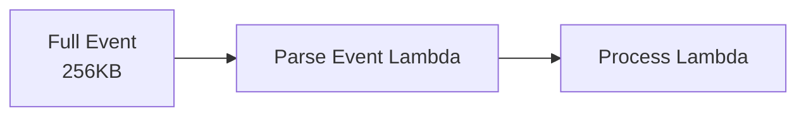

# Input Transformation: Reshaping Event Data

## What the Main Page Introduced

The main page mentioned that EventBridge can transform events before delivery. Input transformation lets you reshape event data without intermediate Lambda functions - saving cost and reducing complexity. Let's master the transformation syntax.

## Going Deeper

In this sub-chapter, we'll explore:
1. **Why transform?** - Use cases for input transformation
2. **InputPath** - Select part of the event
3. **InputTransformer** - Completely reshape events
4. **Built-in variables** - Event metadata access
5. **Target-specific transformations** - Formatting for different targets
6. **Common patterns** - Real transformation examples

---

## Why Transform?

### Without Transformation



Your Lambda receives the full EventBridge envelope:

```json
{
  "version": "0",
  "id": "abc-123",
  "detail-type": "Order Completed",
  "source": "pettracker.orders",
  "account": "123456789012",
  "time": "2024-03-23T10:30:00Z",
  "region": "us-east-1",
  "resources": [],
  "detail": {
    "orderId": "order-123",
    "userId": "user-456",
    "items": [...],
    "total": 99.99
  }
}
```

Then you extract what you need in code.

### With Transformation


Lambda receives exactly what it needs:

```json
{
  "orderId": "order-123",
  "total": 99.99,
  "processedAt": "2024-03-23T10:30:00Z"
}
```

### Benefits

| Benefit | Impact |
|---------|--------|
| **Smaller payloads** | Faster invocation, lower cost |
| **Cleaner code** | No parsing boilerplate |
| **Format conversion** | Match target expectations |
| **Add metadata** | Include event time, source |
| **Remove sensitive data** | Don't pass PII to logs |

---

## InputPath: Select Part of Event

The simplest transformation - select a portion of the event.

### Syntax

```yaml
Targets:
  - Id: MyTarget
    Arn: !GetAtt MyFunction.Arn
    InputPath: "$.detail"
```

### Examples

**Pass only the detail:**
```yaml
InputPath: "$.detail"
```

Result:
```json
{
  "orderId": "order-123",
  "userId": "user-456",
  "total": 99.99
}
```

**Pass a nested object:**
```yaml
InputPath: "$.detail.customer"
```

Result:
```json
{
  "name": "Alex",
  "email": "alex@example.com"
}
```

**Pass a specific field:**
```yaml
InputPath: "$.detail.orderId"
```

Result:
```json
"order-123"
```

### Limitations

- Can only select ONE path
- Can't combine multiple fields
- Can't add new fields
- Can't transform values

For more complex needs, use InputTransformer.

---

## InputTransformer: Full Reshaping

Complete control over the output structure.

### Two Parts

1. **InputPathsMap**: Extract values from the event
2. **InputTemplate**: Build the output using those values

### Basic Example

```yaml
Targets:
  - Id: MyTarget
    Arn: !GetAtt MyFunction.Arn
    InputTransformer:
      InputPathsMap:
        orderId: "$.detail.orderId"
        total: "$.detail.total"
        eventTime: "$.time"
      InputTemplate: |
        {
          "id": "<orderId>",
          "amount": <total>,
          "timestamp": "<eventTime>",
          "source": "eventbridge"
        }
```

### Input Event

```json
{
  "version": "0",
  "id": "abc-123",
  "detail-type": "Order Completed",
  "source": "pettracker.orders",
  "time": "2024-03-23T10:30:00Z",
  "detail": {
    "orderId": "order-123",
    "total": 99.99
  }
}
```

### Output (After Transformation)

```json
{
  "id": "order-123",
  "amount": 99.99,
  "timestamp": "2024-03-23T10:30:00Z",
  "source": "eventbridge"
}
```

### Syntax Rules

| Rule | Example |
|------|---------|
| **String values** | `"<variableName>"` (with quotes) |
| **Numeric values** | `<variableName>` (no quotes) |
| **Static strings** | `"literal value"` |
| **Static numbers** | `123.45` |
| **Static booleans** | `true` or `false` |

### Common Mistake: Quoting

❌ Wrong (number as string):
```json
{"amount": "<total>"}
```

✅ Correct (number as number):
```json
{"amount": <total>}
```

❌ Wrong (string without quotes):
```json
{"id": <orderId>}
```

✅ Correct (string with quotes):
```json
{"id": "<orderId>"}
```

---

## Built-In Variables

Access event metadata without InputPathsMap:

| Variable | Description | Example Value |
|----------|-------------|---------------|
| `<aws.events.rule-arn>` | Rule ARN | `arn:aws:events:...` |
| `<aws.events.rule-name>` | Rule name | `my-rule` |
| `<aws.events.event.ingestion-time>` | When EventBridge received it | `2024-03-23T10:30:00Z` |

### Example with Built-In Variables

```yaml
InputTransformer:
  InputPathsMap:
    orderId: "$.detail.orderId"
  InputTemplate: |
    {
      "orderId": "<orderId>",
      "ruleName": "<aws.events.rule-name>",
      "processedBy": "eventbridge-automation"
    }
```

---

## Target-Specific Transformations

Different targets expect different formats.

### SNS: Message Formatting

SNS expects a simple message string for notifications:

```yaml
Targets:
  - Id: SNSNotification
    Arn: !Ref NotificationTopic
    InputTransformer:
      InputPathsMap:
        orderId: "$.detail.orderId"
        total: "$.detail.total"
        customer: "$.detail.customerEmail"
      InputTemplate: |
        "New order <orderId> for $<total> from <customer>"
```

Output (sent to SNS):
```
"New order order-123 for $99.99 from alex@example.com"
```

### SQS: JSON Message

```yaml
Targets:
  - Id: SQSQueue
    Arn: !GetAtt ProcessingQueue.Arn
    InputTransformer:
      InputPathsMap:
        orderId: "$.detail.orderId"
        items: "$.detail.items"
      InputTemplate: |
        {
          "type": "PROCESS_ORDER",
          "orderId": "<orderId>",
          "items": <items>,
          "priority": "normal"
        }
```

### Step Functions: State Machine Input

```yaml
Targets:
  - Id: OrderWorkflow
    Arn: !Ref OrderStateMachine
    RoleArn: !GetAtt EventBridgeRole.Arn
    InputTransformer:
      InputPathsMap:
        orderId: "$.detail.orderId"
        userId: "$.detail.userId"
        items: "$.detail.items"
      InputTemplate: |
        {
          "orderId": "<orderId>",
          "userId": "<userId>",
          "items": <items>,
          "workflowType": "order-fulfillment"
        }
```

### API Destination: HTTP Body

```yaml
Targets:
  - Id: SlackWebhook
    Arn: !GetAtt SlackApiDestination.Arn
    RoleArn: !GetAtt EventBridgeRole.Arn
    InputTransformer:
      InputPathsMap:
        orderId: "$.detail.orderId"
        total: "$.detail.total"
      InputTemplate: |
        {
          "text": "🎉 New order <orderId> worth $<total>!",
          "channel": "#orders"
        }
```

---

## Common Transformation Patterns

### Pattern 1: Flatten Nested Structure

**Input:**
```json
{
  "detail": {
    "order": {
      "id": "123",
      "customer": {
        "name": "Alex",
        "email": "alex@example.com"
      }
    }
  }
}
```

**Transform:**
```yaml
InputPathsMap:
  orderId: "$.detail.order.id"
  customerName: "$.detail.order.customer.name"
  customerEmail: "$.detail.order.customer.email"
InputTemplate: |
  {
    "orderId": "<orderId>",
    "customerName": "<customerName>",
    "customerEmail": "<customerEmail>"
  }
```

### Pattern 2: Add Processing Metadata

```yaml
InputPathsMap:
  eventId: "$.id"
  orderId: "$.detail.orderId"
  eventTime: "$.time"
InputTemplate: |
  {
    "eventId": "<eventId>",
    "orderId": "<orderId>",
    "eventTime": "<eventTime>",
    "processedBy": "order-processor-v2",
    "environment": "production"
  }
```

### Pattern 3: Format for Slack/Teams

```yaml
InputPathsMap:
  state: "$.detail.state"
  pipeline: "$.detail.pipeline"
  time: "$.time"
InputTemplate: |
  {
    "blocks": [
      {
        "type": "section",
        "text": {
          "type": "mrkdwn",
          "text": "Pipeline *<pipeline>* is now *<state>*"
        }
      },
      {
        "type": "context",
        "elements": [
          {"type": "mrkdwn", "text": "Time: <time>"}
        ]
      }
    ]
  }
```

### Pattern 4: Preserve Arrays

Arrays require special handling:

```yaml
InputPathsMap:
  items: "$.detail.items"
InputTemplate: |
  {
    "orderItems": <items>
  }
```

**Note:** `<items>` without quotes preserves the array structure.

### Pattern 5: Conditional-Like Behavior

Use multiple rules for conditional transformation:

**Rule 1: High-value orders**
```yaml
EventPattern:
  detail:
    total: [{numeric: [">=", 1000]}]
InputTemplate: |
  {
    "priority": "high",
    "orderId": "<orderId>"
  }
```

**Rule 2: Normal orders**
```yaml
EventPattern:
  detail:
    total: [{numeric: ["<", 1000]}]
InputTemplate: |
  {
    "priority": "normal",
    "orderId": "<orderId>"
  }
```

---

## Did You Know?

**Did you know?** InputTransformer can produce output up to 8192 characters. If your template exceeds this, you'll need to use Lambda for transformation.

**Here's something interesting:** JSON Path in InputPathsMap follows a subset of JSONPath. You can use:
- `$.field` - Direct access
- `$.field.nested` - Nested access
- But NOT array indexing like `$.items[0]`

**One more thing:** If an InputPathsMap variable is missing from the event, the placeholder remains unchanged. Always test with sample events!

---

## Exam Tips

**Key points for DVA-C02:**

1. **InputPath vs InputTransformer**: InputPath selects; InputTransformer reshapes
2. **Quoting rules**: Strings need quotes, numbers don't
3. **Built-in variables**: `<aws.events.rule-name>` etc.
4. **Output limit**: 8192 characters max

**Common exam patterns:**

> "Send only the event detail to Lambda, not the full envelope..."
> → `InputPath: "$.detail"`

> "Add static metadata to each event before processing..."
> → InputTransformer with static values in template

> "Reformat events for a Slack webhook..."
> → InputTransformer with Slack block format

---

## Quick Reference

| Feature | Syntax | Use Case |
|---------|--------|----------|
| **InputPath** | `"$.detail"` | Pass subset of event |
| **InputPathsMap** | `orderId: "$.detail.orderId"` | Extract values |
| **InputTemplate** | `{"id": "<orderId>"}` | Build output |
| **String** | `"<variable>"` | Text values |
| **Number** | `<variable>` | Numeric values |
| **Static** | `"literal"` or `123` | Fixed values |

---

## Key Takeaways

- **InputPath** is simple - just select a part of the event
- **InputTransformer** is powerful - completely reshape the output
- **Quote strings, don't quote numbers** - common source of errors
- **Use built-in variables** for event metadata
- **Different targets expect different formats** - customize for each
- **Test with sample events** - catch missing fields early

---

*Next: **Archive and Replay** - Let's learn how to store events and replay them when needed.*

