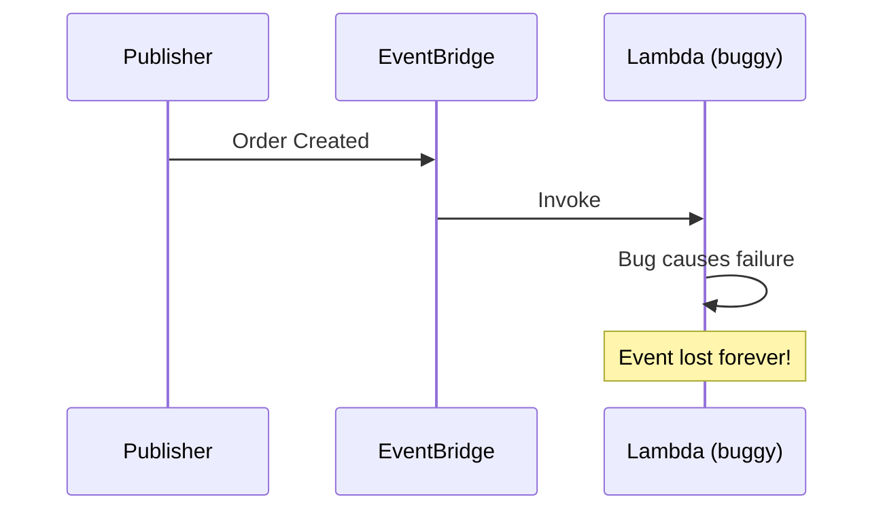
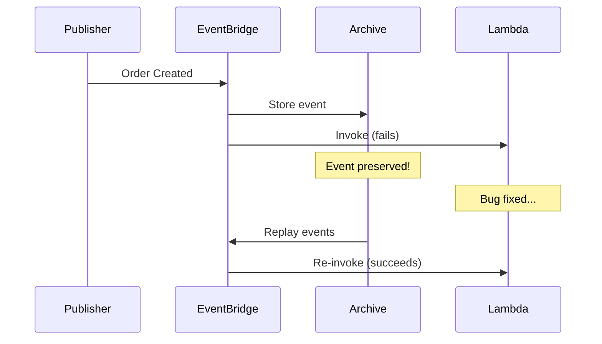
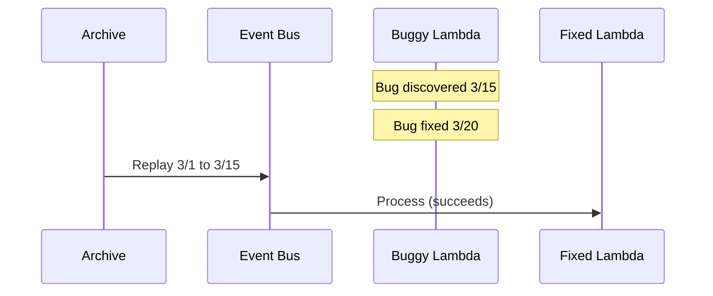
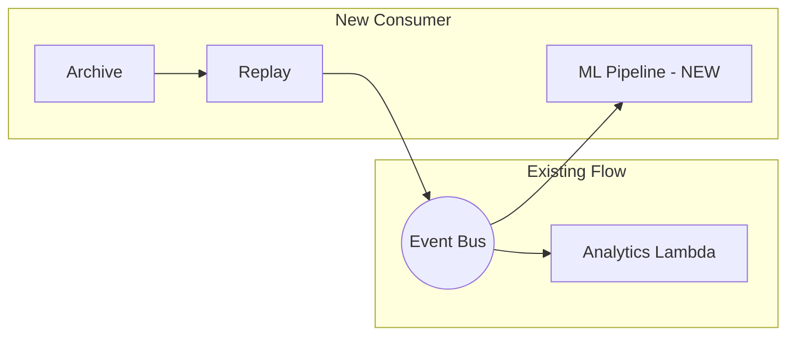
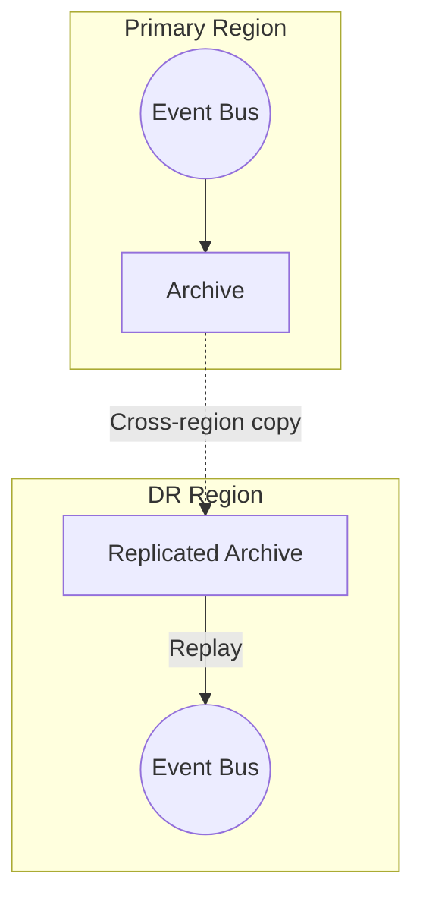

# Archive and Replay: Never Lose an Event

## What the Main Page Introduced

The main page mentioned that EventBridge can archive events and replay them later. This is a game-changer for disaster recovery, debugging, and data reprocessing. Let's explore how archiving works and when to use it.

## Going Deeper

In this sub-chapter, we'll explore:
1. **Why archive events?** - The business cases
2. **Creating archives** - Configuration and filtering
3. **Replay mechanics** - How to reprocess events
4. **Retention strategies** - Balancing cost and recovery
5. **Real-world patterns** - Disaster recovery and debugging
6. **Limitations** - What archives can't do

---

## Why Archive Events?

### The Problem Without Archives



Without archives:
- Bug in handler? Events are gone.
- Need to reprocess last week's events? Impossible.
- Disaster recovery? Hope you have backups elsewhere.

### With Archives



### Use Cases

| Use Case | How Archives Help |
|----------|-------------------|
| **Bug fixes** | Replay events that failed due to bugs |
| **Data recovery** | Reconstruct state after data loss |
| **New consumers** | Replay history to new services |
| **Debugging** | Examine what events were received |
| **Compliance** | Audit trail of all events |
| **Testing** | Replay production events in dev |

---

## Creating Archives

### Console

```
EventBridge → Event buses → [Your bus] → Archives → Create archive
```

### CloudFormation

```yaml
OrdersArchive:
  Type: AWS::Events::Archive
  Properties:
    ArchiveName: orders-archive
    Description: Archive of all order events
    EventPattern:
      source:
        - "pettracker.orders"
    RetentionDays: 90
    SourceArn: !GetAtt OrdersEventBus.Arn
```

### CLI

```bash
aws events create-archive \
  --archive-name orders-archive \
  --event-source-arn arn:aws:events:us-east-1:123456789012:event-bus/orders \
  --event-pattern '{"source": ["pettracker.orders"]}' \
  --retention-days 90
```

### Archive Configuration Options

| Option | Description | Default |
|--------|-------------|---------|
| **ArchiveName** | Unique identifier | Required |
| **SourceArn** | Event bus to archive from | Required |
| **EventPattern** | Filter which events to archive | All events |
| **RetentionDays** | How long to keep events | Indefinite |

### Filtering Archived Events

You don't have to archive everything. Use event patterns:

```yaml
# Only archive high-value orders
EventPattern:
  source:
    - "pettracker.orders"
  detail-type:
    - "Order Completed"
  detail:
    total:
      - numeric:
          - ">="
          - 100
```

```yaml
# Archive all events except test
EventPattern:
  source:
    - anything-but: "pettracker.test"
```

---

## Archive Storage and Cost

### How Events Are Stored

```
Event Published → EventBridge → Rules evaluate → Archive stores
```

Events are stored in compressed format within AWS-managed storage.

### Pricing

| Component | Cost |
|-----------|------|
| **Ingestion** | $0.10 per GB archived |
| **Storage** | $0.03 per GB/month |
| **Replay** | $0.10 per GB replayed |

### Cost Example

```
1 million events/day × 1 KB average = 1 GB/day
Monthly: 30 GB ingested, 450 GB stored (with 90-day retention)

Ingestion: 30 GB × $0.10 = $3.00
Storage: 450 GB × $0.03 = $13.50
Monthly archive cost: ~$16.50
```

### Cost Optimization

1. **Filter aggressively** - Only archive what you might need
2. **Shorter retention** - 30 days vs 365 days
3. **Archive important buses only** - Skip development buses

---

## Replaying Events

### Starting a Replay

```bash
aws events start-replay \
  --replay-name fix-order-bug-march \
  --event-source-arn arn:aws:events:us-east-1:123456789012:event-bus/orders \
  --destination:
      Arn: arn:aws:events:us-east-1:123456789012:event-bus/orders \
  --event-start-time 2024-03-01T00:00:00Z \
  --event-end-time 2024-03-15T23:59:59Z
```

### CloudFormation (Replay)

```yaml
# Note: Replays are typically started via CLI/SDK, not CloudFormation
# This is for documentation purposes

ReplayJob:
  Type: AWS::Events::Replay  # (Not a real resource type - use SDK)
  Properties:
    ReplayName: bug-fix-replay
    SourceArn: !GetAtt OrdersArchive.Arn
    Destination:
      Arn: !GetAtt OrdersEventBus.Arn
    EventStartTime: "2024-03-01T00:00:00Z"
    EventEndTime: "2024-03-15T23:59:59Z"
```

### SDK (Python)

```python
import boto3

events = boto3.client('events')

response = events.start_replay(
    ReplayName='fix-order-processor-bug',
    EventSourceArn='arn:aws:events:us-east-1:123456789012:event-bus/orders',
    Destination={
        'Arn': 'arn:aws:events:us-east-1:123456789012:event-bus/orders'
    },
    EventStartTime='2024-03-01T00:00:00Z',
    EventEndTime='2024-03-15T23:59:59Z',
    # Optional: Filter during replay
    # EventPattern='{"source": ["pettracker.orders"]}'
)

print(f"Replay started: {response['ReplayArn']}")
```

### Monitoring Replay Progress

```bash
aws events describe-replay --replay-name fix-order-bug-march
```

```json
{
  "ReplayName": "fix-order-bug-march",
  "ReplayArn": "arn:aws:events:...:replay/fix-order-bug-march",
  "State": "RUNNING",
  "EventSourceArn": "...",
  "EventStartTime": "2024-03-01T00:00:00Z",
  "EventEndTime": "2024-03-15T23:59:59Z",
  "ReplayStartTime": "2024-03-20T10:00:00Z",
  "ReplayEndTime": null
}
```

**States:** `STARTING`, `RUNNING`, `COMPLETED`, `FAILED`, `CANCELLING`, `CANCELLED`

---

## Replay Destination Options

### Same Bus (Reprocess Everything)

```python
Destination={
    'Arn': source_bus_arn  # Same bus as source
}
```

All existing rules trigger. Use when you want to reprocess normally.

### Different Bus (Controlled Replay)

```python
Destination={
    'Arn': replay_bus_arn  # Different bus
}
```

Only rules on the replay bus trigger. Use for:
- Testing replays before production
- Routing to specific handlers
- Avoiding duplicate notifications

### Filtering During Replay

```python
response = events.start_replay(
    ReplayName='replay-failed-orders',
    EventSourceArn=archive_arn,
    Destination={'Arn': bus_arn},
    EventStartTime='2024-03-01T00:00:00Z',
    EventEndTime='2024-03-15T23:59:59Z',
    # Only replay specific events
    EventPattern=json.dumps({
        'source': ['pettracker.orders'],
        'detail': {
            'status': ['FAILED']
        }
    })
)
```

---

## Real-World Patterns

### Pattern 1: Bug Fix Replay



```python
# 1. Fix the bug in your Lambda
# 2. Deploy the fix
# 3. Replay affected timeframe

events.start_replay(
    ReplayName='fix-order-calculation-bug',
    EventSourceArn=archive_arn,
    Destination={'Arn': bus_arn},
    EventStartTime='2024-03-01T00:00:00Z',
    EventEndTime='2024-03-15T00:00:00Z'
)
```

### Pattern 2: New Consumer Backfill



```python
# 1. Create new rule for ML pipeline
# 2. Replay historical events to populate ML training data

events.start_replay(
    ReplayName='backfill-ml-pipeline',
    EventSourceArn=archive_arn,
    Destination={'Arn': bus_arn},
    EventStartTime='2024-01-01T00:00:00Z',  # Last 3 months
    EventEndTime='2024-03-20T00:00:00Z'
)
```

### Pattern 3: Disaster Recovery



**Note:** Cross-region archive replication requires custom solution (S3 + Lambda).

### Pattern 4: Production Event Testing

```python
# Replay production events to development bus

events.start_replay(
    ReplayName='dev-testing-march-events',
    EventSourceArn=production_archive_arn,
    Destination={
        'Arn': development_bus_arn  # Different bus!
    },
    EventStartTime='2024-03-15T00:00:00Z',
    EventEndTime='2024-03-15T01:00:00Z'  # Just 1 hour
)
```

---

## Limitations and Gotchas

### Event Ordering

**Archives do NOT guarantee order during replay.**

```
Archived: Event 1 → Event 2 → Event 3
Replayed: Event 2 → Event 1 → Event 3 (maybe)
```

**If order matters:**
- Include sequence numbers in events
- Process in Lambda with ordering logic
- Use Kinesis instead (ordered within partition)

### Replay Speed

Replays are **not instant**. Large replays can take hours.

| Events | Approximate Time |
|--------|------------------|
| 10,000 | Minutes |
| 1,000,000 | Hours |
| 10,000,000+ | Day+ |

### Idempotency Required

Events may be replayed multiple times. Your handlers must be idempotent:

```python
def handler(event, context):
    event_id = event['id']

    # Check if already processed
    if event_already_processed(event_id):
        return {'status': 'skipped', 'reason': 'duplicate'}

    # Process the event
    process_order(event)

    # Mark as processed
    mark_processed(event_id)
```

### Archive Size Limits

| Limit | Value |
|-------|-------|
| Archives per bus | 10 |
| Event pattern complexity | Same as rules |
| Maximum replay duration | Unlimited |

---

## Did You Know?

**Did you know?** Archived events include the full EventBridge envelope, including the original `id` and `time`. This is crucial for debugging and deduplication. When you replay events, your consumers can check if they've already processed that original `id` - preventing duplicate processing even though the replay creates new EventBridge-assigned IDs. Without this preservation, replay would be much harder to implement safely.

**Here's something interesting:** You can have multiple archives on the same bus with different filters and retention periods. A common pattern: archive ALL events for 7 days (for debugging), archive only errors for 90 days (for compliance), and archive financial events for 7 years (for audit). Each archive only stores matching events, so you're not paying to store everything at the longest retention.

**One more thing:** Replays create new events with new EventBridge-assigned IDs, but the original event content (including the original `id` in the body) is preserved. This distinction matters: CloudWatch metrics will show the replayed events as new invocations (new IDs), but your application logic can use the original `id` field inside `detail` to maintain idempotency. It's the best of both worlds - visibility into replay activity while preventing duplicate business logic execution.

---

## Exam Tips

**Key points for DVA-C02:**

1. **Archive location**: On the event bus, not on rules
2. **Replay destination**: Same bus or different bus
3. **Filtering**: Both archive creation and replay support patterns
4. **Ordering**: NOT guaranteed during replay

**Common exam patterns:**

> "Events processed by a buggy Lambda need to be reprocessed..."
> → Archive and replay

> "Guarantee exact ordering during replay..."
> → Not possible with EventBridge; use Kinesis for ordered replay

> "Reduce archive costs..."
> → Filter to archive only necessary events, reduce retention

---

## Quick Reference

| Action | Command |
|--------|---------|
| Create archive | `aws events create-archive` |
| List archives | `aws events list-archives` |
| Start replay | `aws events start-replay` |
| Monitor replay | `aws events describe-replay` |
| Cancel replay | `aws events cancel-replay` |

---

## Key Takeaways

- **Archives are insurance** - when a bug causes events to be processed incorrectly, archives let you fix the bug and reprocess. Without archives, those events are gone forever. The peace of mind alone is worth the modest storage cost for critical event flows.

- **Filter aggressively** - don't archive everything unless you have a specific reason. Archive order events, payment events, audit events - things you might need to replay or investigate. Skip high-volume, low-value events like heartbeats or metrics. Use patterns to archive only what matters.

- **Idempotent handlers are required** for replay to work safely. Replays create new EventBridge-assigned IDs, so your handler might see "the same" business event multiple times. Use the original event ID (in the detail) for deduplication, or design handlers where processing twice produces the same result.

- **Order not guaranteed** during replay - events may arrive in a different sequence than they were originally published. If your logic depends on "event A before event B," either include sequence numbers in events, process replays through a sorting step, or use Kinesis instead (which maintains partition ordering).

- **Different bus for testing** - replay to a separate bus first, not directly to production. This lets you verify the replay targets the right events, handlers process correctly, and you don't accidentally double-process in production. Once validated, replay to the production bus.

- **Retention = cost** - longer retention means higher storage costs. Find the balance: 7 days for debugging, 30-90 days for operational recovery, longer for compliance. Remember that archives only store matching events, so aggressive filtering reduces retention costs too.

---

*Next: **Security and Access Control** - Let's explore how to secure your event buses and rules.*


---
*v1.0*
