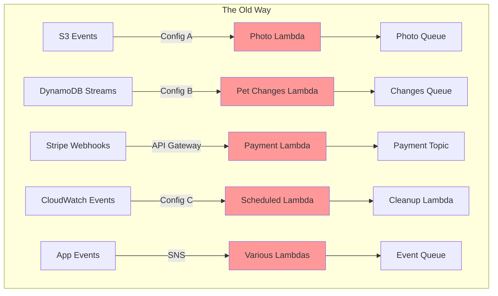
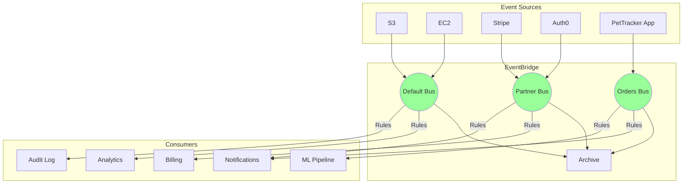

# Alex's Solution: The Unified Event Architecture

## The Journey Complete

We started this chapter with Alex drowning in event spaghetti - five different integration patterns, 2 AM debugging sessions, and the constant fear that adding a new subscriber would break something. Now let's see how EventBridge transformed PetTracker's architecture.

## The Mental Model Shift

Remember the fundamental insight from the main page:

> **With SQS, publishers decide where messages go. With EventBridge, consumers decide what they want.**

This isn't just a technical difference - it's a complete shift in how you think about event-driven systems. Alex's team stopped asking "where should I send this?" and started asking "what happened that others might care about?"

---

## Before: The Event Spaghetti



**The pain:**
- Five different integration patterns to maintain
- Adding a subscriber meant changing publisher code
- No central view of event flow
- Debugging required checking 8+ dashboards
- No event replay after bugs were fixed

---

## After: The Unified Architecture



---

## The Complete Solution

### Event Bus Structure

```yaml
Resources:
  # Default bus handles AWS service events
  # (No need to create - it exists automatically)

  # Custom bus for PetTracker application events
  PetTrackerEventBus:
    Type: AWS::Events::EventBus
    Properties:
      Name: pettracker-events

  # Archives for disaster recovery
  EventArchive:
    Type: AWS::Events::Archive
    Properties:
      ArchiveName: pettracker-archive
      SourceArn: !GetAtt PetTrackerEventBus.Arn
      RetentionDays: 90
```

### Publishing Custom Events

```python
# services/events.py
import boto3
import json
from datetime import datetime

events = boto3.client('events')

def publish_event(source: str, detail_type: str, detail: dict):
    """Unified event publishing for all PetTracker services."""
    events.put_events(
        Entries=[{
            'Source': f'pettracker.{source}',
            'DetailType': detail_type,
            'Detail': json.dumps({
                **detail,
                'version': '1.0',
                'timestamp': datetime.utcnow().isoformat()
            }),
            'EventBusName': 'pettracker-events'
        }]
    )

# Usage across services
publish_event('orders', 'Order Completed', {'orderId': '123', 'total': 99.99})
publish_event('users', 'User Signed Up', {'userId': 'abc', 'plan': 'premium'})
publish_event('pets', 'Pet Profile Updated', {'petId': 'pet-1', 'ownerId': 'user-1'})
```

### Consumer Rules

```yaml
# Analytics gets everything
AnalyticsRule:
  Type: AWS::Events::Rule
  Properties:
    EventBusName: !Ref PetTrackerEventBus
    EventPattern:
      source:
        - prefix: "pettracker."
    Targets:
      - Id: Analytics
        Arn: !GetAtt AnalyticsFunction.Arn

# Notifications for user-facing events
NotificationRule:
  Type: AWS::Events::Rule
  Properties:
    EventBusName: !Ref PetTrackerEventBus
    EventPattern:
      detail-type:
        - "Order Completed"
        - "Pet Profile Updated"
        - "Subscription Renewed"
    Targets:
      - Id: Notifications
        Arn: !GetAtt NotificationFunction.Arn
        InputTransformer:
          InputPathsMap:
            userId: "$.detail.userId"
            eventType: "$.detail-type"
          InputTemplate: |
            {"userId": "<userId>", "type": "<eventType>"}

# VIP handling for high-value orders
VIPOrderRule:
  Type: AWS::Events::Rule
  Properties:
    EventBusName: !Ref PetTrackerEventBus
    EventPattern:
      source:
        - "pettracker.orders"
      detail:
        total:
          - numeric: [">=", 500]
    Targets:
      - Id: VIPHandler
        Arn: !GetAtt VIPFunction.Arn
      - Id: SalesAlert
        Arn: !Ref SalesNotificationTopic
```

### Partner Integration

```yaml
# Stripe events for payment processing
StripePaymentRule:
  Type: AWS::Events::Rule
  Properties:
    EventBusName: aws.partner/stripe.com/123456  # Partner bus
    EventPattern:
      detail-type:
        - "payment_intent.succeeded"
        - "payment_intent.payment_failed"
    Targets:
      - Id: PaymentProcessor
        Arn: !GetAtt PaymentFunction.Arn

# Auth0 events for user provisioning
Auth0Rule:
  Type: AWS::Events::Rule
  Properties:
    EventBusName: aws.partner/auth0.com/789012
    EventPattern:
      detail-type:
        - "Login Success"
        - "Signup Success"
    Targets:
      - Id: UserProvisioning
        Arn: !GetAtt UserProvisioningFunction.Arn
```

### Scheduled Tasks

```yaml
# Daily cleanup with EventBridge Scheduler
DailyCleanup:
  Type: AWS::Scheduler::Schedule
  Properties:
    Name: daily-cleanup
    ScheduleExpression: "cron(0 2 * * ? *)"
    ScheduleExpressionTimezone: "America/Los_Angeles"
    FlexibleTimeWindow:
      Mode: FLEXIBLE
      MaximumWindowInMinutes: 30
    Target:
      Arn: !GetAtt CleanupFunction.Arn
      RoleArn: !GetAtt SchedulerRole.Arn

# Subscription reminders (one-time schedules)
# Created dynamically when subscriptions are purchased
```

---

## What Alex Gained

### 1. Single Integration Pattern

**Before:** Five different integration patterns, each with unique configuration.

**After:** Everything publishes to EventBridge; everything subscribes via rules.

```python
# Before: Different code for each integration
# S3, DynamoDB, Stripe, CloudWatch - all different

# After: One pattern everywhere
publish_event('service', 'Event Type', {'data': 'here'})
```

### 2. Adding Subscribers Without Code Changes

**Before:** Adding analytics meant modifying the order service, the payment service, and deploying both.

**After:** Create a rule. No publisher changes. No deployments to existing services.

```yaml
# Marketing wants order events? Add a rule.
MarketingRule:
  Type: AWS::Events::Rule
  Properties:
    EventPattern:
      source: ["pettracker.orders"]
    Targets:
      - Id: Marketing
        Arn: !GetAtt MarketingQueue.Arn
# Deploy. Done. Order service doesn't know or care.
```

### 3. Central Visibility

**Before:** Check S3 console, then CloudWatch, then Stripe dashboard, then Lambda logs...

**After:** One place to see all events:

```bash
# See what's flowing through the bus
aws events list-rules --event-bus-name pettracker-events

# Test patterns against sample events
aws events test-event-pattern --event-pattern '...' --event '...'
```

### 4. Disaster Recovery

**Before:** Bug fixed? Too bad, those events are gone.

**After:** Replay from archive:

```python
events.start_replay(
    ReplayName='fix-notification-bug',
    EventSourceArn=archive_arn,
    Destination={'Arn': bus_arn},
    EventStartTime='2024-03-01T00:00:00Z',
    EventEndTime='2024-03-15T00:00:00Z'
)
```

### 5. Cost Savings

**Before:** Lambda invocations for every S3 upload, then filtering in code.

**After:** Filter before invocation. Only process what matters.

```
Before: 100,000 Lambda invocations/day (most filtered out)
After: 10,000 Lambda invocations/day (only matching events)
Savings: 90% reduction in Lambda costs for that workflow
```

---

## The Numbers

| Metric | Before | After | Improvement |
|--------|--------|-------|-------------|
| Integration patterns | 5 | 1 | 80% simpler |
| Time to add subscriber | 4 hours | 10 minutes | 96% faster |
| Dashboards to check | 8 | 1 | 87% fewer |
| Lambda invocations | 100K/day | 10K/day | 90% less |
| Event replay capability | None | 90 days | ∞ improvement |

---

## Lessons Learned

### 1. Start with the Mental Model

The biggest change wasn't the code - it was the thinking. Once Alex's team internalized "publishers announce, consumers subscribe," everything else followed naturally.

### 2. Design Events as Contracts

Events are an API between services. Version them, document them, treat them as carefully as REST endpoints.

```python
# Good: Versioned, documented
{
    "version": "1.0",
    "orderId": "123",
    "total": 99.99,
    "currency": "USD"
}
```

### 3. Filter Early, Filter Often

Put filtering logic in EventBridge patterns, not Lambda code. Every invocation you prevent is money saved and noise reduced.

### 4. Archive Everything Important

Storage is cheap. Debugging production issues without event history is expensive. Archive liberally.

### 5. One Bus Per Concern

Don't put everything on the default bus. Separate by:
- Environment (dev, staging, prod)
- Domain (orders, users, payments)
- Access patterns (public, internal)

---

## Quick Reference Card

| Task | Solution |
|------|----------|
| React to S3 uploads | Default bus + rule with `source: aws.s3` |
| Publish app events | Custom bus + `put_events` API |
| Receive Stripe events | Partner bus + rule |
| Run daily job | EventBridge Scheduler |
| Process DynamoDB changes | EventBridge Pipes |
| Replay after bug fix | Archive + `start_replay` |
| Send to external API | API Destination target |
| Reshape event payload | Input Transformer |

---

## Final Exam Checklist

✅ **Know the fundamentals:**
- Event envelope structure (source, detail-type, detail)
- Default bus vs custom bus vs partner bus
- Rule evaluation and target invocation

✅ **Understand the differences:**
- EventBridge vs SQS (consumer-decides vs publisher-decides)
- EventBridge vs SNS (content filtering vs fan-out)
- Scheduler vs scheduled rules (features vs legacy)
- Pipes vs event bus (point-to-point vs pub/sub)

✅ **Remember the limits:**
- 256KB event size
- 5 targets per rule
- 10 events per PutEvents call
- At-least-once delivery (idempotency required)

✅ **Know the patterns:**
- Cross-account: resource policies
- Filtering: patterns with numeric, prefix, anything-but
- Transformation: InputPath vs InputTransformer
- Archive: filter, retention, replay

---

## What's Next?

EventBridge is foundational for modern serverless architectures. You'll see it combined with:

- **Step Functions** for complex workflows
- **Lambda** for event processing
- **SQS** for buffering and retry
- **SNS** for final mile notifications

The mental model you learned here - **consumers decide what they want** - applies beyond EventBridge. It's the core principle of loose coupling that makes microservices maintainable.

---

*"The moment I stopped thinking about where to send messages and started thinking about what happened that matters - that's when EventBridge clicked."*

— Alex, after shipping the unified architecture


---
*v2.0*
