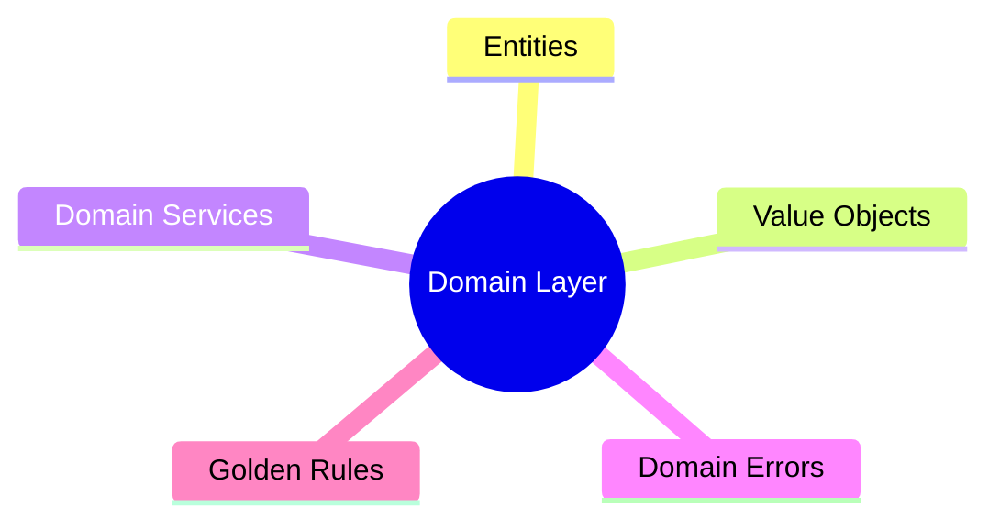

# Course Folder Structure

This document describes the folder layout for courses in the Study Project platform.

## Overview

Courses are stored in a hierarchical folder structure under `data/courses/`. Each course is a self-contained directory with all its content, metadata, assessments, and marketing materials.

Copy and use the templates in the course-template folder

## Course Requirements

Every course MUST have:
- **10 Chapters (Lessons)** - Main sections of the course
- **5 Sub-chapters per Chapter** - Detailed topics within each chapter
- **Sales Document** - For browsing users (Udemy-style landing page)
- **Detailed Curriculum** - For users wanting to see full course contents

## Directory Structure

```
data/courses/
└── {course-slug}/                    # Course root (slug derived from title)
    ├── course.json                   # Course metadata
    ├── sales-page.md                 # Sales/marketing page for browsers
    ├── curriculum.md                 # Detailed curriculum for interested users
    └── lessons/                      # All lessons (chapters) in the course
        └── {NN}-{lesson-slug}/       # Chapter folder (NN = 00-09)
            ├── content.md            # Chapter overview (previews sub-chapters)
            ├── lesson.json           # Chapter metadata
            ├── quiz.json             # Chapter quiz (tests sub-chapter content)
            └── sublessons/           # 5 sub-chapters per chapter
                └── {NN}-{sublesson-slug}/
                    ├── content.md    # Sub-chapter content
                    └── quiz.json     # Optional: Sub-chapter quiz
```

---

## Marketing Documents

### sales-page.md (Required)

A Udemy-style sales page for users browsing courses. Should include:

```markdown
# [Course Title]

## [Compelling Headline/Tagline]

[Hero description - 2-3 sentences that sell the transformation]

### What You'll Learn

- [Outcome 1 - specific, measurable skill]
- [Outcome 2]
- [Outcome 3]
- [Outcome 4]
- [Outcome 5]
- [Outcome 6]

### Course Overview

[2-3 paragraphs describing the course, the problem it solves, and why this approach works]

### Who This Course Is For

- [Target audience 1]
- [Target audience 2]
- [Target audience 3]

### Prerequisites

- [Prerequisite 1]
- [Prerequisite 2]

### Course Stats

| | |
|---|---|
| **Chapters** | 10 |
| **Lectures** | 50+ |
| **Skill Level** | [Beginner/Intermediate/Advanced] |
| **Duration** | [X hours] |

### Instructor

**[Instructor Name]**

[Brief instructor bio and credentials]

### Student Reviews

> "[Testimonial quote]" - Student Name

> "[Testimonial quote]" - Student Name
```

### curriculum.md (Required)

Detailed course curriculum for users who want to see exactly what's covered:

```markdown
# [Course Title] - Full Curriculum

## Course Description

[Detailed description of what the course covers and the learning journey]

---

## Chapter 1: [Chapter Title]

**Overview:** [Brief description of what this chapter covers]

**What You'll Learn:**
- [Learning outcome 1]
- [Learning outcome 2]
- [Learning outcome 3]

### Sub-chapters:

1. **[Sub-chapter 1.1 Title]** - [Brief description]
2. **[Sub-chapter 1.2 Title]** - [Brief description]
3. **[Sub-chapter 1.3 Title]** - [Brief description]
4. **[Sub-chapter 1.4 Title]** - [Brief description]
5. **[Sub-chapter 1.5 Title]** - [Brief description]

**Chapter Quiz:** 3 questions testing comprehension

---

## Chapter 2: [Chapter Title]

[Repeat structure for all 10 chapters...]

---

## What You'll Build

[Description of any projects, exercises, or practical applications]

## Certificate of Completion

Upon completing all chapters and quizzes, you'll receive a certificate of completion.
```

---

## Chapter Content Guidelines

### Chapter Overview (content.md)

The chapter's `content.md` should **preview and introduce** what will be covered in its sub-chapters. It should NOT contain the detailed teaching content - that belongs in sub-chapters.

**Chapter content.md should include:**
1. Chapter title and introduction
2. Overview diagram (Mermaid) showing concepts covered
3. Brief description of each sub-chapter topic
4. Learning objectives for the chapter
5. Why this topic matters

**Example Chapter content.md:**

```markdown
# Chapter 3: The Domain Layer

The domain layer is the **heart** of your application. This chapter covers everything you need to build a robust domain.

## What You'll Learn in This Chapter



## Sub-chapter Overview

### 3.1 Entities: Objects with Identity
Learn what makes an entity different from other objects and how to design them properly.

### 3.2 Value Objects: Immutable Values
Discover how value objects can simplify your code and prevent bugs.

### 3.3 Domain Services
When business logic doesn't belong to an entity, domain services are the answer.

### 3.4 Domain Errors
Handle errors the domain-driven way with meaningful, typed errors.

### 3.5 The Golden Rules of the Domain
The rules that keep your domain clean and maintainable.

## Why This Matters

The domain layer is where your business lives. Get it right, and everything else becomes easier. Get it wrong, and you'll fight your code forever.

Let's dive in!
```

### Sub-chapter Content (sublessons/*/content.md)

Sub-chapters contain the **actual teaching content**. Each sub-chapter should:
1. Teach ONE specific concept in depth
2. Include code examples where appropriate
3. Use diagrams to illustrate concepts
4. Be self-contained but reference related sub-chapters
5. End with a summary or key takeaways

---

## File Descriptions

### course.json

Course-level metadata:

```json
{
  "id": "uuid-string",
  "title": "Course Title",
  "subtitle": "Compelling subtitle for the course",
  "description": "Course description for search/preview",
  "author": "Author Name",
  "author_bio": "Brief author biography",
  "difficulty": "beginner|intermediate|advanced",
  "estimated_hours": 10,
  "chapter_count": 10,
  "subchapter_count": 50,
  "tags": ["tag1", "tag2", "tag3"],
  "language": "en",
  "last_updated": "2024-12-05"
}
```

### lesson.json

Chapter-level metadata:

```json
{
  "title": "Chapter Title",
  "order": 0,
  "has_quiz": true,
  "subchapter_count": 5,
  "estimated_minutes": 45,
  "learning_objectives": [
    "Objective 1",
    "Objective 2",
    "Objective 3"
  ]
}
```

### quiz.json

Assessment questions for the chapter:

```json
{
  "Questions": [
    {
      "ID": "unique-question-id",
      "Question": "The question text?",
      "Options": [
        "Option A",
        "Option B",
        "Option C",
        "Option D"
      ],
      "CorrectIndex": 1,
      "Explanation": "Why option B is correct..."
    }
  ]
}
```

---

## Naming Conventions

### Course Slug
- Derived from course title
- Lowercase, hyphen-separated
- Example: "Hexagonal Architecture: Building Maintainable Software" → `hexagonal-architecture-building-maintainable-software`

### Chapter Folders
- Prefixed with two-digit order number (`00` through `09`)
- Followed by slugified chapter title
- Example: `03-the-domain-layer`

### Sub-chapter Folders
- Same pattern as chapters
- Numbered `00` through `04` (5 sub-chapters)
- Example: `02-domain-services`

---

## Quiz Guidelines

Quizzes should be based on the **actual content taught in that specific chapter/sub-chapter**. Each question should:

1. Reference content visible on that page (diagrams, text, tables)
2. Use phrases like "According to the diagram..." or "According to the lesson..."
3. Test comprehension of what was taught, not general knowledge
4. Include explanations that reference the lesson material

### Example Good Question (content-based)

```json
{
  "Question": "According to the diagram, what are examples of Driving Ports?",
  "Options": [
    "UserRepository, OrderRepository, EmailSender",
    "UserService, OrderService, PaymentService",
    "Database, Cache, Queue",
    "HTTP, GraphQL, gRPC"
  ],
  "CorrectIndex": 1,
  "Explanation": "The diagram shows UserService, OrderService, and PaymentService as examples of Driving Ports."
}
```

### Example Bad Question (not content-based)

```json
{
  "Question": "Who invented Hexagonal Architecture?",
  "Options": ["Martin Fowler", "Alistair Cockburn", "Uncle Bob", "Eric Evans"],
  "CorrectIndex": 1,
  "Explanation": "Alistair Cockburn invented it in 2005."
}
```

This question tests trivia that may not appear in the lesson content.

---

## Complete Course Template

```
{course-slug}/
├── course.json                 # Course metadata
├── sales-page.md               # Udemy-style sales page
├── curriculum.md               # Detailed course curriculum
└── lessons/
    ├── 00-{chapter-1-slug}/
    │   ├── content.md          # Chapter overview (previews sub-chapters)
    │   ├── lesson.json
    │   ├── quiz.json
    │   └── sublessons/
    │       ├── 00-{sub-1}/content.md
    │       ├── 01-{sub-2}/content.md
    │       ├── 02-{sub-3}/content.md
    │       ├── 03-{sub-4}/content.md
    │       └── 04-{sub-5}/content.md
    ├── 01-{chapter-2-slug}/
    │   └── ... (same structure)
    ├── 02-{chapter-3-slug}/
    │   └── ...
    ├── 03-{chapter-4-slug}/
    │   └── ...
    ├── 04-{chapter-5-slug}/
    │   └── ...
    ├── 05-{chapter-6-slug}/
    │   └── ...
    ├── 06-{chapter-7-slug}/
    │   └── ...
    ├── 07-{chapter-8-slug}/
    │   └── ...
    ├── 08-{chapter-9-slug}/
    │   └── ...
    └── 09-{chapter-10-slug}/
        ├── content.md
        ├── lesson.json
        ├── quiz.json
        └── sublessons/
            ├── 00-{sub-1}/content.md
            ├── 01-{sub-2}/content.md
            ├── 02-{sub-3}/content.md
            ├── 03-{sub-4}/content.md
            └── 04-{sub-5}/content.md
```

**Total Content:**
- 10 Chapters
- 50 Sub-chapters (5 per chapter)
- 10 Chapter quizzes
- 1 Sales page
- 1 Detailed curriculum

---

## Backend Configuration

The backend reads courses directly from the folder structure at runtime (no database import needed).

### Environment Variables

| Variable | Default | Description |
|----------|---------|-------------|
| `COURSES_PATH` | `./data/courses` | Path to the courses folder |
| `USE_FOLDER_COURSES` | `true` | Enable folder-based course loading |

### Docker Configuration

In `docker-compose.yml`, the courses folder is mounted as a read-only volume:

```yaml
services:
  backend:
    volumes:
      - ../backend/data/courses:/app/courses:ro
    environment:
      - COURSES_PATH=/app/courses
      - USE_FOLDER_COURSES=true
```

### How It Works

1. **Automatic Discovery** - The backend scans `COURSES_PATH` for course folders on startup
2. **Caching** - Courses are cached for 5 minutes to reduce disk reads
3. **Hot Reload** - Changes to course files are picked up on the next cache refresh
4. **Read-Only** - The folder repository is read-only; Create/Update/Delete operations return errors

### Adding a New Course

1. Create a folder: `data/courses/your-course-slug/`
2. Add required files:
   - `course.json` - Course metadata
   - `lessons/00-chapter-slug/content.md` - Chapter content
   - `lessons/00-chapter-slug/lesson.json` - Chapter metadata
   - `lessons/00-chapter-slug/sublessons/00-topic/content.md` - Sub-chapter content
3. The backend automatically detects and serves the new course

### Switching to Database Mode

To use the SQLite database instead of folders:

```bash
# Environment variable
USE_FOLDER_COURSES=false

# Or in docker-compose.yml
environment:
  - USE_FOLDER_COURSES=false
```

---

## Course Data Benefits

The folder-based structure is designed to be:

1. **Human-readable** - Content can be reviewed and edited directly
2. **Version-controllable** - Can be tracked in Git
3. **Portable** - Easy to share, backup, and migrate
4. **Modular** - Chapters and quizzes can be edited independently
5. **Marketable** - Sales materials included for course discovery
6. **No Import Needed** - Backend reads directly from folders
