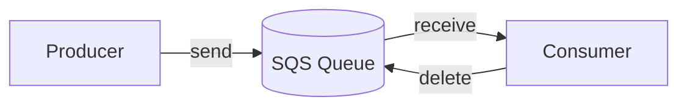
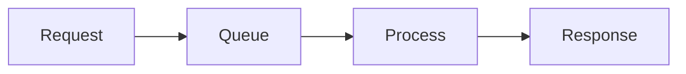
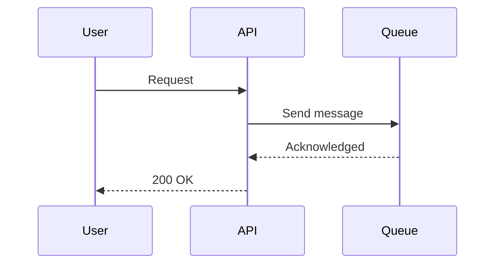
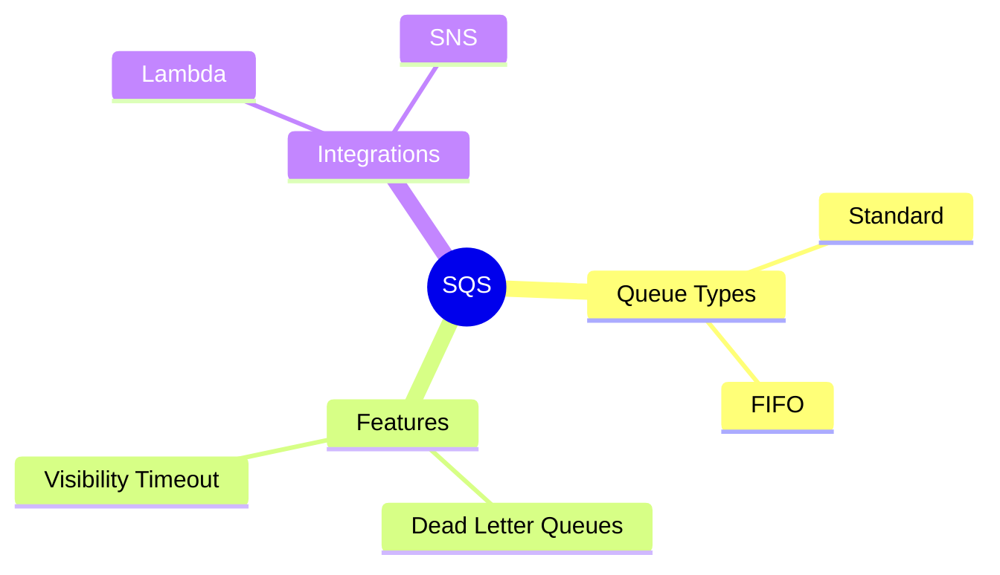

# Course Folder Structure

This document describes the folder layout for courses in the Study Project platform.

## Overview

Courses are stored in a hierarchical folder structure under `data/courses/`. Each course is a self-contained directory with all its content, metadata, assessments, and marketing materials.

Copy and use the templates in the course-template folder

## Course Requirements

Every course MUST have:
- **10-25 Chapters (Lessons)** - Main sections covering the subject matter
- **5-15 Sub-chapters per Chapter** - Detailed topics (varies by complexity)
- **Sales Document** - For browsing users (Udemy-style landing page)
- **Detailed Curriculum** - For users wanting to see full course contents

### Flexible Chapter and Sub-chapter Counts

**Not all chapters need the same number of sub-chapters.** The number should match the topic's complexity:

| Topic Complexity | Recommended Sub-chapters | Example Topics |
|-----------------|-------------------------|----------------|
| **Simple** (foundational) | 8-10 sub-chapters | IAM basics, CloudWatch fundamentals |
| **Medium** (standard service) | 10-13 sub-chapters | S3, API Gateway, Step Functions |
| **Complex** (deep service) | 13-18 sub-chapters | DynamoDB, Lambda, EventBridge |
| **Comprehensive** (multi-topic) | 15-20 sub-chapters | CI/CD Pipeline, Containers (ECS/ECR/EKS) |

### The Multi-Level Learning Framework

**Great educational content works at multiple levels:**

| Reader Type | What They Need | Where They Get It |
|-------------|----------------|-------------------|
| **Quick learner** | Understand the concept in 10 minutes | Main page (content.md) |
| **Deep learner** | Master every detail | Sub-chapters |
| **Reference user** | Look up specific feature | Jump to relevant sub-chapter |

**This means the main content.md must be SUBSTANTIAL - not just a table of contents.**

### The "Wikipedia Article" Test

**The chapter's main content.md should pass this test:**
> "Could someone read ONLY this page and understand the topic well enough to discuss it intelligently?"

If the answer is "no, they need to read the sub-chapters first," the main page is too thin.

### Chapter Overview Guidelines (content.md)

**Target length: 2500-4000 words** - This is REAL teaching content, not a preview.

**Must include:**
1. **What is it?** - Thorough definition with concrete examples (400-600 words)
2. **Why does it exist?** - The problem it solves, with story (400-600 words)
3. **How would you solve this WITHOUT it?** - The manual approach with code (500-800 words)
4. **How does it work?** - Core mechanism with diagram AND explanation (500-800 words)
5. **How is it different?** - Detailed comparison with alternatives (400-600 words)
6. **What you'll learn** - Chapter roadmap (200-300 words)

### The "Teach, Don't Summarize" Principle

**A sentence or two is NOT enough when explaining complex services to newcomers.**

Every section must explain concepts thoroughly enough that someone with zero prior knowledge can understand. Don't assume readers can fill in the gaps.

**Bad (too brief):**
```markdown
## What is EventBridge?

EventBridge is a serverless event bus that routes events between services.
It uses rules to filter events and send them to targets.
```

**Good (thorough explanation):**
```markdown
## What is EventBridge?

**EventBridge is a serverless event bus - a central router where all your events flow through.**

Think of it like a smart mailroom in an office building. When mail arrives, instead of
being dumped in one pile, the mailroom staff look at each piece, read who it's for and
what it's about, and route it to exactly the right desks. Some mail goes to accounting,
some to legal, some to multiple departments. The mailroom handles all this routing
automatically based on rules you set up.

In software terms, an "event" is simply a record that something happened:
- A user signed up
- A file was uploaded
- A payment was processed
- An EC2 instance was stopped

Without EventBridge, each of these events would need its own integration. S3 has its own
notification system. DynamoDB has Streams. Third-party services like Stripe need webhook
handlers. You end up with 5 different patterns for 5 different event sources.

EventBridge changes this by providing ONE place where all events can flow. You create
rules that say "when event X happens, send it to target Y." The service publishing the
event doesn't need to know who's listening - it just announces what happened. Consumers
subscribe to the events they care about.

**The key insight:** EventBridge separates "something happened" from "who needs to know."
Publishers announce events. Consumers subscribe to events. Neither needs to know about
the other.
```

### Explanation Depth Guidelines

Every concept needs MULTIPLE paragraphs, not just a definition:

| Concept Complexity | Minimum Explanation |
|--------------------|---------------------|
| **Simple** (a single term) | 2-3 sentences + example |
| **Medium** (a feature) | 1-2 paragraphs + diagram or code |
| **Complex** (a service/pattern) | 3-5 paragraphs + diagram + example + comparison |

**The "Explain It Three Ways" technique:**

1. **State it** - What is it? (definition)
2. **Illustrate it** - What does it look like? (example, diagram, or analogy)
3. **Contrast it** - What is it NOT? (comparison with familiar concepts)

### The Author Mindset: Teach, Don't Summarize

**You are the author. The reader is learning from YOU.**

Your job is NOT to list facts for readers to decode. Your job IS to explain, illuminate, and help readers understand. Every sentence should add to their understanding, not just state a fact and move on.

**CRITICAL DISTINCTION:**

| Bad (Listing) | Good (Teaching) |
|---------------|-----------------|
| "Messages have a lifespan. Default is 4 days." | "Messages have a lifespan - they don't stay in the queue forever. By default, SQS keeps messages for 4 days. After that, they're automatically deleted whether they've been processed or not. This matters because if your consumer is broken for a week, you might come back to find all your messages have expired and disappeared. That's why 4 days is the default - long enough to recover from most outages, short enough that you notice the problem." |
| "You can delay messages up to 15 minutes." | "You can delay messages, making them invisible for a period before they become available. This is different from visibility timeout - delay happens BEFORE a message is first available, visibility timeout happens AFTER it's been received. Use delay for scheduled tasks, rate limiting, or implementing exponential backoff when you re-queue failed messages. The maximum delay is 15 minutes, which you can set per-message or as a queue default." |
| "Standard queues might deliver duplicates." | "Standard queues optimize for throughput, which means they might occasionally deliver the same message twice. This isn't a bug - it's a design trade-off. To achieve unlimited throughput, SQS distributes messages across multiple servers. Sometimes a server isn't sure if a message was successfully handed off, so it keeps a copy just in case. For most workloads this is fine - your consumer checks 'did I already process order #123?' and skips duplicates. But for payment processing, where charging twice is catastrophic, you'd want a FIFO queue instead." |

**The pattern:** State the fact → Explain WHY it's that way → Explain WHAT it means for the reader → Give CONTEXT for when it matters.

**Every "Did you know?" must explain, not just state:**

| Bad | Good |
|-----|------|
| "SQS can hold up to 120,000 in-flight messages." | "SQS can hold up to 120,000 in-flight messages (messages received but not yet deleted). Hit this limit and `ReceiveMessage` returns an error. This matters when you have a slow consumer and a fast producer - messages pile up in the 'in-flight' state. The solution is usually to add more consumers or increase your processing speed, not to increase the limit." |

**Every "Key Takeaway" must be a mini-lesson:**

| Bad | Good |
|-----|------|
| "Visibility timeout prevents duplicate processing." | "**Visibility timeout prevents duplicate processing** - but only if set correctly. The timeout is your safety net: if a consumer crashes, the message automatically comes back. But if the timeout is shorter than your processing time, you'll get duplicates because the message becomes visible while you're still working on it. This is the single most common SQS misconfiguration. Rule of thumb: set visibility timeout to 6x your average processing time." |

**Remember:** Readers are paying to learn from you. They could read the AWS documentation for free. What they're paying for is your EXPLANATION, your CONTEXT, your INSIGHTS. Give them that value in every sentence.

**The key insight:** Someone who reads ONLY the main page walks away understanding:
- What the technology IS
- WHY they would use it
- HOW it's different from alternatives
- WHEN to choose it vs other options

### The "Why Not Just Use X?" Question

**Every chapter must answer the question: "Why wouldn't I just use [simpler thing I already know]?"**

Readers approach new technology with existing mental models. If you don't address why the new thing is different from what they know, they'll either:
1. Assume it's the same (and misuse it)
2. Dismiss it as unnecessary complexity

**Examples:**

| Chapter | The Question | The Answer |
|---------|--------------|------------|
| EventBridge | "Why not just use SQS?" | SQS = you decide where messages go. EventBridge = consumers decide what they want. Publisher vs consumer ownership. |
| DynamoDB | "Why not just use RDS?" | RDS = relational queries. DynamoDB = key-based access at any scale. Different access patterns. |
| Step Functions | "Why not just call Lambdas from Lambdas?" | Direct calls = you manage retries, state, timeouts. Step Functions = orchestration is handled for you. |
| Lambda | "Why not just use EC2?" | EC2 = you manage servers. Lambda = you just write code. Different operational model. |

**The pattern for answering:**

```markdown
## "But Why Not Just Use [Familiar Thing]?"

Good question. Here's the key difference:

**[Familiar Thing]** works like this: [simple mental model]
- You [action]
- The [result]

**[New Technology]** works differently: [new mental model]
- You [different action]
- The [different result]

**The fundamental shift:** [One sentence capturing the paradigm change]

**Use [Familiar Thing] when:** [scenarios]
**Use [New Technology] when:** [scenarios]
```

This section should appear EARLY in the chapter - before diving into features. Address the skepticism first.

### The 3-Part Deep Dive Pattern (Sub-chapters 00-02)

The first 3 sub-chapters EXPAND on the overview - they don't repeat it.

| Sub-chapter | Title Pattern | Relationship to Main Page | Word Count |
|-------------|---------------|---------------------------|------------|
| **00** | "[Concept] Deep Dive" | Main page INTRODUCES events; this EXPLORES event patterns, structures, edge cases | 1200-1800 words |
| **01** | "The Problem in Detail" | Main page SUMMARIZES the problem; this shows REAL CODE of the painful approach | 1500-2000 words |
| **02** | "[Technology] Architecture" | Main page shows WHAT it does; this shows HOW it works internally | 1500-2000 words |

**The difference between main page and sub-chapter 00:**

| Main Page Says | Sub-chapter 00 Explores |
|----------------|------------------------|
| "An event is a record that something happened" | Event envelope structure, CloudEvents spec, event schemas, versioning strategies |
| "Events decouple services" | Pub/sub patterns, fan-out vs fan-in, eventual consistency implications |
| "AWS services emit events" | Which 200+ services, event formats by service, useful events to know |

**The difference between main page and sub-chapter 01:**

| Main Page Says | Sub-chapter 01 Shows |
|----------------|---------------------|
| "You'd handle each source separately" | Actual CloudFormation/Terraform for S3→Lambda, DynamoDB Streams, API Gateway webhooks |
| "Each integration is different" | Side-by-side code showing 4 different config formats |
| "Debugging is hard" | Real scenario: tracing an event through 5 services at 2 AM |

### Sub-chapter Count Guidelines

**Don't create sub-chapters just to have more pages.** Each sub-chapter must pass the test:
> "Does this add NEW value that couldn't fit elsewhere?"

| Topic Complexity | Recommended Sub-chapters | Structure |
|-----------------|-------------------------|-----------|
| **Simple** | 8-10 | 3 intro + 4-5 core + 1-2 advanced |
| **Medium** | 10-12 | 3 intro + 5-6 core + 2-3 advanced |
| **Complex** | 12-15 | 3 intro + 6-8 core + 3-4 advanced |

**Combine topics when:**
- They're always used together (e.g., "Rules and Targets" not "Rules" + "Targets")
- One is a minor variation of another
- Neither has enough depth for a full sub-chapter

**Separate topics when:**
- Each has distinct exam questions
- Each has different use cases
- Each requires different mental models

**Guidelines for determining sub-chapter count:**

1. **Cover access patterns thoroughly** - Don't compress multiple patterns into one sub-chapter
2. **Each gotcha deserves attention** - Common mistakes warrant their own sub-chapter
3. **Exam topics matter** - If a topic appears frequently on exams, give it more depth
4. **Practical examples take space** - Step-by-step walkthroughs need room to breathe
5. **Story progression** - The narrative should feel natural, not rushed

**Example: EventBridge Chapter Structure (15 sub-chapters)**
```
# INTRODUCTION (3 sub-chapters - every chapter has these)
00 - What Are Events? (define core concept)
01 - The Problem: Event Spaghetti (without EventBridge)
02 - The Solution: How EventBridge Changes Everything

# FUNDAMENTALS (3-4 sub-chapters)
03 - Event Buses (default, custom, cross-account)
04 - Rules and Targets (routing events)
05 - Event Patterns (the art of filtering)

# CORE FEATURES (4-5 sub-chapters)
06 - AWS Service Integration (native events)
07 - Custom Events (publishing your own)
08 - SaaS Partner Integration (Stripe, Auth0)
09 - EventBridge Scheduler (time-based events)
10 - EventBridge Pipes (point-to-point)

# ADVANCED (3-4 sub-chapters)
11 - Input Transformation (reshaping events)
12 - Archive and Replay (disaster recovery)
13 - Security and Access Control (IAM, policies)

# CONCLUSION (1 sub-chapter)
14 - Alex's Solution: Unified Event Architecture
```

**Example: IAM Chapter Structure (10 sub-chapters)**
```
# INTRODUCTION (3 sub-chapters)
00 - What is Identity & Access Management?
01 - The Problem: Managing Access Without IAM
02 - The Solution: How IAM Secures AWS

# CORE CONCEPTS (4 sub-chapters)
03 - Users, Groups, and Roles
04 - Policies and Permissions
05 - Policy Evaluation Logic
06 - Cross-Account Access

# ADVANCED (2 sub-chapters)
07 - Security Tools (Access Analyzer, etc.)
08 - Best Practices

# CONCLUSION (1 sub-chapter)
09 - Exam Tips and Summary
```

**The key is depth over uniformity.** A well-taught complex topic with 15 sub-chapters is better than a rushed treatment in 5.

## Directory Structure

```
data/courses/
└── {course-slug}/                    # Course root (slug derived from title)
    ├── course.json                   # Course metadata
    ├── sales-page.md                 # Sales/marketing page for browsers
    ├── curriculum.md                 # Detailed curriculum for interested users
    ├── assets/                       # Course-level images and assets
    │   ├── logo.png                  # Technology/topic logo (optional)
    │   ├── hero.png                  # Course hero image (optional)
    │   └── ...                       # Other shared images
    └── lessons/                      # All lessons (chapters) in the course
        └── {NN}-{lesson-slug}/       # Chapter folder (NN = 00-09)
            ├── content.md            # Chapter overview (previews sub-chapters)
            ├── lesson.json           # Chapter metadata
            ├── quiz.json             # Chapter quiz (tests sub-chapter content)
            ├── assets/               # Chapter-specific images (optional)
            │   └── ...
            └── sublessons/           # 5-15 sub-chapters per chapter (varies by topic)
                └── {NN}-{sublesson-slug}/
                    ├── content.md    # Sub-chapter content
                    ├── quiz.json     # Optional: Sub-chapter quiz
                    └── assets/       # Sub-chapter images (optional)
                        └── ...
```

---

## Marketing Documents

### sales-page.md (Required)

A Udemy-style sales page for users browsing courses. Should include:

```markdown
# [Course Title]

## [Compelling Headline/Tagline]

[Hero description - 2-3 sentences that sell the transformation]

### What You'll Learn

- [Outcome 1 - specific, measurable skill]
- [Outcome 2]
- [Outcome 3]
- [Outcome 4]
- [Outcome 5]
- [Outcome 6]

### Course Overview

[2-3 paragraphs describing the course, the problem it solves, and why this approach works]

### Who This Course Is For

- [Target audience 1]
- [Target audience 2]
- [Target audience 3]

### Prerequisites

- [Prerequisite 1]
- [Prerequisite 2]

### Course Stats

| | |
|---|---|
| **Chapters** | 15-25 |
| **Lectures** | 100+ |
| **Skill Level** | [Beginner/Intermediate/Advanced] |
| **Duration** | [X hours] |

### Instructor

**[Instructor Name]**

[Brief instructor bio and credentials]

### Student Reviews

> "[Testimonial quote]" - Student Name

> "[Testimonial quote]" - Student Name
```

### curriculum.md (Required)

Detailed course curriculum for users who want to see exactly what's covered:

```markdown
# [Course Title] - Full Curriculum

## Course Description

[Detailed description of what the course covers and the learning journey]

---

## Chapter 1: [Chapter Title]

**Overview:** [Brief description of what this chapter covers]

**What You'll Learn:**
- [Learning outcome 1]
- [Learning outcome 2]
- [Learning outcome 3]

### Sub-chapters:

1. **[Sub-chapter 1.1 Title]** - [Brief description]
2. **[Sub-chapter 1.2 Title]** - [Brief description]
3. **[Sub-chapter 1.3 Title]** - [Brief description]
4. **[Sub-chapter 1.4 Title]** - [Brief description]
5. **[Sub-chapter 1.5 Title]** - [Brief description]
... *(add more as needed for topic complexity - see guidelines)*

**Chapter Quiz:** 5-10 questions testing comprehension

---

## Chapter 2: [Chapter Title]

[Repeat structure for all 10 chapters...]

---

## What You'll Build

[Description of any projects, exercises, or practical applications]

## Certificate of Completion

Upon completing all chapters and quizzes, you'll receive a certificate of completion.
```

---

## Chapter Content Guidelines

### Chapter Overview (content.md)

The chapter's `content.md` is the **landing page** for newcomers to this topic. It must assume the reader knows NOTHING about the subject and answer four fundamental questions:

**The Five Questions Every Chapter Overview Must Answer:**

1. **What is [this thing]?** - A simple definition anyone can understand
2. **Why does it exist?** - The real-world problem it solves
3. **How would you solve this WITHOUT this technology?** - The manual/traditional approach
4. **How does [this technology] solve it better?** - The improved approach
5. **How is it different from alternatives?** - Comparison with other AWS services

**Common mistakes:**
- Jumping straight into features without explaining what the thing IS first
- Not showing the "before" picture - how would you solve this manually?
- Assuming readers understand why the new approach is better

**The "Before and After" Pattern:**

Every chapter should show:
1. **The Problem** - What are you trying to do?
2. **The Manual Way** - How would you solve this without this technology?
3. **Why That's Painful** - What's wrong with the manual approach?
4. **The Better Way** - How this technology solves it
5. **Why It's Better** - Concrete benefits (speed, cost, reliability, etc.)

**Chapter content.md should include:**
1. **Simple definition** - What is this? (assume zero knowledge)
2. **The problem it solves** - Story-driven, relatable scenario
3. **The manual/traditional solution** - How you'd solve this WITHOUT this technology
4. **Why that's painful** - The downsides of the manual approach
5. **How this technology solves it** - The better way, with diagrams
6. **Key differentiators** - Comparison table with alternatives
7. **What you'll learn** - Chapter roadmap with brief descriptions
8. **Why this matters for the exam** - If certification course

**Chapter overview length:** 2000-3500 words (3x longer than typical sublessons)

The chapter overview is NOT just a table of contents - it's a mini-lesson that gives readers enough understanding to decide if they need to dive deeper.

**Example Chapter content.md (following the Five Questions pattern):**

```markdown
# EventBridge: The Event Router That Changes Everything

## What is an Event? (The 30-Second Version)

**An event is simply: "Something happened."**

When a user signs up - that's an event. When a file is uploaded - that's an event.

[Simple diagram showing examples of events]

---

## The Problem: Multiple Event Sources

Alex at PetTracker had events coming from everywhere - S3, DynamoDB, Stripe, CloudWatch...

[Diagram showing multiple disconnected event sources]

---

## How You'd Normally Handle This (Without EventBridge)

Before EventBridge, you'd handle each event source separately:

**For S3 events:** Configure S3 bucket notifications → Lambda trigger
**For DynamoDB:** Enable Streams → Lambda trigger
**For Stripe:** API Gateway → Lambda webhook handler
**For scheduled tasks:** CloudWatch Events → Lambda

Each integration is different. Each has its own configuration. Each needs separate monitoring.

[Diagram showing the "manual" approach with multiple integration patterns]

### Why This Is Painful

1. **No single view** - Events scattered across 6+ different services
2. **Different patterns** - Each integration works differently
3. **Hard to debug** - When something fails, check 6 places
4. **Hard to add new sources** - Each new integration is custom work
5. **No filtering** - Events go everywhere, consumers filter themselves

---

## How EventBridge Solves This

Instead of point-to-point integrations, ALL events flow through one central hub:

[Diagram showing EventBridge as central router]

### The Key Difference

| Without EventBridge | With EventBridge |
|---------------------|------------------|
| 6 different integration patterns | 1 unified pattern |
| Filter in each consumer | Filter at the router |
| Debug in 6 places | Debug in 1 place |
| Custom code per source | Native integrations |

---

## What Makes EventBridge Different from SNS?

[Comparison table and explanation]

---

## What You'll Learn / Exam Tips / Chapter Roadmap

[Rest of chapter overview]
```

**Notice the "Before and After" pattern:**
1. What is [concept]? (assume zero knowledge)
2. The problem (story-driven)
3. **How you'd solve it WITHOUT this technology** ← Critical section
4. **Why that approach is painful** ← Makes the value click
5. How this technology solves it better
6. Comparison with alternatives
7. Chapter roadmap

### Sub-chapter Content (sublessons/*/content.md)

**Target length: 1500-2500 words** - Sub-chapters go DEEP on specific topics.

Sub-chapters contain the **actual teaching content**. Each sub-chapter should:
1. Teach ONE specific concept in depth with thorough explanations
2. Include code examples with detailed annotations
3. Use diagrams to illustrate concepts
4. Be self-contained but reference related sub-chapters
5. End with a summary or key takeaways

### Sub-chapter Explanation Standards

**Every sub-chapter must explain concepts as if the reader has never heard of them.**

Even though sub-chapters go deeper, they should still be accessible. Don't assume readers remember details from the main page or have prior AWS experience.

**Bad (assumes too much):**
```markdown
## Event Patterns

Event patterns use JSON to match events. Here's an example:

```json
{"source": ["aws.s3"]}
```

This matches S3 events.
```

**Good (teaches thoroughly):**
```markdown
## Event Patterns: The Art of Filtering

An event pattern is a JSON document that describes which events should match a rule.
Think of it like a search filter - you're telling EventBridge "only give me events
that look like THIS."

### How Pattern Matching Works

When an event arrives at EventBridge, it's compared against every rule's pattern.
If the event "matches" the pattern, it gets sent to that rule's targets. If not,
the rule ignores it.

**The key principle:** An event matches a pattern when every field specified in the
pattern exists in the event AND has a matching value. Fields in the event that
AREN'T in the pattern are ignored - patterns don't need to match everything.

Let's see this in action:

```json
// This is an incoming event from S3
{
  "source": "aws.s3",
  "detail-type": "Object Created",
  "detail": {
    "bucket": {"name": "my-photos"},
    "object": {"key": "vacation/beach.jpg", "size": 1024000}
  }
}

// This pattern MATCHES the event
{
  "source": ["aws.s3"]
}
// Why? The pattern only checks "source", and it matches.

// This pattern ALSO MATCHES
{
  "source": ["aws.s3"],
  "detail-type": ["Object Created"]
}
// Why? Both specified fields match the event.

// This pattern DOES NOT MATCH
{
  "source": ["aws.s3"],
  "detail-type": ["Object Deleted"]
}
// Why? detail-type is "Object Created" in the event, not "Object Deleted".
```

**Notice:** Pattern values are always arrays, even for single values. This is
because patterns support matching against multiple possible values:

```json
{
  "source": ["aws.s3", "aws.ec2", "aws.lambda"]
}
// Matches events from ANY of these three services
```

This is one of EventBridge's most powerful features - you can create a single
rule that reacts to events from multiple sources.
```

### The "New Reader" Test

Before finishing any section, ask: **"If someone started reading HERE, would they be lost?"**

If yes, add context. Every section should be understandable even if someone jumps directly to it.

---

## Writing Comprehensive Content

This section provides detailed guidance on writing engaging, educational content. **This is not about bullet points** - it's about creating narrative-driven, memorable learning experiences.

---

## The Course Storyline

Every course tells a story. The technical content is the *what*, but the story is *why they care*. Before writing any content, understand the narrative arc.

### The PetTracker Story (AWS Developer Associate Example)

**The Setting:** A startup called PetTracker helps pet owners manage vaccinations, appointments, and health records. The company is growing fast and facing real infrastructure challenges.

**The Characters:**

| Character | Role | Personality | Appears When... |
|-----------|------|-------------|-----------------|
| **Alex** | The protagonist. Junior-to-mid developer who makes mistakes and learns. | Eager, sometimes overconfident, relatable | Every lesson - this is their journey |
| **Sam** | Senior DevOps engineer and mentor | Patient, experienced, uses analogies | Infrastructure/architecture topics (SQS, Lambda, etc.) |
| **Maya** | Frontend developer and friend | Curious, asks "dumb" questions that aren't dumb | User-facing concerns, explains concepts to others |
| **Jordan** | Security consultant | Serious but helpful, slightly paranoid | Security topics (IAM, encryption, policies) |
| **Dr. Chen** | CTO | Strategic thinker, sees big picture | Architecture decisions, trade-offs |

**The Story Arc:**

1. **Chapter 1-2: The Setup** - Alex joins PetTracker, learns the basics, first small wins
2. **Chapter 3-5: Growing Pains** - Traffic increases, things start breaking, Alex learns resilience
3. **Chapter 6-8: The Crisis** - Major incident (National Pet Day), Alex must apply everything learned
4. **Chapter 9-10: Mastery** - Alex designs solutions independently, mentors new team members

### How to Weave the Story

**Every lesson should advance the story:**

```markdown
## Alex's Monday Morning Surprise

Alex arrives at work to 47 Slack messages. The notification service crashed over the weekend.

"What happened?" Alex asks, scrolling through the alerts.

Sam pulls up the logs. "National Pet Day. Traffic spiked 10x. The API tried to send
50,000 notifications synchronously, and when SendGrid rate-limited us, messages
started piling up in memory."

"How many did we lose?"

Sam's expression says it all. "About 38,000."

Alex feels sick. 38,000 pet owners didn't get their vaccination reminders. This is
exactly the kind of failure that could hurt real pets.

"There's a better way to handle this," Sam says, pulling up the AWS console.
"Let me show you something called SQS."
```

### Adding Humor and Humanity

**Do:**
- Character mistakes that readers relate to
- Gentle ribbing between team members
- Real-world frustrations (meetings, unclear requirements, production issues at 2am)
- Small wins worth celebrating

**Don't:**
- Make anyone look stupid
- Mock users or customers
- Use humor that distracts from learning
- Force jokes where they don't fit

**Examples of good humor:**

```markdown
"I thought I understood visibility timeout," Alex admits, staring at duplicate
messages in the logs.

Maya walks by. "Ah, the 'I'll just set it to 30 seconds, what could go wrong' phase.
We've all been there."

"You too?"

"Three months ago. I set it to 10 seconds for a Lambda that took 45 seconds to run.
My CloudWatch bill still haunts me."
```

```markdown
Jordan reviews Alex's queue policy. "This is actually pretty good."

Alex blinks. "Did Jordan just give me a compliment?"

"Don't get used to it," Jordan says, but there's a hint of a smile. "You're still
exposing the receipt handle in your logs, which is a minor security issue."

"There it is," Alex mutters.
```

### Failures and Wins

**Every chapter should have:**
- At least one failure or mistake (relatable, educational)
- At least one win (satisfying, builds confidence)
- A "what did we learn" moment (often in dialogue)

**Example pattern:**

1. **The Problem:** Alex implements something
2. **The Failure:** It doesn't work as expected (relatable mistake)
3. **The Investigation:** Debugging with a mentor's help
4. **The Aha Moment:** Understanding *why* it failed
5. **The Fix:** Correct implementation
6. **The Win:** It works, metrics improve, team celebrates

```markdown
## The Failure

Alex deploys the new queue configuration and goes home feeling accomplished.

At 2:47 AM, PagerDuty wakes Alex up. Messages are being processed twice.

## The Investigation

"Your visibility timeout is 30 seconds," Sam says the next morning, pulling up the
Lambda metrics. "Your average processing time is 45 seconds. See the problem?"

Alex stares at the graph. A spike of duplicate invocations, exactly 30 seconds
after each initial invocation.

"The message becomes visible again while Lambda is still processing it."

"Exactly."

## The Fix

```terminal
$ aws sqs set-queue-attributes \
    --queue-url https://sqs.../pettracker-notifications \
    --attributes VisibilityTimeout=300
```

Alex sets the timeout to 5 minutes - 6x the processing time, with room to spare.

## The Win

The next morning, Alex checks CloudWatch. Zero duplicate invocations. The team's
Slack channel has a message from the support team: "Whatever you did to the
notifications, it's working great. Thanks!"

Alex screenshots the message. First production win.
```

---

### Explaining Technical Jargon

**Never assume readers know technical terms.** When you use jargon, explain it immediately through dialogue or examples.

**Bad - unexplained jargon:**
```markdown
Standard queues are best for high-volume, idempotent workloads.
```

**Good - jargon explained naturally:**
```markdown
Standard queues are best for high-volume work that's safe to retry.

"Wait," Maya interrupts. "You mentioned 'idempotent' earlier. What does that mean?"

"Idempotent means doing something twice has the same result as doing it once," Sam explains. "Like pressing an elevator button - press it 10 times, you still only go to floor 5. Sending the same email twice is annoying but not catastrophic. Charging a credit card twice is a disaster."
```

**Common terms that need explanation:**
- Idempotent
- Eventual consistency
- At-least-once / exactly-once delivery
- Pub/sub
- Fan-out
- Dead letter queue
- Visibility timeout
- Back pressure
- Circuit breaker

**The rule:** If a term wouldn't be understood by a smart person who hasn't worked in cloud infrastructure, explain it.

---

### The Story-First Approach

Every sub-chapter should tell a story. Don't just explain concepts - show them in action through the course protagonist's journey.

#### Structure for Technical Sub-chapters

1. **Open with the protagonist's situation** (2-3 paragraphs)
   - What problem are they facing?
   - Why does this matter to them?
   - Create emotional connection

2. **Introduce the concept with WWHB** (see Introducing New Technologies)
   - What is it?
   - Why does it exist?
   - How does it work?
   - What's the benefit?

3. **Deep-dive explanations** (multiple sections)
   - Use diagrams to visualize
   - Compare/contrast with alternatives
   - Show real configuration/code
   - Explain common mistakes

4. **Practical implementation** (hands-on section)
   - Step-by-step CLI commands or code
   - Real-world example tied to the story
   - Before/after comparisons

5. **Exam/certification tips** (if applicable)
   - Key points to remember
   - Common exam question patterns
   - Quick-reference table

6. **Key takeaways** (summary section)
   - Reinforce the main concepts
   - Bridge to next lesson

### Continuing the Story Throughout

**The story is the thread that connects all lessons.** Each sub-chapter should advance the protagonist's journey, not just teach isolated concepts.

#### Story Continuity Techniques

1. **Reference previous lessons:**
   ```markdown
   After implementing SQS (from the previous lesson), Alex notices something troubling...
   ```

2. **Create mini-cliffhangers:**
   ```markdown
   The notifications are working, but Alex notices the CloudWatch metrics showing
   something strange. That's a problem for the next lesson.
   ```

3. **Show character growth:**
   ```markdown
   "A month ago, I would have just added another EC2 instance," Alex admits.
   "Now I know that's not the answer."
   ```

4. **Use recurring characters:**
   - Sam (DevOps mentor) appears when infrastructure advice is needed
   - Jordan (Security consultant) appears for security topics
   - Maya (Frontend developer) appears for user-facing concerns

#### Example: Story Weaving

**DON'T:** Jump straight to code
```markdown
## Dead Letter Queues

Here's how to create a DLQ:

```bash
aws sqs create-queue --queue-name my-dlq
```
```

**DO:** Continue the narrative
```markdown
## Alex's Messages Keep Failing

After implementing SQS, Alex notices something troubling in the CloudWatch metrics:
some messages are being received over and over again, but never successfully processed.

"Why is this message being received 47 times?" Alex asks, staring at the logs.

Sam reviews the situation: "You have poison messages. Messages that can never be
processed successfully, but they keep trying forever. You need a Dead Letter Queue."

## What is a Dead Letter Queue?

**What is a DLQ?** It's a separate queue that receives messages which have failed...
```

### Keeping Users Engaged

Readers lose focus after ~3-4 paragraphs of pure text or code. Use these techniques:

#### 1. Dialogue Breaks

Insert character dialogue to break up technical content:

```markdown
After configuring the queue, Alex runs a quick test.

"Is it working?" Maya asks, peering over Alex's shoulder.

"Let's check the metrics..." Alex pulls up CloudWatch. The graph shows messages
flowing smoothly. "Perfect. Zero messages in the DLQ."

"What's a DLQ?" Maya asks.

"Dead Letter Queue - where failed messages go. If we see messages there, something's wrong."
```

#### 2. Mini-Challenges

Pose questions that make readers think:

```markdown
**Think about it:** What happens if your Lambda function takes 45 seconds to process
a message, but the visibility timeout is only 30 seconds?

*(The message becomes visible again while still being processed, causing duplicates!)*
```

#### 3. "Aha!" Moments

Highlight insights that change perspective:

```markdown
Alex suddenly realizes the implication: "Wait - if I use the order ID as the
Message Group ID, then all operations for that order happen in sequence, but
different orders process in parallel!"

"Exactly," Sam confirms. "That's the key insight with FIFO queues."
```

#### 4. Visual Variety

Alternate between:
- Prose paragraphs (2-3 max before a break)
- Mermaid diagrams
- Tables
- Code blocks
- Dialogue
- Callout boxes

#### 5. Concrete Numbers

Abstract concepts become real with specific numbers:

```markdown
**Before:** "The system was slow"
**After:** "Response time dropped from 1,200ms to 15ms - an 80x improvement"

**Before:** "Many messages were lost"
**After:** "38,000 notifications were lost - a 76% failure rate"
```

### Code Block Guidelines

**Code should enhance understanding, not overwhelm.**

#### Maximum Code Block Lengths

| Code Type | Max Lines | If Longer... |
|-----------|-----------|--------------|
| CLI commands | 5-7 | Break into multiple blocks with explanation |
| Python/JS | 15-25 | Extract to separate sections |
| JSON/YAML | 20-30 | Show relevant excerpt, link to full version |
| Config files | 10-15 | Show key parts, explain with prose |

#### The Explanation Sandwich

Always surround code with context:

```markdown
**Before code:** What problem this solves and what we're about to do
```python
# Code here
```
**After code:** What this accomplished and what to notice
```

#### Bad Example (Code Dump)

```markdown
## Lambda Handler

```python
import json
import boto3
from typing import List, Dict, Any

ses = boto3.client('ses')
sns_client = boto3.client('sns')

def handler(event: Dict[str, Any], context) -> Dict[str, List]:
    batch_item_failures = []
    for record in event['Records']:
        message_id = record['messageId']
        try:
            body = json.loads(record['body'])
            notification = validate_notification(body)
            notification_type = notification['type']
            if notification_type == 'email':
                send_email_notification(notification)
            elif notification_type == 'sms':
                send_sms_notification(notification)
            # ... 40 more lines
```
*(Reader is overwhelmed and skips the code)*

#### Good Example (Explained Code)

```markdown
## The Lambda Handler

Our handler needs to do three things:
1. Parse each message from the SQS batch
2. Route to the appropriate notification sender
3. Report which messages failed (for partial batch retry)

Let's start with the basic structure:

```python
def handler(event, context):
    """Process notification messages from SQS."""
    batch_item_failures = []

    for record in event['Records']:
        try:
            body = json.loads(record['body'])
            process_notification(body)
        except Exception as e:
            # Record failed message for retry
            batch_item_failures.append({
                'itemIdentifier': record['messageId']
            })

    return {'batchItemFailures': batch_item_failures}
```

**Key insight:** By returning `batchItemFailures`, only the failed messages retry.
Without this, the entire batch would retry if any message failed.

Now let's look at the `process_notification` function...
```

### Balancing Explanation and Examples

**The 60/40 Rule:** Each section should be approximately 60% explanation, 40% examples/code.

#### Content Ratio Checklist

For each major section, ensure you have:

- [ ] **Why before How**: Explain the problem before showing the solution
- [ ] **Prose before Code**: Set context before showing implementation
- [ ] **Diagram before Details**: Visual overview before deep dive
- [ ] **Simple before Complex**: Basic example before edge cases
- [ ] **Story before Technical**: Character context before technical content

#### Signs You Need More Explanation

- Three or more code blocks in a row without prose
- A code block longer than 20 lines
- New concept introduced inside a code comment
- Reader needs to infer "why" from the code

#### Signs You Need More Examples

- Three or more paragraphs without visual break
- Abstract concept without concrete illustration
- "How to" section without actual commands
- Comparison without side-by-side example

### Writing Style Guidelines

#### DO: Write Like You're Teaching a Friend

```markdown
## Alex Gets a Complaint from Australia

PetTracker is gaining users! But then Alex receives feedback from an Australian user:

> "Love the app, but it takes forever to load the pet photos. Like 4-5 seconds sometimes!"

Alex checks the setup:
- App server: us-east-1
- Images: S3 bucket in us-east-1
- Australian user distance: ~15,000 km

"There has to be a better way," Alex thinks. That's when Alex discovers **Edge Locations**.
```

This creates engagement through:
- Real problem the reader can relate to
- Specific details (not vague)
- Emotional journey
- Natural lead-in to the solution

#### DON'T: Write Like a Reference Manual

```markdown
## Edge Locations

Edge Locations are infrastructure components. There are 400+ Edge Locations globally.

Key features:
- Caching
- Low latency
- Global distribution
```

This fails because:
- No story or context
- No "why should I care?"
- Feels like reading documentation
- Won't be remembered

### Explaining Concepts in Depth

When explaining ANY concept, provide multiple layers of understanding. **Don't just state what something does - layer the explanation with progressive insights.**

#### The Progressive Revelation Pattern

Introduce concepts in layers, with each layer adding depth. Use dialogue to make it conversational:

```markdown
"So it's just a queue?" Alex asks.

"It's more than that," Sam explains. "Yes, it stores messages - that's the basics.
But here's what makes it powerful: SQS stores every message across multiple data
centers automatically."

"Why does that matter?"

"Think about it - if one data center goes offline, your messages don't disappear.
They're already copied elsewhere. But there's more..."

Alex leans in.

"SQS also handles the 'exactly when to show messages' problem. When a consumer
takes a message, SQS hides it from other consumers. If processing fails, the
message automatically reappears. You don't have to code any of that."

"So it's like a smart queue with built-in retry logic?"

"Exactly. And here's something people often miss: SQS scales infinitely. There's
no configuration. You could send a million messages per second and SQS just
handles it."
```

#### Layer 1: What It Does (The Basics)

Start with a simple definition anyone can understand:

```markdown
**What is Amazon SQS?** At its core, it's a waiting room for messages. Service A
puts a message in the queue, Service B picks it up when it's ready.
```

#### Layer 2: Why It Exists (The Problem)

Explain the pain point it solves:

```markdown
"Why can't Service A just call Service B directly?" Maya asks.

"It can," Sam says, "until it can't. What happens when Service B is slow? Or down?
Or overwhelmed?"

"The request fails?"

"Worse. The message disappears forever. And Service A might crash too, waiting
for a response that never comes. SQS breaks that dependency."
```

#### Layer 3: How It Works (The Mechanism)

Reveal the internal workings:

```markdown
**But how does it actually work under the hood?**

When you send a message to SQS, it doesn't go to one server - it's immediately
replicated across multiple servers in multiple availability zones. That's why
messages don't get lost.

When a consumer calls `ReceiveMessage`, SQS picks a server that has messages
and returns one (or more). But here's the clever part: the message isn't deleted.
It becomes *invisible* for a period called the "visibility timeout."

If the consumer processes successfully and calls `DeleteMessage` - great, it's
gone. But if the consumer crashes? The visibility timeout expires, and the
message reappears. Automatic retry with zero code.
```

#### Layer 4: The "Did You Know" Insights

Add unexpected details that deepen understanding:

```markdown
**Did you know?** SQS messages can live for up to 14 days. Most people use the
4-day default, but for disaster recovery scenarios, you can set messages to
stick around for two weeks.

**Here's something interesting:** When you receive a message, SQS gives you a
"receipt handle" - a temporary identifier for that specific receive operation.
If you try to delete using an old receipt handle (from a previous receive of
the same message), it fails silently. This prevents race conditions when
multiple consumers accidentally grab the same message.

**One more thing:** SQS doesn't guarantee order in standard queues. Messages
might arrive out of sequence. This seems like a limitation, but it's actually
what enables unlimited throughput. If you need order, that's what FIFO queues
are for - but you trade throughput for ordering guarantees.
```

#### Layer 5: The Implications (Why This Matters)

Connect the dots to real-world impact:

```markdown
"So what does all this mean for PetTracker?" Alex asks.

"It means you can stop thinking about infrastructure," Sam says. "When National
Cat Day hits and traffic spikes 10x, SQS just absorbs it. No servers to scale,
no databases to tune. The messages wait patiently until your Lambda functions
catch up."

"And if Lambda is slow?"

"Messages wait longer. They don't disappear. When processing catches up, the
queue drains. You might have a 30-second delay during a spike instead of lost
notifications."

"That's... actually fine for notifications."

"Exactly. You traded 'must process instantly or lose it' for 'will definitely
process, might take a few seconds'. For most workloads, that's a great trade."
```

### Using Conversations to Explain

**Conversations are more memorable than documentation.** Use character dialogue to:

1. **Introduce concepts through questions:**
   ```markdown
   "What's the difference between Standard and FIFO queues?" Maya asks.

   Sam draws two diagrams on the whiteboard...
   ```

2. **Reveal complexity gradually:**
   ```markdown
   "I thought I understood visibility timeout, but now I'm confused," Alex admits.

   "Let's walk through it step by step," Sam says. "First, what do you think
   happens when you receive a message?"
   ```

3. **Challenge assumptions:**
   ```markdown
   "So FIFO is always better since it guarantees order?"

   Jordan shakes their head. "FIFO has a 300 messages per second limit. Standard
   is unlimited. What matters more for your use case - order or throughput?"

   Alex thinks about it. "For notifications... I don't really care about order.
   I just don't want to lose messages."

   "Then Standard is your answer."
   ```

4. **Highlight gotchas through mistakes:**
   ```markdown
   Alex deploys the new queue configuration. Two hours later, the alerts start.

   "Why are messages being processed twice?" Alex asks, frustrated.

   Sam looks at the config. "Your visibility timeout is 30 seconds, but your
   Lambda function takes 45 seconds to process. See the problem?"

   "The message becomes visible again while Lambda is still processing it!"

   "Exactly. Rule of thumb: visibility timeout should be at least 6x your
   average processing time."
   ```

### Visual Representation

```markdown

```

### Comparison Tables

Use tables to crystallize understanding:

```markdown
| Approach | Without SQS | With SQS |
|----------|-------------|----------|
| Failure handling | Message lost | Message retry automatic |
| Scaling | Bottleneck at receiver | Independent scaling |
| Coupling | Tight - direct dependency | Loose - through queue |
```

### Using Tables Effectively

Tables should **enhance understanding**, not just list facts:

#### Good: Comparative Tables

```markdown
| Feature | Standard Queue | FIFO Queue |
|---------|----------------|------------|
| **Throughput** | Unlimited | 300 msg/sec (3000 batched) |
| **Ordering** | Best-effort | Guaranteed |
| **Duplicates** | Possible | Prevented |
| **Use when** | High volume, idempotent | Order matters, exactly-once |
```

#### Good: Before/After Tables

```markdown
| Metric | Before (Direct Calls) | After (With SQS) |
|--------|----------------------|------------------|
| API Response Time | 1200ms | 10ms |
| Message Loss Rate | 76% under load | 0% |
| Failure Recovery | Manual | Automatic |
```

#### Good: Decision Tables

```markdown
**When to use which service:**

| Scenario | Use SQS | Use SNS | Use Both |
|----------|---------|---------|----------|
| One consumer per message | ✅ | ❌ | ❌ |
| Multiple consumers same message | ❌ | ✅ | ✅ (fan-out) |
| Need message persistence | ✅ | ❌ | ✅ |
| Real-time push | ❌ | ✅ | ✅ |
```

### Using Diagrams Effectively

Every significant concept should have a visual representation:

#### Mermaid Diagram Types

**Flow diagrams** for processes:
```markdown

```

**Sequence diagrams** for interactions:
```markdown

```

**Mindmaps** for concept overviews:
```markdown

```

### Code Examples

Code should be:
1. **Complete** - Can be copy-pasted and run
2. **Annotated** - Comments explain the "why"
3. **Contextual** - Relates to the story

#### Good Code Example

```python
import boto3
import json

# Alex creates an SQS client to connect to the notification queue
sqs = boto3.client('sqs')
queue_url = 'https://sqs.us-east-1.amazonaws.com/123456789012/notifications'

# Send a vaccination reminder - this is what was failing before!
response = sqs.send_message(
    QueueUrl=queue_url,
    MessageBody=json.dumps({
        'type': 'vaccination_reminder',
        'pet_id': 'pet-123',
        'owner_id': 'user-456',
        'due_date': '2024-03-30'
    }),
    # Message attributes enable filtering without parsing the body
    MessageAttributes={
        'notification_type': {
            'DataType': 'String',
            'StringValue': 'email'
        }
    }
)

# The message is now safely stored - even if email service is down!
print(f"Message queued: {response['MessageId']}")
```

### Exam/Certification Tips Section

For certification courses, include a dedicated section:

```markdown
## Exam Tips

**Key points for DVA-C02:**

1. **Standard queues** offer unlimited throughput with at-least-once delivery
2. **FIFO queues** guarantee ordering but limit to 300 msg/sec
3. **Long polling** reduces costs - always enable it
4. **Message size limit** is 256KB - use S3 for larger payloads
5. **Default retention** is 4 days (configurable 1 min to 14 days)

**Common exam question patterns:**

> "An application sends messages but occasionally receives duplicates..."
> → Answer: Use FIFO queue for exactly-once processing

> "A company wants to reduce SQS API costs..."
> → Answer: Enable long polling (ReceiveMessageWaitTimeSeconds > 0)

> "Messages larger than 256KB need to be processed..."
> → Answer: Store payload in S3, send S3 reference in SQS message
```

### Content Length Guidelines

| Section | Target Length |
|---------|---------------|
| Story opening | 100-200 words |
| Concept introduction (WWHB) | 150-300 words |
| Each detailed section | 200-400 words |
| Code examples | 10-40 lines with comments |
| Exam tips | 100-200 words |
| Key takeaways | 50-100 words |
| **Total sub-chapter** | **800-1500 words** |

### Checklist Before Publishing Content

- [ ] Opens with story context (protagonist's situation)
- [ ] New concepts use WWHB pattern
- [ ] Has at least one Mermaid diagram
- [ ] Has at least one comparison table
- [ ] Code examples are complete and annotated
- [ ] Includes exam tips (if certification course)
- [ ] Ends with key takeaways
- [ ] Transitions to next lesson

---

## Using Images and Logos

### When to Include a Logo

If the sub-chapter introduces a **specific technology, service, or tool** (e.g., AWS S3, Docker, Kubernetes), include the official logo at the start of the content to help visual recognition.

**Example:**

```markdown
# Introduction to Amazon S3


Amazon S3 (Simple Storage Service) is AWS's object storage service...
```

### Logo Guidelines

1. **Place logos after the h1 title** - Not before
2. **Use official logos** - Download from official brand resources
3. **Keep logos small** - Typically 64-128px height
4. **Store in assets folder** - `assets/logos/` at course level for shared logos
5. **Only for technologies** - Don't add logos for general concepts

### Image Paths

Images can be referenced relative to the content file:
- Course-level: `../../assets/logo.png` (from sub-chapter)
- Chapter-level: `../assets/diagram.png` (from sub-chapter)
- Sub-chapter level: `./assets/screenshot.png` (same folder)

---

## Introducing New Technologies

When introducing a new technology, service, or concept for the first time, follow this pattern:

### The WWHB Pattern

1. **What** - What is it? (definition)
2. **Why** - Why does it exist? What problem does it solve?
3. **How** - How does it work? (format, structure, mechanism)
4. **Benefit** - What's the benefit to the reader?

### Example: Bad Introduction

```markdown
#### The Solution: AZ IDs

**AZ IDs** are consistent across all accounts. They look like `use1-az1`, `use1-az2`, etc.
```

This jumps straight into details without context.

### Example: Good Introduction

```markdown
#### The Solution: AZ IDs

To solve this problem, AWS provides **AZ IDs** (Availability Zone Identifiers).

**What are AZ IDs?** They are unique identifiers that refer directly to a physical
data center, not a randomized name. Unlike AZ names (like `us-east-1a`), AZ IDs
(like `use1-az1`) are the same across ALL AWS accounts.

**The format is:** `{region-code}-az{number}` — for example, `use1-az1` means
"US East 1, Availability Zone 1".

**Why does this help?** When you and a partner both use `use1-az1`, you're
guaranteed to be talking about the exact same physical data center.
```

This provides context before details.

---

## File Descriptions

### course.json

Course-level metadata:

```json
{
  "id": "uuid-string",
  "title": "Course Title",
  "subtitle": "Compelling subtitle for the course",
  "description": "Course description for search/preview",
  "author": "Author Name",
  "author_bio": "Brief author biography",
  "difficulty": "beginner|intermediate|advanced",
  "estimated_hours": 10,
  "chapter_count": 10,
  "subchapter_count": 50,
  "tags": ["tag1", "tag2", "tag3"],
  "language": "en",
  "last_updated": "2024-12-05"
}
```

### lesson.json

Chapter-level metadata:

```json
{
  "title": "Chapter Title",
  "order": 0,
  "has_quiz": true,
  "subchapter_count": 5,
  "estimated_minutes": 45,
  "learning_objectives": [
    "Objective 1",
    "Objective 2",
    "Objective 3"
  ]
}
```

### quiz.json

Assessment questions for the chapter:

```json
{
  "Questions": [
    {
      "ID": "unique-question-id",
      "Question": "The question text?",
      "Options": [
        "Option A",
        "Option B",
        "Option C",
        "Option D"
      ],
      "CorrectIndex": 1,
      "Explanation": "Why option B is correct..."
    }
  ]
}
```

---

## Naming Conventions

### Course Slug
- Derived from course title
- Lowercase, hyphen-separated
- Example: "Hexagonal Architecture: Building Maintainable Software" → `hexagonal-architecture-building-maintainable-software`

### Chapter Folders
- Prefixed with two-digit order number (`00` through `09`)
- Followed by slugified chapter title
- Example: `03-the-domain-layer`

### Sub-chapter Folders
- Same pattern as chapters
- Numbered `00` through `04` (5 sub-chapters)
- Example: `02-domain-services`

---

## Quiz Guidelines

Quizzes should be based on the **actual content taught in that specific chapter/sub-chapter**. Each question should:

1. Reference content visible on that page (diagrams, text, tables)
2. Use phrases like "According to the diagram..." or "According to the lesson..."
3. Test comprehension of what was taught, not general knowledge
4. Include explanations that reference the lesson material

### Example Good Question (content-based)

```json
{
  "Question": "According to the diagram, what are examples of Driving Ports?",
  "Options": [
    "UserRepository, OrderRepository, EmailSender",
    "UserService, OrderService, PaymentService",
    "Database, Cache, Queue",
    "HTTP, GraphQL, gRPC"
  ],
  "CorrectIndex": 1,
  "Explanation": "The diagram shows UserService, OrderService, and PaymentService as examples of Driving Ports."
}
```

### Example Bad Question (not content-based)

```json
{
  "Question": "Who invented Hexagonal Architecture?",
  "Options": ["Martin Fowler", "Alistair Cockburn", "Uncle Bob", "Eric Evans"],
  "CorrectIndex": 1,
  "Explanation": "Alistair Cockburn invented it in 2005."
}
```

This question tests trivia that may not appear in the lesson content.

---

## Complete Course Template

```
{course-slug}/
├── course.json                 # Course metadata
├── sales-page.md               # Udemy-style sales page
├── curriculum.md               # Detailed course curriculum
└── lessons/
    ├── 00-{simple-topic}/          # Simple chapter (6 sub-chapters)
    │   ├── content.md
    │   ├── lesson.json
    │   ├── quiz.json
    │   └── sublessons/
    │       ├── 00-{sub}/content.md
    │       ├── 01-{sub}/content.md
    │       ├── 02-{sub}/content.md
    │       ├── 03-{sub}/content.md
    │       ├── 04-{sub}/content.md
    │       └── 05-{sub}/content.md
    ├── 01-{medium-topic}/          # Medium chapter (10 sub-chapters)
    │   ├── content.md
    │   ├── lesson.json
    │   ├── quiz.json
    │   └── sublessons/
    │       ├── 00-{sub}/content.md
    │       ├── ...
    │       └── 09-{sub}/content.md
    ├── 02-{complex-topic}/         # Complex chapter (15 sub-chapters)
    │   ├── content.md
    │   ├── lesson.json
    │   ├── quiz.json
    │   └── sublessons/
    │       ├── 00-{sub}/content.md
    │       ├── ...
    │       └── 14-{sub}/content.md
    └── ...
```

**Total Content (flexible):**
- 15-25 Chapters (depending on subject breadth)
- 100-200+ Sub-chapters (varies by chapter complexity)
- Chapter quizzes (5-10 questions each)
- 1 Sales page
- 1 Detailed curriculum

**Target word counts:**

| Content Type | Word Count | Purpose |
|--------------|------------|---------|
| **Chapter overview (content.md)** | 1500-2500 words | Landing page - answers "What is this?" |
| **Story opening sub-chapter** | 600-1000 words | Sets up the problem/scenario |
| **Technical sub-chapters** | 1200-2000 words | Deep teaching content |
| **Summary sub-chapter** | 1500-2500 words | Ties everything together |

**Key insight:** Chapter overviews should be 2-3x longer than typical sub-chapters because they must:
1. Explain what the topic IS (assume zero knowledge)
2. Show why it matters (the problem it solves)
3. Give a high-level understanding (how it works)
4. Compare with alternatives
5. Preview the chapter content

**Target course size:** 500-800 pages total for comprehensive certification courses

---

## Backend Configuration

The backend reads courses directly from the folder structure at runtime (no database import needed).

### Environment Variables

| Variable | Default | Description |
|----------|---------|-------------|
| `COURSES_PATH` | `./data/courses` | Path to the courses folder |
| `USE_FOLDER_COURSES` | `true` | Enable folder-based course loading |

### Docker Configuration

In `docker-compose.yml`, the courses folder is mounted as a read-only volume:

```yaml
services:
  backend:
    volumes:
      - ../backend/data/courses:/app/courses:ro
    environment:
      - COURSES_PATH=/app/courses
      - USE_FOLDER_COURSES=true
```

### How It Works

1. **Automatic Discovery** - The backend scans `COURSES_PATH` for course folders on startup
2. **Caching** - Courses are cached for 5 minutes to reduce disk reads
3. **Hot Reload** - Changes to course files are picked up on the next cache refresh
4. **Read-Only** - The folder repository is read-only; Create/Update/Delete operations return errors

### Adding a New Course

1. Create a folder: `data/courses/your-course-slug/`
2. Add required files:
   - `course.json` - Course metadata
   - `lessons/00-chapter-slug/content.md` - Chapter content
   - `lessons/00-chapter-slug/lesson.json` - Chapter metadata
   - `lessons/00-chapter-slug/sublessons/00-topic/content.md` - Sub-chapter content
3. The backend automatically detects and serves the new course

### Switching to Database Mode

To use the SQLite database instead of folders:

```bash
# Environment variable
USE_FOLDER_COURSES=false

# Or in docker-compose.yml
environment:
  - USE_FOLDER_COURSES=false
```

---

## Course Data Benefits

The folder-based structure is designed to be:

1. **Human-readable** - Content can be reviewed and edited directly
2. **Version-controllable** - Can be tracked in Git
3. **Portable** - Easy to share, backup, and migrate
4. **Modular** - Chapters and quizzes can be edited independently
5. **Marketable** - Sales materials included for course discovery
6. **No Import Needed** - Backend reads directly from folders
