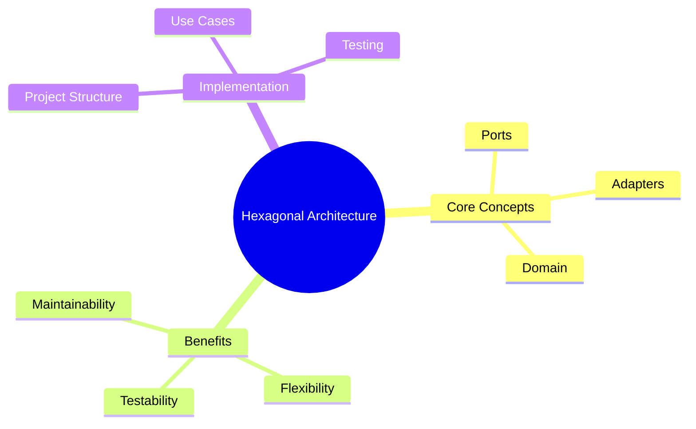

# Introduction to Hexagonal Architecture

## Sam's Challenge

Sam stared at the email from Maya, the angel investor who wanted to fund BookShelf. The weekend hackathon project had turned into something real, but there was a problem.

"Sam, I love the web app," Maya had written, "but my users need mobile support. Can you build iOS and Android apps?"

Before Sam could reply, another email arrived from Chen at Riverside Library: "We're interested in BookShelf for our enterprise deployment, but we need it to run on-premise with our existing Oracle database. Is that possible?"

Sam opened the BookShelf codebase and winced. The database queries were scattered throughout the HTTP handlers. The business logic was mixed with JSON serialization. Everything was tightly coupled to PostgreSQL and REST endpoints.

"How am I supposed to add mobile apps AND switch databases?" Sam muttered. "I'd have to rewrite everything!"

That's when Sam's mentor Alex sent a message: "Sounds like you need Hexagonal Architecture. Let me show you how to build software that actually adapts to change."

---

Welcome to this comprehensive course on Hexagonal Architecture! By the end of this course, you'll understand how to build maintainable, testable, and flexible software - just like Sam will learn to transform BookShelf.

## Course Overview

## What You'll Learn

- Why traditional architecture often fails at scale (Sam's initial problem)
- The core principles of Hexagonal Architecture
- How to implement Ports and Adapters
- Real-world patterns and best practices
- How to test hexagonal applications

## The BookShelf Journey

Throughout this course, we'll follow Sam's journey transforming BookShelf from a tightly-coupled monolith into a flexible, hexagonal architecture that can:

- Support multiple interfaces (REST, GraphQL, gRPC, mobile apps)
- Work with different databases (PostgreSQL, SQLite, Oracle)
- Deploy anywhere (cloud, on-premise, embedded)
- Be tested independently at every layer

You'll see real code examples from the BookShelf domain:
- **Book** - The items in the library
- **User** - People who borrow books
- **Loan** - The borrowing transaction

## Prerequisites

- Basic knowledge of Go programming
- Understanding of interfaces
- Familiarity with web APIs (REST/GraphQL)

## Sam's Starting Point

BookShelf started as a simple REST API with these features:
- Users can register and log in
- Browse available books
- Borrow and return books
- View borrowing history

The code worked, but it was inflexible. Every new requirement meant touching multiple files and risking breaking existing functionality.

Let's begin our journey into better software architecture and help Sam build something that can actually grow!