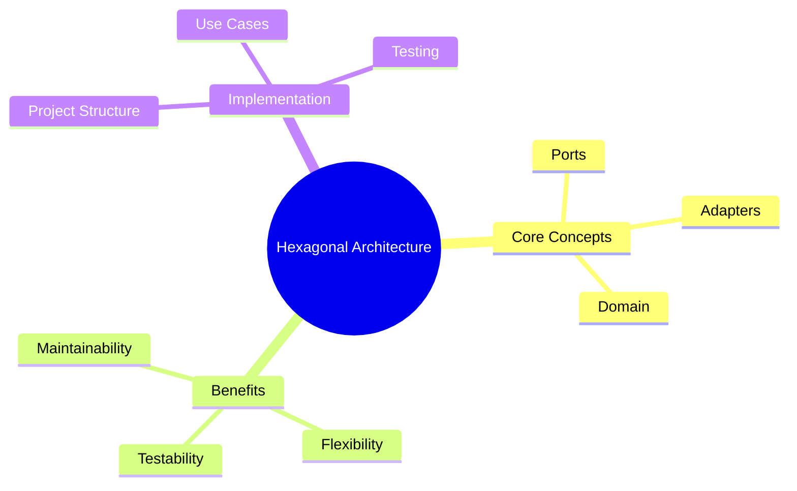

# Introduction to Hexagonal Architecture

Welcome to this comprehensive course on Hexagonal Architecture! By the end of this course, you'll understand how to build maintainable, testable, and flexible software.

## Course Overview

## What You'll Learn

- Why traditional architecture often fails at scale
- The core principles of Hexagonal Architecture
- How to implement Ports and Adapters
- Real-world patterns and best practices
- How to test hexagonal applications

## Prerequisites

- Basic knowledge of Go programming
- Understanding of interfaces
- Familiarity with web APIs (REST/GraphQL)

Let's begin our journey into better software architecture!