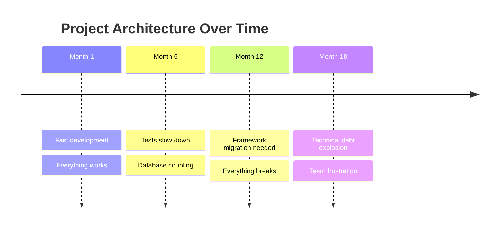
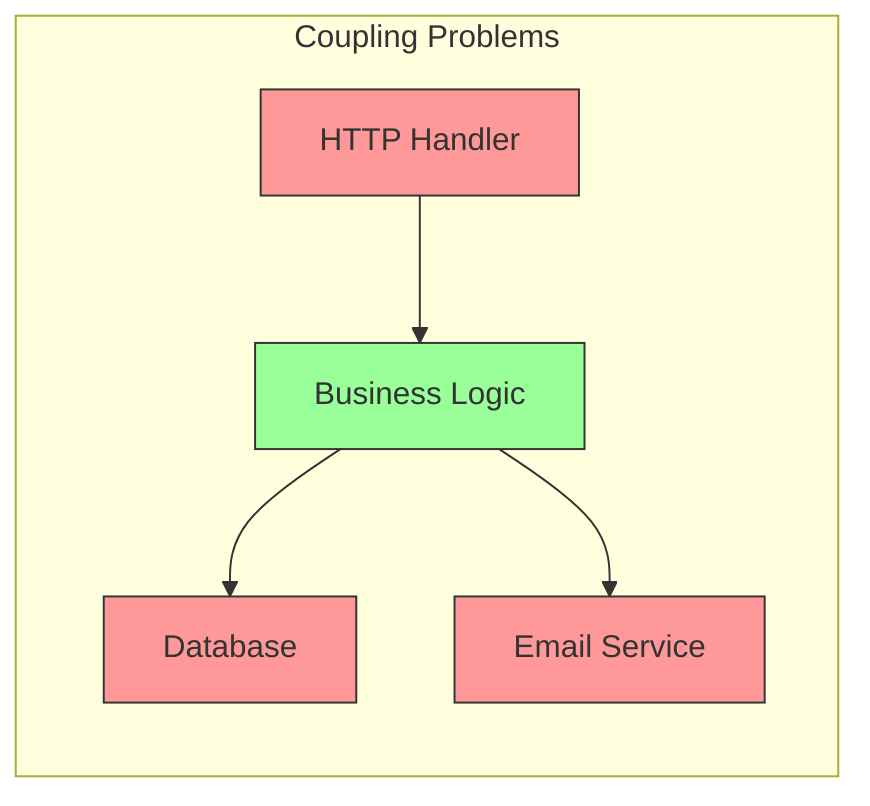

# The Problem: Why Traditional Architecture Fails

Before we dive into Hexagonal Architecture, let's understand the pain it solves.

## The Typical Project Journey



## A Real Story

Imagine you're building an e-commerce platform. You start simple:

```go
// Seems reasonable at first...
func CreateOrder(w http.ResponseWriter, r *http.Request) {
    var order Order
    json.NewDecoder(r.Body).Decode(&order)

    // Validate
    if order.Total < 0 {
        http.Error(w, "Invalid total", 400)
        return
    }

    // Save to database
    db.Exec("INSERT INTO orders...")

    // Send email
    smtp.Send(order.CustomerEmail, "Order confirmed!")

    json.NewEncoder(w).Encode(order)
}
```

### What's Wrong Here?



1. **Testing is painful** - You need a real database and SMTP server
2. **Changes cascade** - Switching email providers means changing business logic
3. **Everything is coupled** - HTTP, database, email all mixed together
4. **No clear boundaries** - Where does "order creation" logic live?