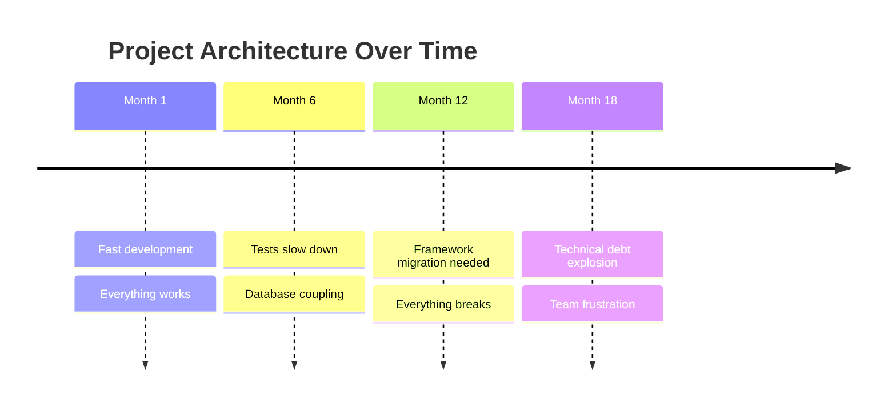
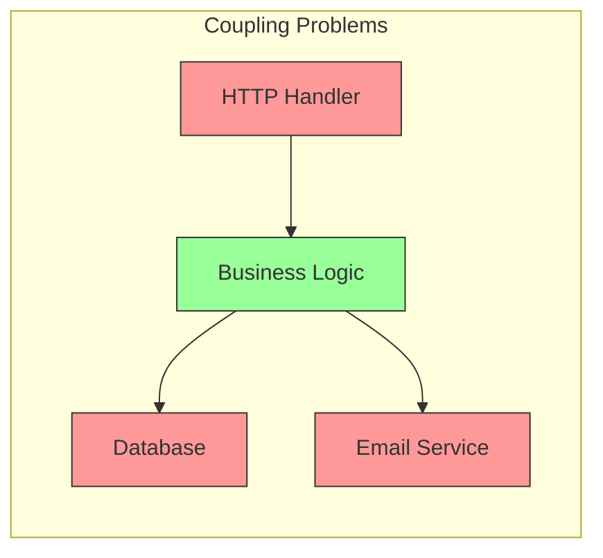

# The Problem: Why Traditional Architecture Fails

## Sam's Scenario: The Weekend That Changed Everything

Sam was riding high. BookShelf, the digital library management system built during a weekend hackathon, had just won first place. Users loved it—simple book tracking, loan management, and a clean interface. The judges praised its elegant simplicity.

Three months later, Sam sat staring at the codebase with growing dread. Maya, an angel investor, wanted a mobile app. Chen from Riverside Library needed on-premise deployment with their existing Oracle database. Every "small" change seemed to break something unexpected. The elegant weekend project had become a tangled mess.

"How did this happen so fast?" Sam wondered, scrolling through a 500-line function that mixed HTTP handling, database queries, and email notifications. This is when Alex, a senior architect, reached out with a message: "Want to learn why your architecture is fighting you?"

## The Typical Project Journey



## Sam's Code: The Hackathon Hero

Here's what Sam built during the hackathon weekend for BookShelf:

```go
// Seemed perfect for the demo...
func CreateLoan(w http.ResponseWriter, r *http.Request) {
    var loan Loan
    json.NewDecoder(r.Body).Decode(&loan)

    // Validate
    if loan.BookISBN == "" {
        http.Error(w, "Invalid ISBN", 400)
        return
    }

    // Save to database
    db.Exec("INSERT INTO loans (book_isbn, user_email, due_date) VALUES (?, ?, ?)",
        loan.BookISBN, loan.UserEmail, loan.DueDate)

    // Send email
    smtp.Send(loan.UserEmail, "Book loan confirmed! Due: " + loan.DueDate)

    json.NewEncoder(w).Encode(loan)
}
```

### What's Wrong Here?



1. **Testing is painful** - You need a real database and SMTP server
2. **Changes cascade** - Switching email providers means changing business logic
3. **Everything is coupled** - HTTP, database, email all mixed together
4. **No clear boundaries** - Where does "loan creation" logic live?

## Sam's Insight

"I see it now," Sam told Alex after analyzing the code. "When Maya asked for a mobile app, I couldn't reuse the loan logic because it's buried in the HTTP handler. When Chen wanted Oracle instead of SQLite, I'd have to change every function. And I can't write a single test without setting up a real database and email server."

Alex smiled. "Exactly. Your code works, but it's fighting against change. Every new requirement is a battle because everything is tangled together. Let me show you a better way—one where your business logic doesn't know or care about HTTP, databases, or email providers. It's called Hexagonal Architecture."