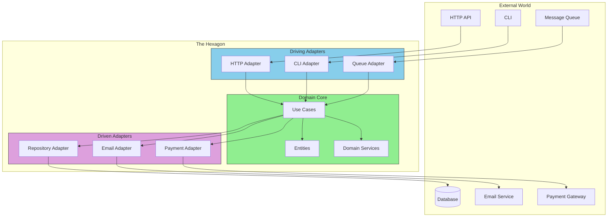

# The Big Picture: What is Hexagonal Architecture?

Hexagonal Architecture was invented by Alistair Cockburn in 2005.

## The Core Idea (In One Sentence)

> **Your business logic should not know or care about the outside world.**

That's it. Everything else flows from this principle.

## The Hexagon Metaphor

- **Domain (Core)** - Pure business logic, no dependencies
- **Ports** - Interfaces that define contracts
- **Adapters** - Implementations that connect to the real world

## Other Names

You might hear these terms - they're all related:
- **Ports and Adapters** (same thing, clearer name)
- **Clean Architecture** (Uncle Bob's version)
- **Onion Architecture** (similar, layers like an onion)