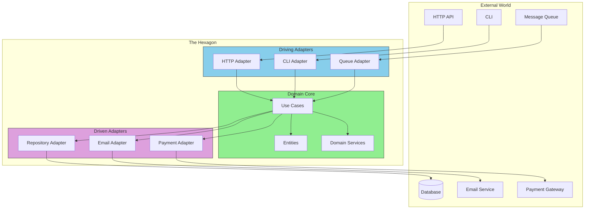

# The Big Picture: What is Hexagonal Architecture?

## Sam's Scenario: Alex's Drawing

"Let me show you something," Alex said, pulling out a tablet. They sketched a hexagon with "BookShelf Core" in the center. "Right now, your loan creation logic knows about HTTP requests, SQLite syntax, and SMTP. What if it didn't need to know any of that?"

Sam looked puzzled. "But it has to store data and send emails somehow."

"Of course," Alex replied. "But the *loan logic* doesn't need to know *how*. It just needs to say 'save this loan' and 'send this email.' The hexagon is your business logic—creating loans, managing books, tracking users. Everything else is outside, plugging into it."

Alex continued, "This is Hexagonal Architecture, invented by Alistair Cockburn in 2005. It has one simple rule that changes everything."

## The Core Idea (In One Sentence)

> **Your business logic should not know or care about the outside world.**

That's it. Everything else flows from this principle.

## The Hexagon Metaphor

- **Domain (Core)** - Pure business logic, no dependencies
- **Ports** - Interfaces that define contracts
- **Adapters** - Implementations that connect to the real world

## Sam's Insight: The Light Bulb Moment

Sam's eyes lit up. "So when Maya wants a mobile app, I just create a new adapter? The loan creation logic stays the same?"

"Exactly!" Alex confirmed. "And when Chen needs Oracle instead of SQLite?"

"Just a different adapter for the database," Sam said, excited now. "The Book and Loan logic doesn't change at all. It just calls an interface like 'BookRepository' and doesn't care if it's SQLite, Oracle, or even a test mock."

"You've got it," Alex smiled. "Your business rules live in the hexagon, isolated and testable. Everything else—HTTP handlers, databases, email services—plugs into it through ports and adapters. Now Maya can have her mobile app, Chen can have Oracle, and your tests can use an in-memory database. All without touching your core business logic."

## Other Names

You might hear these terms - they're all related:
- **Ports and Adapters** (same thing, clearer name)
- **Clean Architecture** (Uncle Bob's version)
- **Onion Architecture** (similar, layers like an onion)