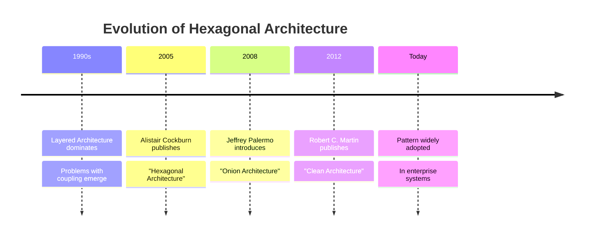
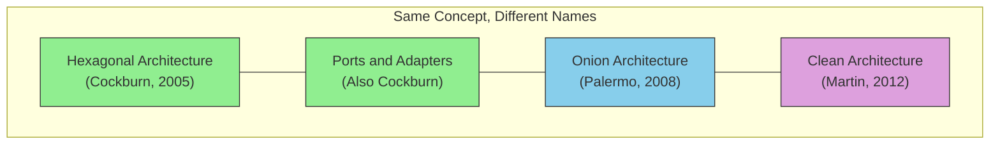

# History and Alternative Names

## Sam's Scenario: Research Time

After Alex left, Sam dove into research. "If this pattern is so good, why haven't I heard of it?" They started searching and found multiple names: Hexagonal Architecture, Ports and Adapters, Clean Architecture, Onion Architecture. "Are these all different things?" Sam messaged Alex.

"Great question," Alex replied. "They're all solving the same problem—isolating business logic from infrastructure. Let me give you the history."

Hexagonal Architecture was introduced by **Alistair Cockburn** in 2005, though the ideas had been brewing for years before that.

## The Origin Story

## Why "Hexagonal"?

The hexagon shape isn't significant - Cockburn chose it because:
- It allows drawing multiple ports on different "sides"
- It breaks the mental model of traditional layered diagrams
- Six sides can represent different types of external actors

## Alternative Names

| Name | Author | Key Emphasis |
|------|--------|--------------|
| **Hexagonal** | Cockburn | Ports and adapters metaphor |
| **Ports and Adapters** | Cockburn | Same as above, clearer name |
| **Onion Architecture** | Palermo | Layers like an onion, core at center |
| **Clean Architecture** | Martin | Dependency Rule, enterprise patterns |

## They All Share Core Principles

Despite different names, all these architectures share:

1. **Business logic at the center** - isolated from external concerns
2. **Dependency inversion** - outer layers depend on inner, never reverse
3. **Interface-based communication** - ports/boundaries between layers
4. **Testability** - core can be tested without infrastructure

## Cockburn's Original Definition

> "Allow an application to equally be driven by users, programs, automated test or batch scripts, and to be developed and tested in isolation from its eventual run-time devices and databases."

This single sentence captures the essence of the pattern.

## Sam's Insight

"I get it now," Sam realized. "Whether I call it Hexagonal, Ports and Adapters, or Clean Architecture, the core idea is the same: BookShelf's loan logic should work whether I'm calling it from a REST API, a GraphQL endpoint, or a CLI tool. And it should work with SQLite, Oracle, or a test mock."

Sam bookmarked Cockburn's original article. "This isn't just theory—this solves exactly the problems I'm facing with Maya's mobile requirements and Chen's Oracle database. Time to refactor BookShelf the right way."
