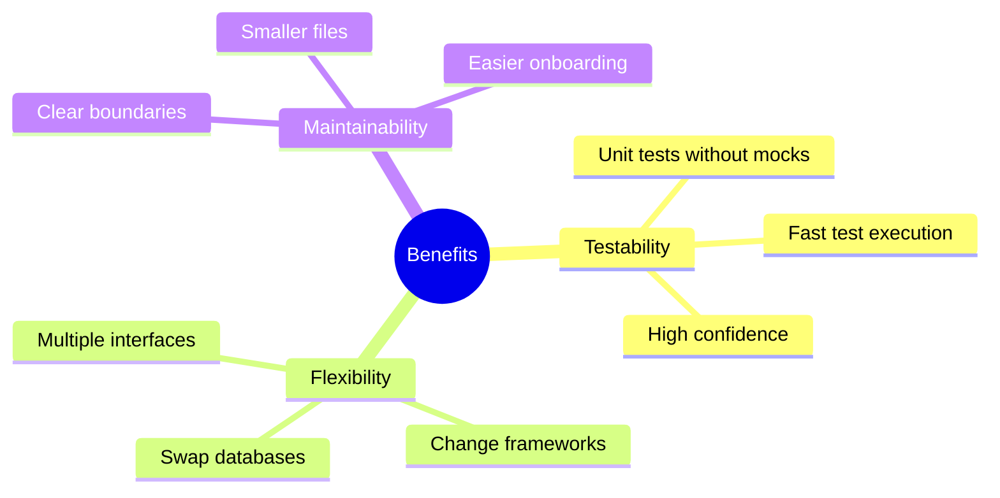
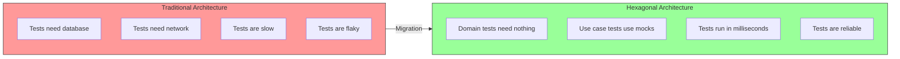
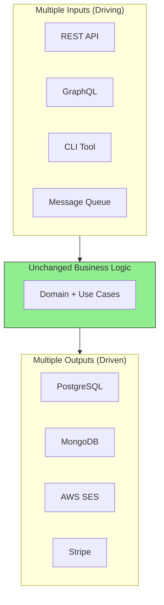
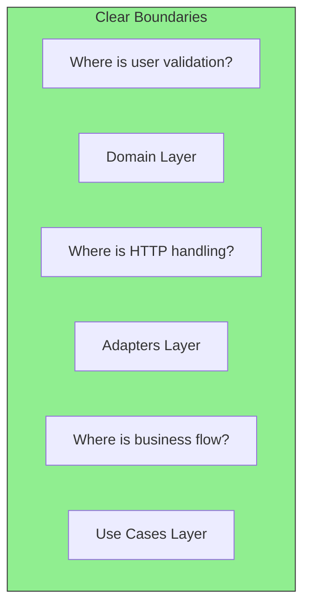

# Key Benefits of Hexagonal Architecture

Why should you invest time learning this pattern? Here are the concrete benefits you'll gain.

## The Three Core Benefits

## 1. Testability

**Real Numbers:**
| Metric | Before | After |
|--------|--------|-------|
| Unit test execution | 45 seconds | 0.5 seconds |
| Test coverage | 40% | 85% |
| Flaky tests | 15% | 0% |

## 2. Flexibility

Your application can have multiple entry points and exit points without changing business logic:

**Example scenarios:**
- Switch from PostgreSQL to MongoDB? Just write a new adapter
- Add a CLI interface? Create a new driving adapter
- Replace SendGrid with AWS SES? Swap the email adapter

## 3. Maintainability

**Benefits for teams:**
- New developers can understand the codebase faster
- Each layer has a single responsibility
- Changes are isolated to specific areas
- Code reviews are more focused

## Summary Table

| Benefit | How Hex Arch Achieves It |
|---------|--------------------------|
| **Testability** | Domain has zero dependencies, use mocks for use cases |
| **Flexibility** | Swap adapters without touching business logic |
| **Maintainability** | Clear layers, each with one job |
| **Framework Independence** | Domain doesn't know about HTTP, SQL, or any framework |
| **Delayed Decisions** | Choose your database later, start with in-memory |
| **Team Scalability** | Different teams can work on different layers |
