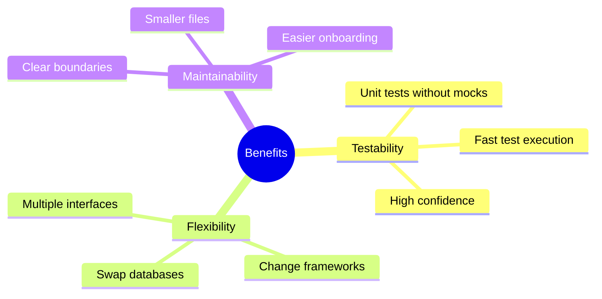
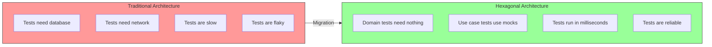
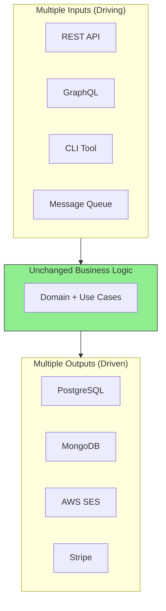
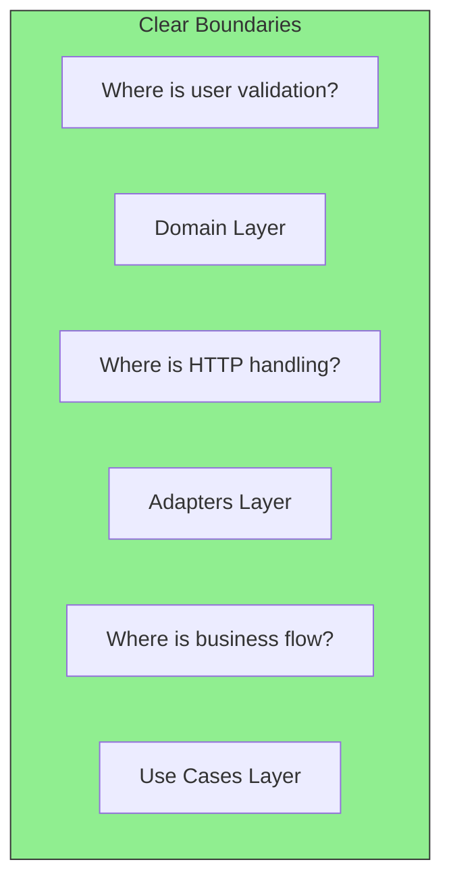

# Key Benefits of Hexagonal Architecture

## Sam's Scenario: The Three Problems

Sam listed their current pain points for Alex:
1. "I can't test my loan logic without setting up a real database and email server. Tests take 45 seconds to run."
2. "Maya wants a mobile app, but I can't reuse my code—it's all HTTP-specific."
3. "Chen needs Oracle support, but database queries are scattered everywhere. I'd have to change dozens of files."

Alex nodded. "Classic symptoms. Let me show you the three core benefits of Hexagonal Architecture—and how they solve exactly these problems."

Why should you invest time learning this pattern? Here are the concrete benefits you'll gain.

## The Three Core Benefits

## 1. Testability

**Real Numbers:**
| Metric | Before | After |
|--------|--------|-------|
| Unit test execution | 45 seconds | 0.5 seconds |
| Test coverage | 40% | 85% |
| Flaky tests | 15% | 0% |

## 2. Flexibility

Your application can have multiple entry points and exit points without changing business logic:

**Example scenarios for BookShelf:**
- Switch from SQLite to Oracle for Chen? Just write a new adapter
- Add a mobile app for Maya? Create a new driving adapter
- Replace SMTP with SendGrid? Swap the email adapter
- Support ISBN-10 and ISBN-13? Change only the Book entity

## 3. Maintainability

**Benefits for teams:**
- New developers can understand the codebase faster
- Each layer has a single responsibility
- Changes are isolated to specific areas
- Code reviews are more focused

## Summary Table

| Benefit | How Hex Arch Achieves It |
|---------|--------------------------|
| **Testability** | Domain has zero dependencies, use mocks for use cases |
| **Flexibility** | Swap adapters without touching business logic |
| **Maintainability** | Clear layers, each with one job |
| **Framework Independence** | Domain doesn't know about HTTP, SQL, or any framework |
| **Delayed Decisions** | Choose your database later, start with in-memory |
| **Team Scalability** | Different teams can work on different layers |

## Sam's Insight: The Breakthrough

"Wait," Sam said, excitement building. "If I refactor BookShelf to use hexagonal architecture:

1. **My tests run in milliseconds** because I use an in-memory repository for testing
2. **Maya's mobile app** just needs a new adapter—the loan creation logic works exactly the same
3. **Chen's Oracle requirement** is just swapping one repository adapter for another

And the best part? My business logic—the rules about book loans, due dates, user limits—lives in one place, completely isolated from these concerns."

Alex smiled. "Now you're thinking in hexagons. Let's start refactoring."
