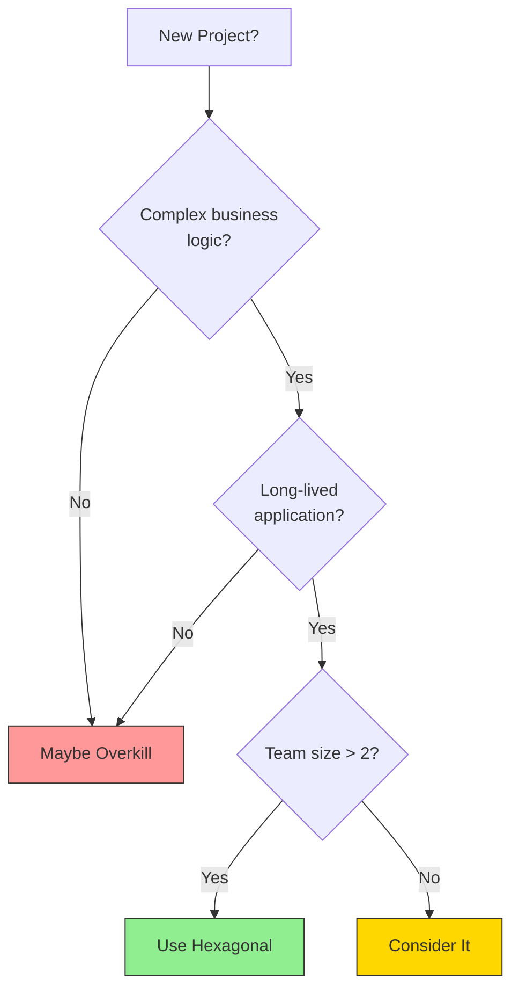
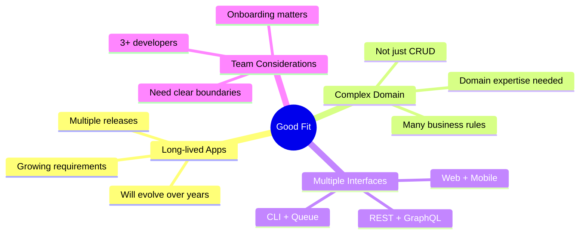
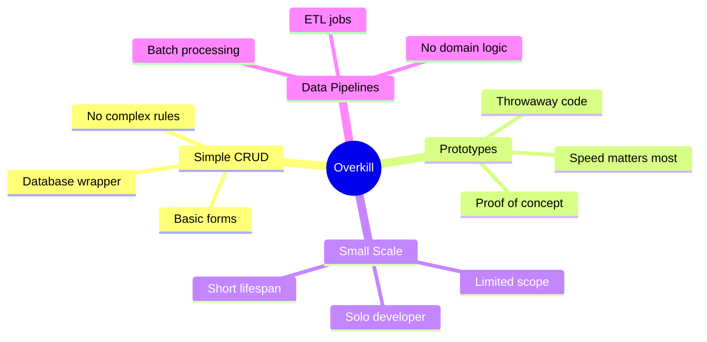

# When to Use (and When Not To)

## Sam's Scenario: The Honest Question

"Okay, I'm sold on hexagonal architecture for BookShelf," Sam admitted. "But I have a confession. Last week I built a tiny URL shortener for a friend's wedding. Just a simple form that saves links to a database. Should I have used hexagonal architecture for that too?"

Alex laughed. "Absolutely not! That would be massive overkill. Hexagonal architecture has a cost—more files, more interfaces, more initial complexity. Let me show you when it's worth that cost and when it's not."

Hexagonal Architecture is powerful, but it's not always the right choice. Let's look at when it shines and when it might be overkill.

## Decision Framework

## Good Fit: Use Hexagonal Architecture

**Examples of good fits:**
- **BookShelf** - digital library with loans, users, multiple storage needs
- E-commerce platforms
- Banking/financial systems
- Healthcare applications
- Enterprise SaaS products
- Microservices with complex domains

## Overkill: Skip Hexagonal Architecture

**Examples of overkill:**
- Simple blog or CMS
- One-off scripts
- **Wedding URL shortener** - Sam's simple form-to-database app
- Landing page backends
- Simple REST wrappers around a database
- Basic CRUD with no business rules

## The Middle Ground

Sometimes you're not sure. Here are some questions to help:

| Question | If Yes | If No |
|----------|--------|-------|
| Will this exist in 2 years? | Consider Hex | Keep simple |
| Multiple data sources? | Consider Hex | Keep simple |
| Need high test coverage? | Consider Hex | Keep simple |
| Team growing? | Consider Hex | Keep simple |
| Complex business rules? | Consider Hex | Keep simple |

## Signs You Made the Wrong Choice

**Used Hexagonal when you shouldn't have:**
- More boilerplate than business code
- Ports with single implementations that will never change
- Team spending more time on architecture than features

**Didn't use it when you should have:**
- Fear of changing database queries breaks features
- Tests require full infrastructure
- New developers take months to understand the code
- "Quick fixes" cause cascading breaks

## The Pragmatic Approach

> Start simple. Add structure as complexity grows.

You can always refactor toward Hexagonal Architecture later. It's easier to add ports and adapters to existing code than to remove unnecessary abstractions.

## Sam's Insight: The Right Tool for the Job

"So my weekend hackathon approach was actually fine for the initial BookShelf," Sam realized. "The problem wasn't building it quickly—the problem was not recognizing when complexity demanded better architecture."

"Exactly," Alex confirmed. "When Maya and Chen showed up with real requirements—mobile support, enterprise deployment, multiple databases—that was the signal. BookShelf graduated from a hackathon demo to a real product. Now it deserves hexagonal architecture."

Sam nodded, understanding. "And the wedding URL shortener?"

"Keep it simple," Alex grinned. "Not everything needs to be architected for enterprise scale. Save your energy for the projects that matter. BookShelf matters—it's growing, has real users, and needs to evolve. That's when hexagonal architecture pays off."
