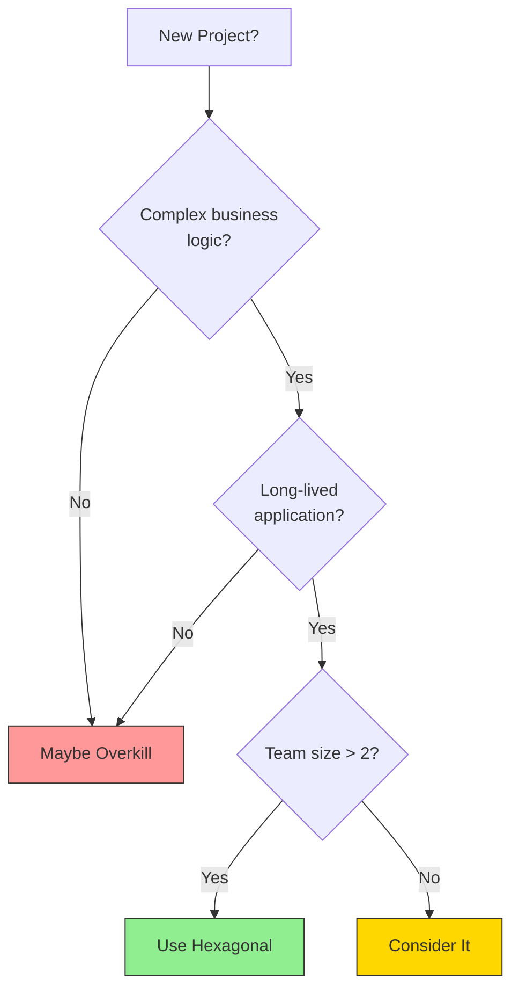
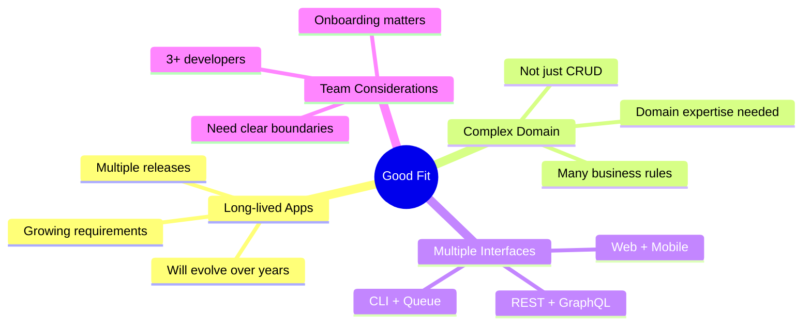
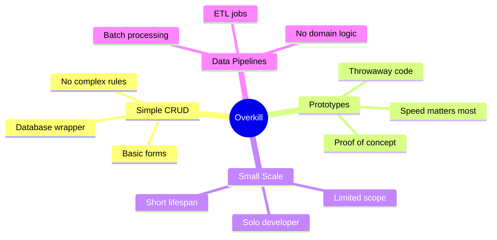

# When to Use (and When Not To)

Hexagonal Architecture is powerful, but it's not always the right choice. Let's look at when it shines and when it might be overkill.

## Decision Framework

## Good Fit: Use Hexagonal Architecture

**Examples of good fits:**
- E-commerce platforms
- Banking/financial systems
- Healthcare applications
- Enterprise SaaS products
- Microservices with complex domains

## Overkill: Skip Hexagonal Architecture

**Examples of overkill:**
- Simple blog or CMS
- One-off scripts
- Hackathon projects
- Landing page backends
- Simple REST wrappers around a database

## The Middle Ground

Sometimes you're not sure. Here are some questions to help:

| Question | If Yes | If No |
|----------|--------|-------|
| Will this exist in 2 years? | Consider Hex | Keep simple |
| Multiple data sources? | Consider Hex | Keep simple |
| Need high test coverage? | Consider Hex | Keep simple |
| Team growing? | Consider Hex | Keep simple |
| Complex business rules? | Consider Hex | Keep simple |

## Signs You Made the Wrong Choice

**Used Hexagonal when you shouldn't have:**
- More boilerplate than business code
- Ports with single implementations that will never change
- Team spending more time on architecture than features

**Didn't use it when you should have:**
- Fear of changing database queries breaks features
- Tests require full infrastructure
- New developers take months to understand the code
- "Quick fixes" cause cascading breaks

## The Pragmatic Approach

> Start simple. Add structure as complexity grows.

You can always refactor toward Hexagonal Architecture later. It's easier to add ports and adapters to existing code than to remove unnecessary abstractions.
