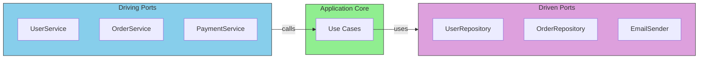

# Core Concepts: Ports

## Sam's Challenge

"Okay Alex, I get that my code is a mess," Sam said over video call. "But where do I even start?"

Alex smiled. "Start with **ports**. Think of them as contracts - agreements about what your application can do, without saying *how* it does it."

"Like... interfaces?" Sam asked.

"Exactly! Let's look at BookShelf. Right now, what can someone do with your app?"

Sam thought for a moment. "They can borrow books, return books, search for books..."

"Perfect. Those are your **driving ports** - the operations that *drive* your application. They're the 'what' your application offers to the outside world."

Alex continued, "And what does BookShelf need from the outside world?"

"It needs to... store data? Send emails when books are due?"

"Right! Those are your **driven ports** - the things your application *drives* or controls in the external world."

---

Ports are the **interfaces** that define how your application communicates with the outside world.

## Port Types Overview



This chapter covers the two types of ports and how to design them effectively.

## BookShelf Ports Example

### Driving Ports (What BookShelf Offers)

```go
// BookService - The operations BookShelf offers to the world
type BookService interface {
    BorrowBook(ctx context.Context, userID, bookID string) (*Loan, error)
    ReturnBook(ctx context.Context, loanID string) error
    SearchBooks(ctx context.Context, query string) ([]*Book, error)
    GetAvailableBooks(ctx context.Context) ([]*Book, error)
}

// UserService - User management operations
type UserService interface {
    RegisterUser(ctx context.Context, email, name string) (*User, error)
    GetUser(ctx context.Context, userID string) (*User, error)
    GetUserLoans(ctx context.Context, userID string) ([]*Loan, error)
}
```

Notice these interfaces don't care *how* you call them (REST? GraphQL? CLI?) - they just define what operations exist.

### Driven Ports (What BookShelf Needs)

```go
// BookRepository - BookShelf needs to store books somewhere
type BookRepository interface {
    FindByID(ctx context.Context, id string) (*Book, error)
    FindAvailable(ctx context.Context) ([]*Book, error)
    Search(ctx context.Context, query string) ([]*Book, error)
    Update(ctx context.Context, book *Book) error
}

// LoanRepository - BookShelf needs to track loans
type LoanRepository interface {
    Create(ctx context.Context, loan *Loan) error
    FindByID(ctx context.Context, id string) (*Loan, error)
    FindActiveByUser(ctx context.Context, userID string) ([]*Loan, error)
    Update(ctx context.Context, loan *Loan) error
}

// NotificationService - BookShelf needs to notify users
type NotificationService interface {
    SendBorrowConfirmation(ctx context.Context, user *User, book *Book) error
    SendReturnReminder(ctx context.Context, user *User, loan *Loan) error
}
```

Notice these interfaces don't care *what* database you use (PostgreSQL? SQLite? Oracle?) or *how* you send notifications (email? SMS? push?) - they just define what operations the application needs.

## Sam's Progress

"Oh, I see it now!" Sam exclaimed. "My HTTP handlers were calling database queries directly. If I define these port interfaces, then my business logic only depends on the *contract*, not the *implementation*!"

"Exactly," Alex nodded. "Now when Maya wants a mobile app, you just implement the same BookService interface with a different adapter. When Chen wants Oracle support, you just implement BookRepository with an Oracle adapter. The business logic never changes."

Sam opened the editor, ready to define BookShelf's ports. This was starting to make sense.