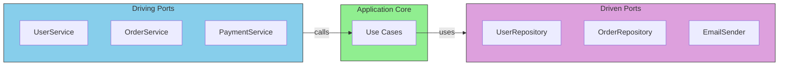

# Core Concepts: Ports

Ports are the **interfaces** that define how your application communicates with the outside world.

## Port Types Overview

This chapter covers the two types of ports and how to design them effectively.