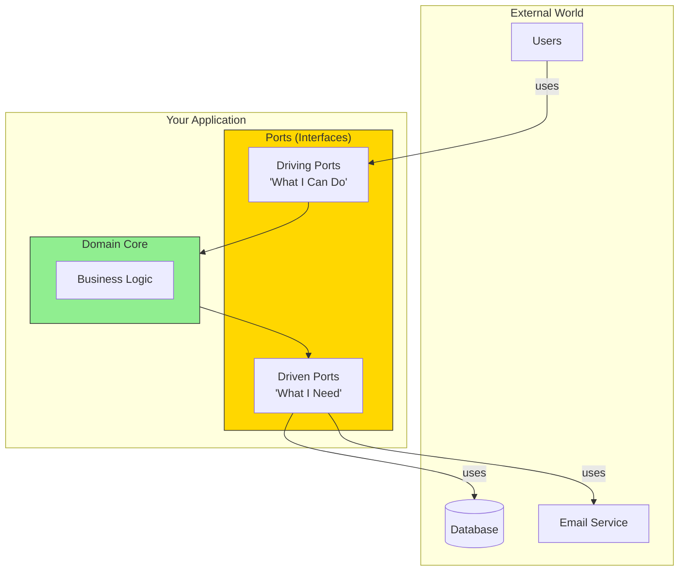
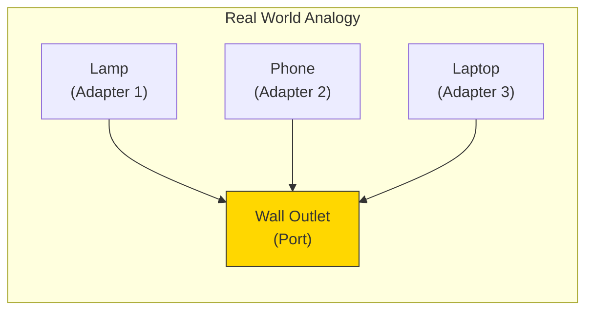
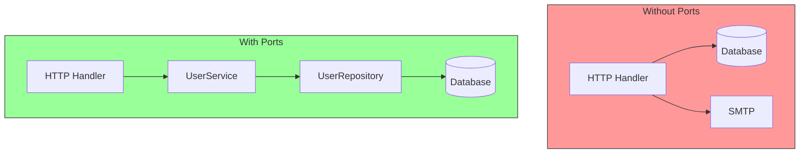

# What Are Ports?

## Sam's Scenario: The Interface Revelation

"Okay, so I need to separate my business logic from the infrastructure," Sam said, opening BookShelf's codebase. "But how? Where do I even start?"

Alex pulled up the loan creation code. "See this direct database call? Instead of calling SQLite directly, what if your loan logic just called an interface called 'LoanRepository'? It doesn't care if it's SQLite, Oracle, or a test mock—it just needs something that can save and retrieve loans."

"An interface..." Sam's eyes widened. "So ports are just Go interfaces?"

"Exactly! Ports are the **interfaces** that define how your application communicates with the outside world. They're the 'contract' between your business logic and everything else."

## The Port Concept



## Think of Ports as Electrical Outlets

Just like a wall outlet:
- Defines a **standard interface** (the shape of the plug)
- **Doesn't care** what's plugged in (lamp, phone, laptop)
- **Abstracts** the complexity behind it (power grid, transformers)



## Ports in Code

In Go, ports are simply **interfaces**:

```go
// A Driving Port - what BookShelf offers
type LoanService interface {
    CreateLoan(ctx context.Context, input CreateLoanInput) (*Loan, error)
    GetLoan(ctx context.Context, id string) (*Loan, error)
    ReturnBook(ctx context.Context, loanID string) error
}

// A Driven Port - what BookShelf needs
type BookRepository interface {
    Save(ctx context.Context, book *Book) error
    FindByISBN(ctx context.Context, isbn string) (*Book, error)
    FindByTitle(ctx context.Context, title string) ([]*Book, error)
}
```

## Two Types of Ports

| Type | Direction | Question It Answers | BookShelf Examples |
|------|-----------|---------------------|---------|
| **Driving Port** | Inbound | "What can this app do?" | LoanService, BookService |
| **Driven Port** | Outbound | "What does this app need?" | BookRepository, EmailNotifier |

## Why Ports Matter



Ports provide:
- **Abstraction** - hide implementation details
- **Testability** - mock the interfaces easily
- **Flexibility** - swap implementations without changing logic
- **Documentation** - interfaces describe capabilities

## Sam's Insight

"I get it now!" Sam said, typing rapidly. "My `CreateLoan` use case doesn't call SQLite directly—it calls the `BookRepository` interface. I can have a `SQLiteBookRepository` for development, an `OracleBookRepository` for Chen's enterprise deployment, and an `InMemoryBookRepository` for testing. The loan logic never changes!"

Alex nodded approvingly. "Now you're thinking in ports. The interface is the boundary, the contract. Everything on the BookShelf side of that boundary is pure business logic. Everything on the other side is infrastructure that can be swapped at will."
