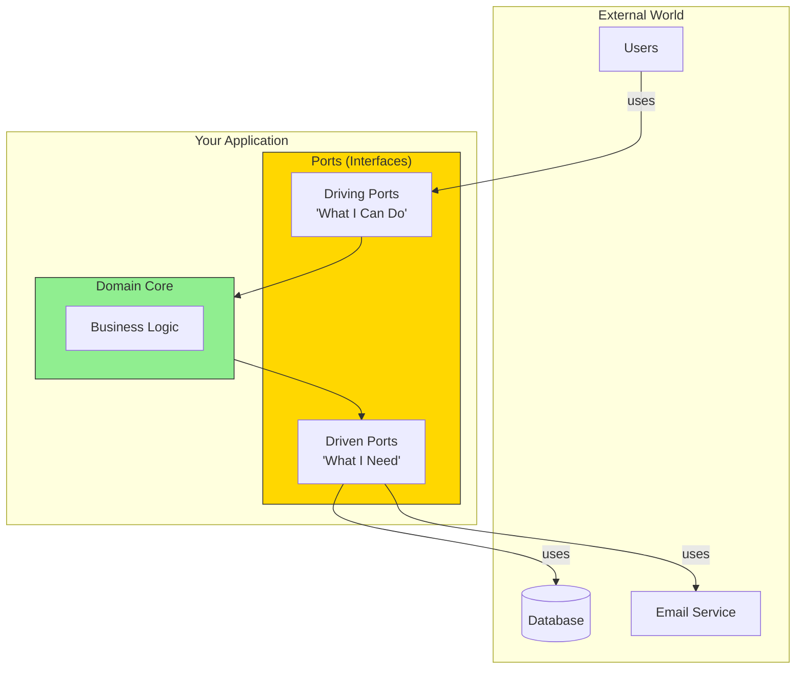
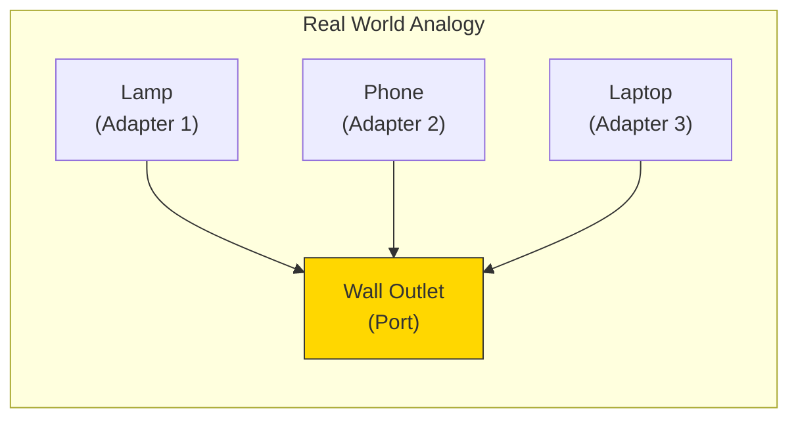
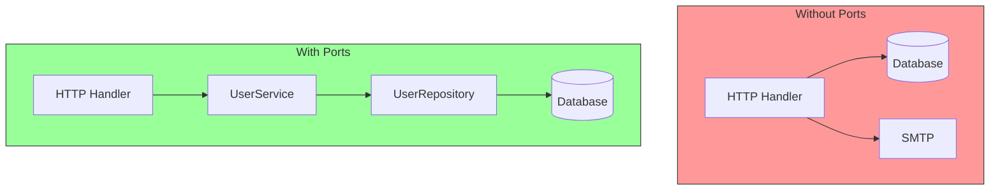

# What Are Ports?

Ports are the **interfaces** that define how your application communicates with the outside world. They're the "contract" between your business logic and everything else.

## The Port Concept



## Think of Ports as Electrical Outlets

Just like a wall outlet:
- Defines a **standard interface** (the shape of the plug)
- **Doesn't care** what's plugged in (lamp, phone, laptop)
- **Abstracts** the complexity behind it (power grid, transformers)



## Ports in Code

In Go, ports are simply **interfaces**:

```go
// A Driving Port - what the application offers
type UserService interface {
    CreateUser(ctx context.Context, input CreateUserInput) (*User, error)
    GetUser(ctx context.Context, id string) (*User, error)
}

// A Driven Port - what the application needs
type UserRepository interface {
    Save(ctx context.Context, user *User) error
    FindByID(ctx context.Context, id string) (*User, error)
}
```

## Two Types of Ports

| Type | Direction | Question It Answers | Example |
|------|-----------|---------------------|---------|
| **Driving Port** | Inbound | "What can this app do?" | UserService, OrderService |
| **Driven Port** | Outbound | "What does this app need?" | UserRepository, EmailSender |

## Why Ports Matter



Ports provide:
- **Abstraction** - hide implementation details
- **Testability** - mock the interfaces easily
- **Flexibility** - swap implementations without changing logic
- **Documentation** - interfaces describe capabilities
