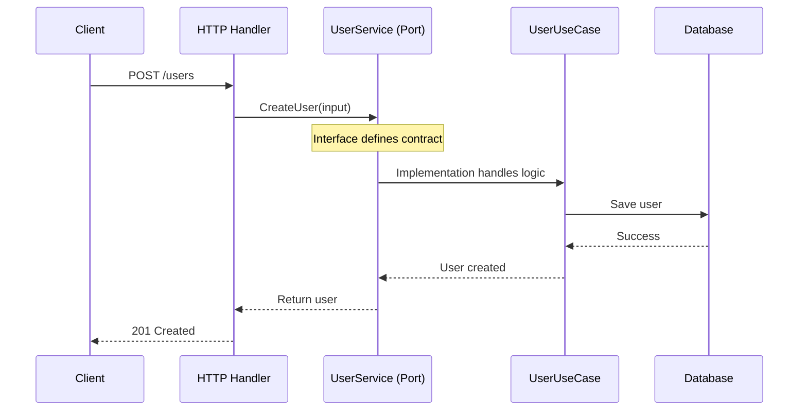

# Driving Ports (Inbound)

**Who uses them:** The outside world
**What they do:** Define what your application CAN DO

Think: "What services does my application offer?"

## Driving Port Flow



```go
// This port says: "My application can manage users"
type UserService interface {
    CreateUser(ctx context.Context, input CreateUserInput) (*User, error)
    GetUser(ctx context.Context, id string) (*User, error)
    UpdateUser(ctx context.Context, id string, input UpdateUserInput) (*User, error)
    DeleteUser(ctx context.Context, id string) error
}
```

These ports are implemented by your **use cases** and called by **driving adapters**.