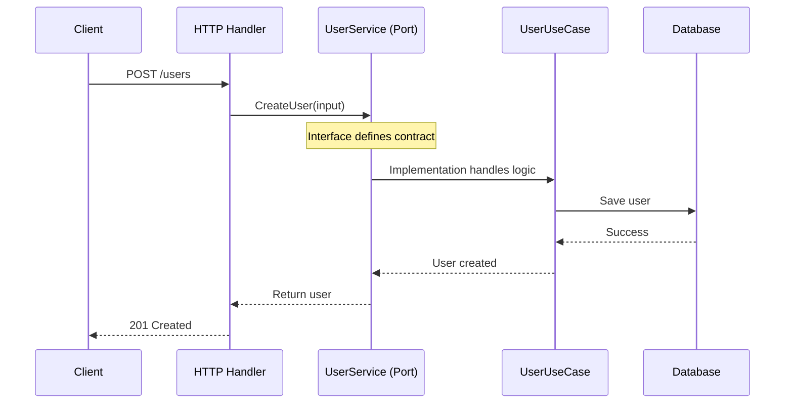

# Driving Ports (Inbound)

## Sam's Scenario: What Can BookShelf Do?

"Let me make sure I understand driving ports," Sam said, drawing on the whiteboard. "These are the interfaces that define what BookShelf can do for the outside world, right?"

"Exactly!" Alex confirmed. "When Maya's mobile app wants to create a loan, when Chen's web portal wants to search for books, when your CLI tool wants to list overdue items—they all use driving ports. These ports say 'here's what BookShelf offers.'"

**Who uses them:** The outside world
**What they do:** Define what your application CAN DO

Think: "What services does my application offer?"

## Driving Port Flow



```go
// This port says: "BookShelf can manage loans"
type LoanService interface {
    CreateLoan(ctx context.Context, input CreateLoanInput) (*Loan, error)
    GetLoan(ctx context.Context, id string) (*Loan, error)
    ReturnBook(ctx context.Context, loanID string) error
    ListOverdueLoans(ctx context.Context) ([]*Loan, error)
}

// This port says: "BookShelf can manage books"
type BookService interface {
    AddBook(ctx context.Context, input AddBookInput) (*Book, error)
    FindByISBN(ctx context.Context, isbn string) (*Book, error)
    SearchByTitle(ctx context.Context, title string) ([]*Book, error)
}
```

These ports are implemented by your **use cases** and called by **driving adapters**.

## Sam's Insight

"So when Maya's mobile app needs to create a loan," Sam said slowly, "it doesn't call my HTTP handler directly. It calls the `LoanService` interface. The mobile adapter implements the mobile-specific stuff, then calls `CreateLoan`. The REST adapter does REST-specific stuff, then calls the same `CreateLoan`. Same port, different adapters!"

Alex smiled. "Perfect. The driving port is the boundary. Maya's app, Chen's portal, your tests—they all use the same `LoanService` interface. Your business logic stays pure and reusable."