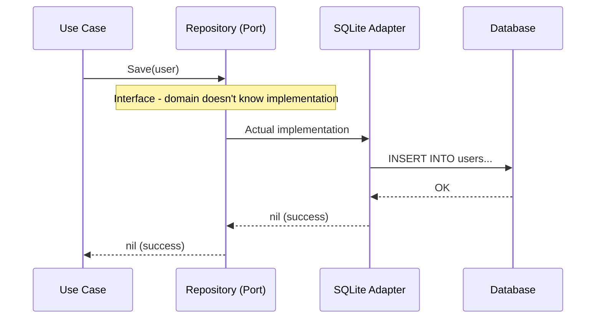

# Driven Ports (Outbound)

**Who uses them:** Your application
**What they do:** Define what your application NEEDS

Think: "What external capabilities does my application require?"

## Driven Port Flow



```go
// This port says: "I need to store users somewhere"
type UserRepository interface {
    Save(ctx context.Context, user *User) error
    FindByID(ctx context.Context, id string) (*User, error)
    FindByEmail(ctx context.Context, email string) (*User, error)
}

// This port says: "I need to send emails somehow"
type EmailSender interface {
    SendWelcomeEmail(ctx context.Context, to, userName string) error
    SendPasswordReset(ctx context.Context, to, resetLink string) error
}
```

These ports are **defined by your domain** but **implemented by adapters**.