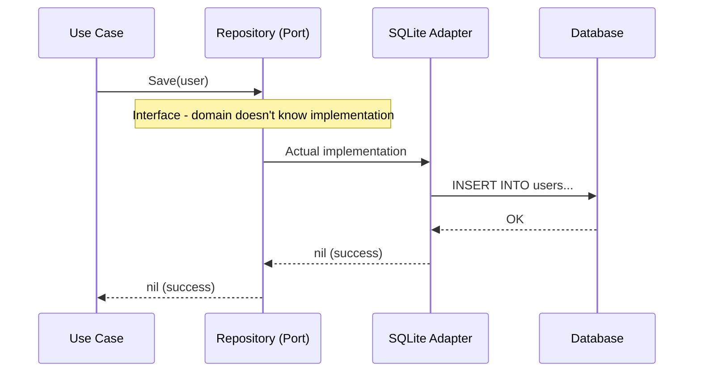

# Driven Ports (Outbound)

## Sam's Scenario: What Does BookShelf Need?

"Okay, driving ports make sense," Sam said. "But what about the other direction? BookShelf needs to store books in a database, send email notifications, maybe even check if an ISBN is valid online. How do those work?"

"Those are driven ports," Alex explained. "Your use cases define what they need through interfaces, but they don't care about the implementation. `CreateLoan` needs to save a loan somewhere—it calls `LoanRepository.Save()`. It doesn't know if that's SQLite, Oracle, or Redis. That's the power of driven ports."

**Who uses them:** Your application
**What they do:** Define what your application NEEDS

Think: "What external capabilities does my application require?"

## Driven Port Flow



```go
// This port says: "BookShelf needs to store loans somewhere"
type LoanRepository interface {
    Save(ctx context.Context, loan *Loan) error
    FindByID(ctx context.Context, id string) (*Loan, error)
    FindByUserEmail(ctx context.Context, email string) ([]*Loan, error)
    FindOverdue(ctx context.Context) ([]*Loan, error)
}

// This port says: "BookShelf needs to store books somewhere"
type BookRepository interface {
    Save(ctx context.Context, book *Book) error
    FindByISBN(ctx context.Context, isbn string) (*Book, error)
    FindByTitle(ctx context.Context, title string) ([]*Book, error)
}

// This port says: "BookShelf needs to send notifications somehow"
type EmailNotifier interface {
    SendLoanConfirmation(ctx context.Context, to string, loan *Loan) error
    SendOverdueReminder(ctx context.Context, to string, loan *Loan) error
}
```

These ports are **defined by your domain** but **implemented by adapters**.

## Sam's Insight

"This is brilliant!" Sam exclaimed. "My `CreateLoan` use case just says 'I need a LoanRepository.' In my tests, I pass in an in-memory mock. In development, I pass in SQLite. For Chen's deployment, I pass in Oracle. The use case doesn't change at all!"

Alex nodded. "And when you need to add email notifications later?"

"I just define an `EmailNotifier` interface," Sam said confidently, "inject it into my use case, and create different implementations—SMTP for development, SendGrid for production, a no-op mock for testing. The loan logic stays pure."