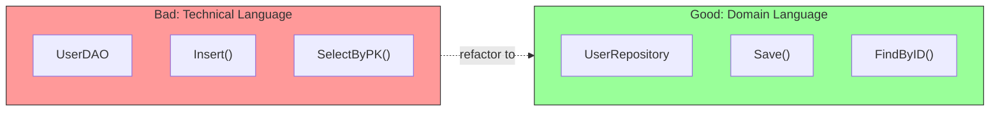

# Port Design Guidelines

## Sam's Scenario: The Naming Mistake

Sam showed Alex their first attempt at a port interface:

```go
type BookDAO interface {
    Insert(row BookRow) error
    SelectByPK(pk string) (*BookRow, error)
    UpdateRecord(pk string, data map[string]interface{}) error
}
```

Alex winced. "I see database language leaking into your domain. What happens when Chen wants to use Oracle instead of SQLite? This interface already assumes SQL terminology."

"Oh no," Sam realized. "What should I do instead?"

## 1. Use Domain Language



```go
// Bad: Technical/database language
type BookDAO interface {
    Insert(row BookRow) error
    SelectByPK(pk string) (*BookRow, error)
}

// Good: Domain language
type BookRepository interface {
    Save(ctx context.Context, book *Book) error
    FindByISBN(ctx context.Context, isbn string) (*Book, error)
}
```

## Sam's Insight

"I get it!" Sam said, rewriting the interface. "Instead of `Insert`, I use `Save`—that's what BookShelf does in the real world. Instead of `SelectByPK`, I use `FindByISBN` because that's how librarians think. The interface should speak the language of libraries, not databases."

Alex nodded. "Exactly. When you use domain language, the code reads like a conversation between librarians, not database administrators. That's maintainable code."

## 2. Keep Ports Focused

Follow the Interface Segregation Principle - many small interfaces are better than one large one.

## 3. Don't Leak Infrastructure

```go
// Bad: Leaks SQL concepts
type UserRepository interface {
    Query(sql string, args ...interface{}) (*sql.Rows, error)
}

// Good: Pure domain concepts
type UserRepository interface {
    FindByID(ctx context.Context, id string) (*User, error)
}
```