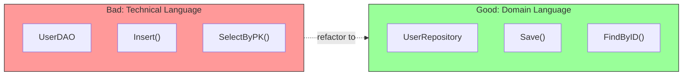

# Port Design Guidelines

## 1. Use Domain Language



```go
// Bad: Technical/database language
type UserDAO interface {
    Insert(row UserRow) error
    SelectByPK(pk int64) (*UserRow, error)
}

// Good: Domain language
type UserRepository interface {
    Save(ctx context.Context, user *User) error
    FindByID(ctx context.Context, id string) (*User, error)
}
```

## 2. Keep Ports Focused

Follow the Interface Segregation Principle - many small interfaces are better than one large one.

## 3. Don't Leak Infrastructure

```go
// Bad: Leaks SQL concepts
type UserRepository interface {
    Query(sql string, args ...interface{}) (*sql.Rows, error)
}

// Good: Pure domain concepts
type UserRepository interface {
    FindByID(ctx context.Context, id string) (*User, error)
}
```