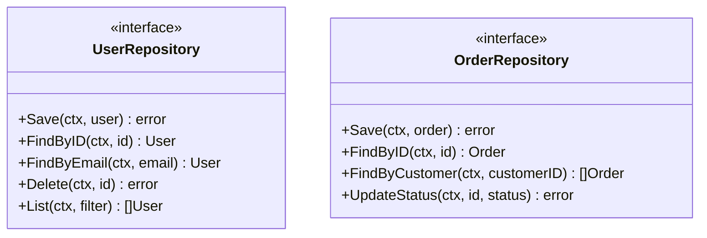
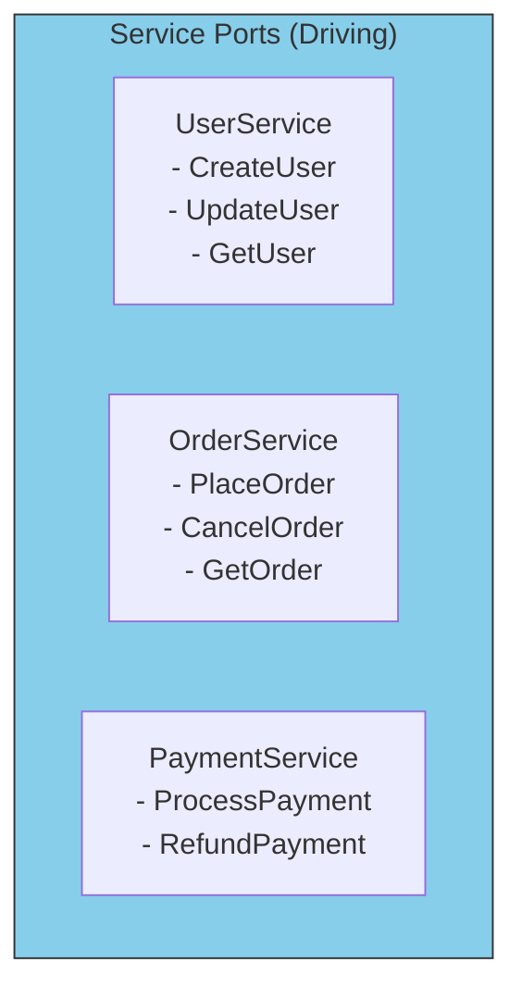

# Common Port Patterns

## Sam's Scenario: Building BookShelf's Port Catalog

"Now that I understand ports," Sam said, "what ports does BookShelf actually need? I don't want to over-engineer, but I also don't want to miss important ones."

Alex pulled out a list. "Let's identify the common patterns. Most applications need repositories for data, notifiers for communication, and services that define capabilities. BookShelf is no different."

Let's look at the most common types of ports you'll create in real applications.

## Repository Port Pattern

The most common driven port - abstracts data persistence:



```go
// Repository pattern - CRUD operations for BookShelf entities
type BookRepository interface {
    Save(ctx context.Context, book *Book) error
    FindByISBN(ctx context.Context, isbn string) (*Book, error)
    FindByTitle(ctx context.Context, title string) ([]*Book, error)
    Delete(ctx context.Context, isbn string) error
    List(ctx context.Context, filter BookFilter) ([]*Book, error)
}

type LoanRepository interface {
    Save(ctx context.Context, loan *Loan) error
    FindByID(ctx context.Context, id string) (*Loan, error)
    FindByUserEmail(ctx context.Context, email string) ([]*Loan, error)
    FindOverdue(ctx context.Context) ([]*Loan, error)
}
```

## Notification Port Pattern

Abstracts sending notifications of any kind:

```go
// Notification ports - BookShelf communications
type EmailNotifier interface {
    SendLoanConfirmation(ctx context.Context, to string, loan *Loan) error
    SendOverdueReminder(ctx context.Context, to string, loan *Loan) error
    SendBookAvailable(ctx context.Context, to string, book *Book) error
}

type SMSNotifier interface {
    SendDueDateReminder(ctx context.Context, phone string, loan *Loan) error
}
```

## Service Port Pattern

Driving ports that define application capabilities:



```go
// Service ports - BookShelf capabilities
type LoanService interface {
    CreateLoan(ctx context.Context, input CreateLoanInput) (*Loan, error)
    ReturnBook(ctx context.Context, loanID string) error
    GetLoan(ctx context.Context, id string) (*Loan, error)
    ListOverdueLoans(ctx context.Context) ([]*Loan, error)
}

type BookService interface {
    AddBook(ctx context.Context, input AddBookInput) (*Book, error)
    RemoveBook(ctx context.Context, isbn string) error
    FindBook(ctx context.Context, isbn string) (*Book, error)
    SearchBooks(ctx context.Context, query string) ([]*Book, error)
}
```

## External Service Port Pattern

Abstracts third-party APIs:

```go
// External service ports
type PaymentGateway interface {
    Charge(ctx context.Context, amount Money, cardToken string) (*Payment, error)
    Refund(ctx context.Context, paymentID string) error
}

type FileStorage interface {
    Upload(ctx context.Context, key string, data io.Reader) error
    Download(ctx context.Context, key string) (io.ReadCloser, error)
    Delete(ctx context.Context, key string) error
}

type SearchIndex interface {
    Index(ctx context.Context, id string, document interface{}) error
    Search(ctx context.Context, query string) ([]SearchResult, error)
}
```

## Port Pattern Summary

| Pattern | Type | Purpose | Examples |
|---------|------|---------|----------|
| **Repository** | Driven | Data persistence | UserRepository, OrderRepository |
| **Notification** | Driven | Send messages | EmailSender, SMSSender |
| **Service** | Driving | App capabilities | UserService, OrderService |
| **External** | Driven | Third-party APIs | PaymentGateway, FileStorage |
| **Event** | Driven | Publish events | EventPublisher, MessageQueue |

## Guidelines for Port Design

1. **Name ports by capability**, not implementation
2. **Keep ports focused** - follow Interface Segregation Principle
3. **Use domain language** - `Save`, not `Insert`; `FindByISBN`, not `SelectByPK`
4. **Return domain types** - `*Book`, not `*BookRow`

## Sam's Insight

Sam created a simple chart for BookShelf:

**Driving Ports (What BookShelf offers):**
- `LoanService` - manage book loans
- `BookService` - manage book catalog

**Driven Ports (What BookShelf needs):**
- `BookRepository` - store books
- `LoanRepository` - store loans
- `EmailNotifier` - send notifications

"This is so clear!" Sam said. "Every port has a single, obvious responsibility. When Maya's mobile app needs to create a loan, it calls `LoanService`. When Chen's Oracle adapter needs to be implemented, it implements `BookRepository` and `LoanRepository`. The ports are the contracts that make everything work together."
