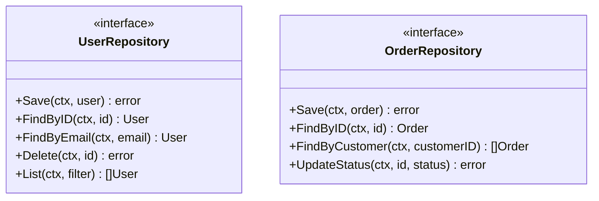
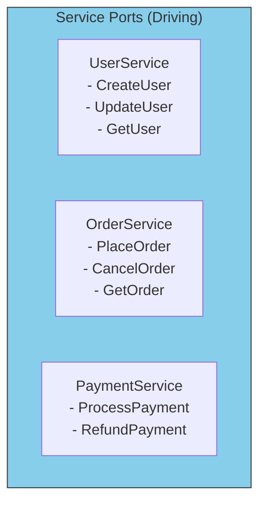

# Common Port Patterns

Let's look at the most common types of ports you'll create in real applications.

## Repository Port Pattern

The most common driven port - abstracts data persistence:



```go
// Repository pattern - CRUD operations for domain entities
type UserRepository interface {
    Save(ctx context.Context, user *User) error
    FindByID(ctx context.Context, id string) (*User, error)
    FindByEmail(ctx context.Context, email string) (*User, error)
    Delete(ctx context.Context, id string) error
    List(ctx context.Context, filter UserFilter) ([]*User, error)
}
```

## Notification Port Pattern

Abstracts sending notifications of any kind:

```go
// Notification ports - various ways to notify users
type EmailSender interface {
    SendWelcomeEmail(ctx context.Context, to, userName string) error
    SendPasswordReset(ctx context.Context, to, resetLink string) error
    SendOrderConfirmation(ctx context.Context, to string, order *Order) error
}

type SMSSender interface {
    SendVerificationCode(ctx context.Context, phone, code string) error
    SendAlert(ctx context.Context, phone, message string) error
}

type PushNotifier interface {
    SendPush(ctx context.Context, deviceID, title, body string) error
}
```

## Service Port Pattern

Driving ports that define application capabilities:



```go
// Service ports - what the application can do
type UserService interface {
    CreateUser(ctx context.Context, input CreateUserInput) (*User, error)
    UpdateUser(ctx context.Context, id string, input UpdateUserInput) (*User, error)
    GetUser(ctx context.Context, id string) (*User, error)
    DeleteUser(ctx context.Context, id string) error
}

type OrderService interface {
    PlaceOrder(ctx context.Context, input PlaceOrderInput) (*Order, error)
    CancelOrder(ctx context.Context, id string) error
    GetOrder(ctx context.Context, id string) (*Order, error)
    ListOrders(ctx context.Context, filter OrderFilter) ([]*Order, error)
}
```

## External Service Port Pattern

Abstracts third-party APIs:

```go
// External service ports
type PaymentGateway interface {
    Charge(ctx context.Context, amount Money, cardToken string) (*Payment, error)
    Refund(ctx context.Context, paymentID string) error
}

type FileStorage interface {
    Upload(ctx context.Context, key string, data io.Reader) error
    Download(ctx context.Context, key string) (io.ReadCloser, error)
    Delete(ctx context.Context, key string) error
}

type SearchIndex interface {
    Index(ctx context.Context, id string, document interface{}) error
    Search(ctx context.Context, query string) ([]SearchResult, error)
}
```

## Port Pattern Summary

| Pattern | Type | Purpose | Examples |
|---------|------|---------|----------|
| **Repository** | Driven | Data persistence | UserRepository, OrderRepository |
| **Notification** | Driven | Send messages | EmailSender, SMSSender |
| **Service** | Driving | App capabilities | UserService, OrderService |
| **External** | Driven | Third-party APIs | PaymentGateway, FileStorage |
| **Event** | Driven | Publish events | EventPublisher, MessageQueue |

## Guidelines for Port Design

1. **Name ports by capability**, not implementation
2. **Keep ports focused** - follow Interface Segregation Principle
3. **Use domain language** - `Save`, not `Insert`; `FindByID`, not `SelectByPK`
4. **Return domain types** - `*User`, not `*UserRow`
