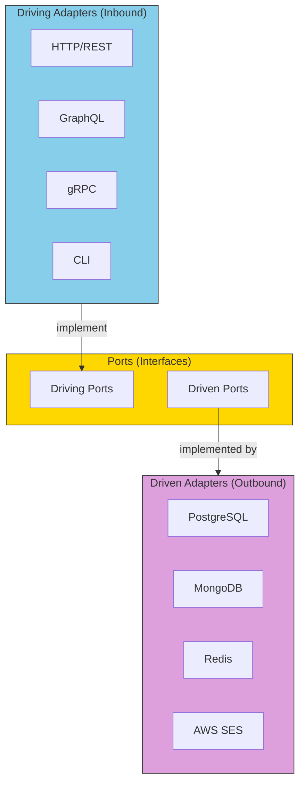

# Core Concepts: Adapters

## Sam's Challenge

"Okay, I've defined my ports," Sam showed Alex the BookService and BookRepository interfaces. "But now what? These are just interfaces - they don't actually *do* anything."

Alex grinned. "Now comes the fun part - **adapters**. Remember how I said ports are contracts? Adapters are the implementations that fulfill those contracts."

"So... I write a PostgreSQL adapter for BookRepository?" Sam asked.

"Exactly! And here's the beautiful part - you can write *multiple* adapters for the same port. PostgreSQL adapter for production, SQLite adapter for mobile apps, in-memory adapter for testing."

Sam's eyes lit up. "Wait... so I could support Maya's mobile requirement AND Chen's Oracle requirement just by writing different adapters? Without changing any business logic?"

"Now you're getting it!"

---

If ports are the contracts, adapters are the **concrete implementations** that fulfill those contracts.

## Adapter Architecture



In software, adapters translate between your domain and the outside world.

## BookShelf Adapters Example

### Driven Adapters (Outbound)

Let's see how Sam implements multiple adapters for BookRepository:

#### PostgreSQL Adapter (Production)

```go
// PostgresBookRepository implements BookRepository using PostgreSQL
type PostgresBookRepository struct {
    db *sql.DB
}

func (r *PostgresBookRepository) FindByID(ctx context.Context, id string) (*Book, error) {
    var book Book
    query := "SELECT id, title, author, isbn, available FROM books WHERE id = $1"
    err := r.db.QueryRowContext(ctx, query, id).Scan(
        &book.ID, &book.Title, &book.Author, &book.ISBN, &book.Available,
    )
    if err == sql.ErrNoRows {
        return nil, ErrBookNotFound
    }
    return &book, err
}

func (r *PostgresBookRepository) FindAvailable(ctx context.Context) ([]*Book, error) {
    query := "SELECT id, title, author, isbn, available FROM books WHERE available = true"
    rows, err := r.db.QueryContext(ctx, query)
    if err != nil {
        return nil, err
    }
    defer rows.Close()

    var books []*Book
    for rows.Next() {
        var book Book
        if err := rows.Scan(&book.ID, &book.Title, &book.Author, &book.ISBN, &book.Available); err != nil {
            return nil, err
        }
        books = append(books, &book)
    }
    return books, nil
}
```

#### SQLite Adapter (Mobile/On-Premise)

```go
// SQLiteBookRepository implements BookRepository using SQLite
type SQLiteBookRepository struct {
    db *sql.DB
}

func (r *SQLiteBookRepository) FindByID(ctx context.Context, id string) (*Book, error) {
    var book Book
    // SQLite uses ? instead of $1 for parameters
    query := "SELECT id, title, author, isbn, available FROM books WHERE id = ?"
    err := r.db.QueryRowContext(ctx, query, id).Scan(
        &book.ID, &book.Title, &book.Author, &book.ISBN, &book.Available,
    )
    if err == sql.ErrNoRows {
        return nil, ErrBookNotFound
    }
    return &book, err
}

func (r *SQLiteBookRepository) FindAvailable(ctx context.Context) ([]*Book, error) {
    query := "SELECT id, title, author, isbn, available FROM books WHERE available = 1"
    rows, err := r.db.QueryContext(ctx, query)
    if err != nil {
        return nil, err
    }
    defer rows.Close()

    var books []*Book
    for rows.Next() {
        var book Book
        if err := rows.Scan(&book.ID, &book.Title, &book.Author, &book.ISBN, &book.Available); err != nil {
            return nil, err
        }
        books = append(books, &book)
    }
    return books, nil
}
```

#### In-Memory Adapter (Testing)

```go
// InMemoryBookRepository implements BookRepository using in-memory storage
type InMemoryBookRepository struct {
    books map[string]*Book
    mu    sync.RWMutex
}

func (r *InMemoryBookRepository) FindByID(ctx context.Context, id string) (*Book, error) {
    r.mu.RLock()
    defer r.mu.RUnlock()

    book, exists := r.books[id]
    if !exists {
        return nil, ErrBookNotFound
    }
    return book, nil
}

func (r *InMemoryBookRepository) FindAvailable(ctx context.Context) ([]*Book, error) {
    r.mu.RLock()
    defer r.mu.RUnlock()

    var available []*Book
    for _, book := range r.books {
        if book.Available {
            available = append(available, book)
        }
    }
    return available, nil
}
```

### Driving Adapters (Inbound)

Now let's see how different clients can interact with the same BookService port:

#### REST Adapter

```go
// HTTPBookHandler is a driving adapter that exposes BookService via REST
type HTTPBookHandler struct {
    bookService BookService
}

func (h *HTTPBookHandler) GetAvailableBooks(w http.ResponseWriter, r *http.Request) {
    books, err := h.bookService.GetAvailableBooks(r.Context())
    if err != nil {
        http.Error(w, err.Error(), http.StatusInternalServerError)
        return
    }

    w.Header().Set("Content-Type", "application/json")
    json.NewEncoder(w).Encode(books)
}

func (h *HTTPBookHandler) BorrowBook(w http.ResponseWriter, r *http.Request) {
    var req struct {
        UserID string `json:"userId"`
        BookID string `json:"bookId"`
    }

    if err := json.NewDecoder(r.Body).Decode(&req); err != nil {
        http.Error(w, err.Error(), http.StatusBadRequest)
        return
    }

    loan, err := h.bookService.BorrowBook(r.Context(), req.UserID, req.BookID)
    if err != nil {
        http.Error(w, err.Error(), http.StatusBadRequest)
        return
    }

    w.Header().Set("Content-Type", "application/json")
    w.WriteHeader(http.StatusCreated)
    json.NewEncoder(w).Encode(loan)
}
```

#### GraphQL Adapter

```go
// GraphQLResolver is a driving adapter that exposes BookService via GraphQL
type GraphQLResolver struct {
    bookService BookService
}

func (r *GraphQLResolver) AvailableBooks(ctx context.Context) ([]*BookDTO, error) {
    books, err := r.bookService.GetAvailableBooks(ctx)
    if err != nil {
        return nil, err
    }

    // Convert domain books to GraphQL DTOs
    var dtos []*BookDTO
    for _, book := range books {
        dtos = append(dtos, &BookDTO{
            ID:     book.ID,
            Title:  book.Title,
            Author: book.Author,
            ISBN:   book.ISBN,
        })
    }
    return dtos, nil
}

func (r *GraphQLResolver) BorrowBook(ctx context.Context, args struct {
    UserID string
    BookID string
}) (*LoanDTO, error) {
    loan, err := r.bookService.BorrowBook(ctx, args.UserID, args.BookID)
    if err != nil {
        return nil, err
    }

    return &LoanDTO{
        ID:         loan.ID,
        UserID:     loan.UserID,
        BookID:     loan.BookID,
        BorrowedAt: loan.BorrowedAt,
        DueDate:    loan.DueDate,
    }, nil
}
```

#### CLI Adapter

```go
// CLIBookHandler is a driving adapter that exposes BookService via command-line
type CLIBookHandler struct {
    bookService BookService
}

func (h *CLIBookHandler) ListAvailableBooks(ctx context.Context) error {
    books, err := h.bookService.GetAvailableBooks(ctx)
    if err != nil {
        return err
    }

    fmt.Println("Available Books:")
    for _, book := range books {
        fmt.Printf("  [%s] %s by %s (ISBN: %s)\n",
            book.ID, book.Title, book.Author, book.ISBN)
    }
    return nil
}

func (h *CLIBookHandler) BorrowBook(ctx context.Context, userID, bookID string) error {
    loan, err := h.bookService.BorrowBook(ctx, userID, bookID)
    if err != nil {
        return err
    }

    fmt.Printf("Book borrowed successfully!\n")
    fmt.Printf("  Loan ID: %s\n", loan.ID)
    fmt.Printf("  Due Date: %s\n", loan.DueDate.Format("2006-01-02"))
    return nil
}
```

## Sam's Progress

Sam sat back, amazed. "So let me get this straight... I can have:
- PostgreSQL adapter for my web app
- SQLite adapter for mobile apps
- Oracle adapter for Chen's enterprise deployment
- In-memory adapter for tests

And they ALL use the same BookService business logic?"

"Exactly," Alex confirmed. "And for Maya's mobile app, you can have:
- REST adapter for the web frontend
- GraphQL adapter for the mobile app
- CLI adapter for admin tools

All calling the same use cases, all working with any database adapter you choose."

Sam started coding furiously. "This is incredible! I can swap out databases, add new interfaces, test everything independently... The business logic doesn't care about any of it!"

"Now you understand why it's called 'Hexagonal Architecture,'" Alex said. "Your core is protected, and you can plug in adapters on any side - like the sides of a hexagon."

Sam smiled. BookShelf was about to become a lot more flexible.