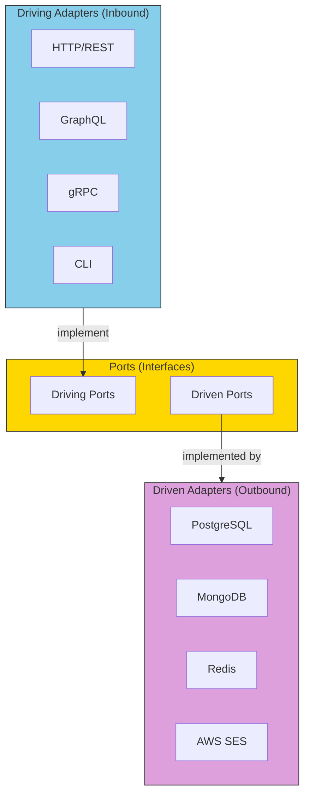

# Core Concepts: Adapters

If ports are the contracts, adapters are the **concrete implementations** that fulfill those contracts.

## Adapter Architecture

In software, adapters translate between your domain and the outside world.