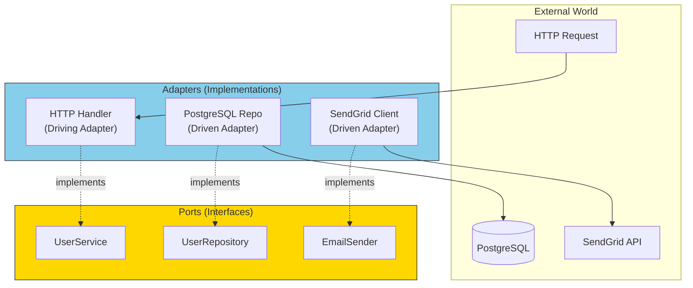
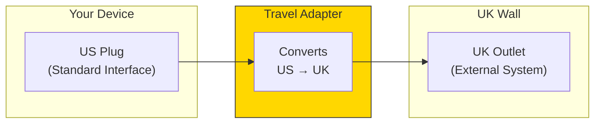
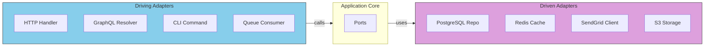

# What Are Adapters?

## Sam's Scenario: Making It Real

"Okay, I've defined all my ports," Sam said, looking at the interface definitions. "But these are just contracts. How do I actually save a book to SQLite? How do I actually send an email? That's where adapters come in, right?"

"Exactly!" Alex confirmed. "Ports are the 'what'—the contract. Adapters are the 'how'—the actual implementation. Your `BookRepository` port says 'I need to save books.' Your `SQLiteBookRepository` adapter says 'here's how to save books to SQLite.'"

If ports are the interfaces (contracts), adapters are the **concrete implementations** that fulfill those contracts. They bridge the gap between your application and the outside world.

## The Adapter Concept



## Real-World Analogy

Think of a power adapter for international travel:



The adapter:
- **Knows** both the interface your device expects AND the external system
- **Translates** between the two formats
- **Isolates** your device from knowing about UK outlets

## Adapters in Code

```go
// Port (Interface) - The contract
type BookRepository interface {
    Save(ctx context.Context, book *Book) error
    FindByISBN(ctx context.Context, isbn string) (*Book, error)
}

// Adapter (Implementation) - SQLite version for development
type SQLiteBookRepository struct {
    db *sql.DB
}

func (r *SQLiteBookRepository) Save(ctx context.Context, book *Book) error {
    query := `INSERT INTO books (isbn, title, author) VALUES (?, ?, ?)`
    _, err := r.db.ExecContext(ctx, query, book.ISBN, book.Title, book.Author)
    return err
}

func (r *SQLiteBookRepository) FindByISBN(ctx context.Context, isbn string) (*Book, error) {
    query := `SELECT isbn, title, author FROM books WHERE isbn = ?`
    row := r.db.QueryRowContext(ctx, query, isbn)

    var book Book
    err := row.Scan(&book.ISBN, &book.Title, &book.Author)
    return &book, err
}

// Another Adapter - Oracle version for Chen's enterprise deployment
type OracleBookRepository struct {
    db *sql.DB
}

func (r *OracleBookRepository) Save(ctx context.Context, book *Book) error {
    query := `INSERT INTO books (isbn, title, author) VALUES (:1, :2, :3)`
    _, err := r.db.ExecContext(ctx, query, book.ISBN, book.Title, book.Author)
    return err
}

func (r *OracleBookRepository) FindByISBN(ctx context.Context, isbn string) (*Book, error) {
    // Oracle-specific implementation
    // Same interface, different database!
    // ...
}
```

## Two Types of Adapters



| Type | Direction | Purpose | Examples |
|------|-----------|---------|----------|
| **Driving** | Inbound | Receive external input | HTTP handlers, CLI, GraphQL |
| **Driven** | Outbound | Access external resources | Database repos, API clients |

## Key Adapter Responsibilities

| Do This | Don't Do This |
|---------|---------------|
| Translate data formats | Contain business logic |
| Handle protocol details | Make business decisions |
| Map to/from domain types | Validate business rules |
| Deal with external errors | Know about other adapters |
| Configure connections | Store business state |

## Sam's Insight

"This is the missing piece!" Sam exclaimed. "I have one `BookRepository` interface, but I can create multiple adapters:
- `SQLiteBookRepository` for my development machine
- `OracleBookRepository` for Chen's enterprise deployment
- `InMemoryBookRepository` for testing

They all implement the same interface, so my business logic doesn't change. I just swap which adapter gets injected. The power is in the separation!"

Alex nodded. "Now you're seeing the full picture. Ports define the contract, adapters fulfill it. Your loan creation logic calls `bookRepo.Save(book)` and doesn't care which adapter is behind that interface."
