# What Are Adapters?

If ports are the interfaces (contracts), adapters are the **concrete implementations** that fulfill those contracts. They bridge the gap between your application and the outside world.

## The Adapter Concept


## Real-World Analogy

Think of a power adapter for international travel:

```mermaid
flowchart LR
    subgraph Device["Your Device"]
        US_Plug["US Plug<br/>(Standard Interface)"]
    end

    subgraph Adapter["Travel Adapter"]
        Convert["Converts<br/>US → UK"]
    end

    subgraph Wall["UK Wall"]
        UK_Outlet["UK Outlet<br/>(External System)"]
    end

    US_Plug --> Convert --> UK_Outlet

    style Adapter fill:#FFD700,stroke:#333
```



The adapter:
- **Knows** both the interface your device expects AND the external system
- **Translates** between the two formats
- **Isolates** your device from knowing about UK outlets

## Adapters in Code

```go
// Port (Interface)
type UserRepository interface {
    Save(ctx context.Context, user *User) error
    FindByID(ctx context.Context, id string) (*User, error)
}

// Adapter (Implementation)
type PostgresUserRepository struct {
    db *pgxpool.Pool
}

func (r *PostgresUserRepository) Save(ctx context.Context, user *User) error {
    query := `INSERT INTO users (id, name, email) VALUES ($1, $2, $3)`
    _, err := r.db.Exec(ctx, query, user.ID, user.Name, user.Email)
    return err
}

func (r *PostgresUserRepository) FindByID(ctx context.Context, id string) (*User, error) {
    query := `SELECT id, name, email FROM users WHERE id = $1`
    row := r.db.QueryRow(ctx, query, id)

    var user User
    err := row.Scan(&user.ID, &user.Name, &user.Email)
    return &user, err
}
```

## Two Types of Adapters


| Type | Direction | Purpose | Examples |
|------|-----------|---------|----------|
| **Driving** | Inbound | Receive external input | HTTP handlers, CLI, GraphQL |
| **Driven** | Outbound | Access external resources | Database repos, API clients |

## Key Adapter Responsibilities

| Do This | Don't Do This |
|---------|---------------|
| Translate data formats | Contain business logic |
| Handle protocol details | Make business decisions |
| Map to/from domain types | Validate business rules |
| Deal with external errors | Know about other adapters |
| Configure connections | Store business state |
