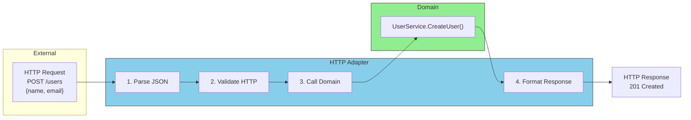

# Driving Adapters (Inbound)

**What they do:** Receive requests from the outside world and translate them into domain calls.

## Request Flow Through Driving Adapter



**Examples:**
- HTTP handlers (REST APIs)
- GraphQL resolvers
- CLI commands
- gRPC servers
- Message queue consumers

```go
// HTTP Adapter - translates HTTP to domain calls
type UserHTTPHandler struct {
    userService ports.UserService  // The driving port
}

func (h *UserHTTPHandler) CreateUser(w http.ResponseWriter, r *http.Request) {
    // 1. TRANSLATE: HTTP request -> Domain input
    var req CreateUserRequest
    json.NewDecoder(r.Body).Decode(&req)

    // 2. CALL: Domain service
    user, err := h.userService.CreateUser(r.Context(), ports.CreateUserInput{
        Name:  req.Name,
        Email: req.Email,
    })

    // 3. TRANSLATE: Domain result -> HTTP response
    if err != nil {
        // Handle error and return appropriate HTTP status
        return
    }

    w.WriteHeader(http.StatusCreated)
    json.NewEncoder(w).Encode(user)
}
```