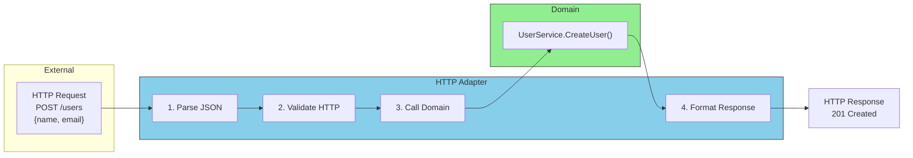

# Driving Adapters (Inbound)

## Sam's Scenario: The REST Handler

"Let me make sure I understand driving adapters," Sam said, opening the HTTP handler code. "Maya's mobile app sends a REST request to create a loan. My HTTP handler is a driving adapter that translates that HTTP request into a call to `LoanService.CreateLoan()`, right?"

"Perfect!" Alex confirmed. "The HTTP adapter handles all the HTTP-specific stuff—parsing JSON, checking headers, returning status codes. Then it calls your business logic through the `LoanService` port. Your business logic never knows it came from HTTP."

**What they do:** Receive requests from the outside world and translate them into domain calls.

## Request Flow Through Driving Adapter



**Examples for BookShelf:**
- HTTP handlers (REST APIs for Maya's mobile app)
- GraphQL resolvers (if needed later)
- CLI commands (for library staff)
- gRPC servers (for Chen's enterprise integration)
- Message queue consumers (for async notifications)

## Sam's Insight

"So when Maya's mobile app makes a REST call," Sam said, drawing it out, "my `LoanHTTPHandler` (driving adapter) handles the HTTP details, then calls `loanService.CreateLoan()` (driving port). The use case does the business logic and calls `loanRepo.Save()` (driven port), which is implemented by `SQLiteBookRepository` (driven adapter). The adapters are on the edges, the ports are the boundaries!"

Alex smiled. "You've got it. And when you add a CLI tool for library staff?"

"I create a new driving adapter—`LoanCLIHandler`," Sam answered confidently. "It parses command-line arguments instead of HTTP requests, but calls the same `loanService.CreateLoan()` port. Same business logic, different interface!"

```go
// HTTP Adapter for BookShelf - translates HTTP to domain calls
type LoanHTTPHandler struct {
    loanService ports.LoanService  // The driving port
}

func (h *LoanHTTPHandler) CreateLoan(w http.ResponseWriter, r *http.Request) {
    // 1. TRANSLATE: HTTP request -> Domain input
    var req CreateLoanRequest
    if err := json.NewDecoder(r.Body).Decode(&req); err != nil {
        http.Error(w, "Invalid JSON", http.StatusBadRequest)
        return
    }

    // 2. CALL: Domain service through the port
    loan, err := h.loanService.CreateLoan(r.Context(), ports.CreateLoanInput{
        BookISBN:  req.ISBN,
        UserEmail: req.UserEmail,
        DueDate:   req.DueDate,
    })

    // 3. TRANSLATE: Domain result -> HTTP response
    if err != nil {
        http.Error(w, err.Error(), http.StatusBadRequest)
        return
    }

    w.WriteHeader(http.StatusCreated)
    json.NewEncoder(w).Encode(loan)
}
```