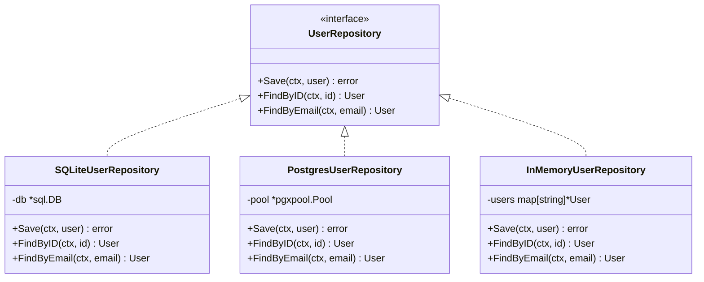

# Driven Adapters (Outbound)

**What they do:** Implement the interfaces your domain needs, connecting to real infrastructure.

## Driven Adapter Implementation



**Examples:**
- Database repositories (PostgreSQL, MongoDB, SQLite)
- Email services (SendGrid, SES, SMTP)
- Payment gateways (Stripe, PayPal)
- External API clients

```go
// SQLite Adapter - implements UserRepository port
type SQLiteUserRepository struct {
    db *sql.DB
}

func (r *SQLiteUserRepository) Save(ctx context.Context, user *entities.User) error {
    query := `INSERT INTO users (id, name, email) VALUES (?, ?, ?)`
    _, err := r.db.ExecContext(ctx, query, user.ID, user.Name, user.Email)
    return err
}

func (r *SQLiteUserRepository) FindByID(ctx context.Context, id string) (*entities.User, error) {
    query := `SELECT id, name, email FROM users WHERE id = ?`

    var user entities.User
    err := r.db.QueryRowContext(ctx, query, id).Scan(&user.ID, &user.Name, &user.Email)

    if err == sql.ErrNoRows {
        return nil, entities.ErrUserNotFound
    }
    return &user, err
}
```