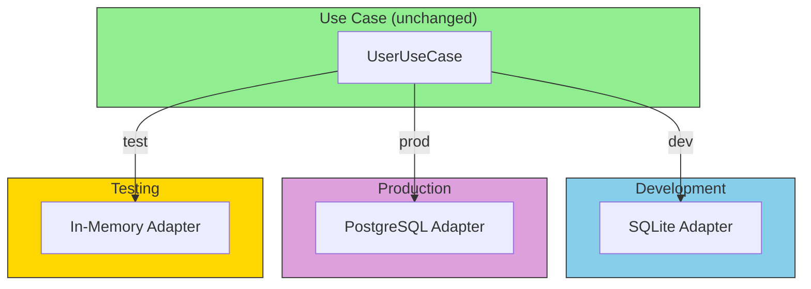

# The Power of Swappable Adapters

## Sam's Scenario: Deployment Day

Maya called excitedly: "The mobile app is ready! Can you deploy a test environment?" Then Chen emailed: "We need to test with our Oracle database before going live." Sam's heart sank—switching databases used to take weeks.

But then Sam remembered: hexagonal architecture. "Wait," Sam thought, "I have `SQLiteBookRepository` for local dev and I just need to create `OracleBookRepository`. The use cases don't change at all. I can run both environments simultaneously!"

The magic of adapters is that they can be **swapped** without changing business logic.

## Adapter Swapping



```go
// In main.go for BookShelf, just swap the adapter:

// Sam's local development: SQLite
bookRepo := sqlite.NewBookRepository(sqliteDB)
loanRepo := sqlite.NewLoanRepository(sqliteDB)

// Maya's mobile test server: SQLite (same as dev)
bookRepo := sqlite.NewBookRepository(sqliteDB)
loanRepo := sqlite.NewLoanRepository(sqliteDB)

// Chen's enterprise production: Oracle
bookRepo := oracle.NewBookRepository(oracleDB)
loanRepo := oracle.NewLoanRepository(oracleDB)

// Unit tests: In-memory (no database needed!)
bookRepo := memory.NewBookRepository()
loanRepo := memory.NewLoanRepository()

// The rest of your code doesn't change!
loanService := usecases.NewLoanService(bookRepo, loanRepo)
```

## Adapter Responsibilities

| Do This | Don't Do This |
|---------|---------------|
| Translate data formats | Contain business logic |
| Handle infrastructure errors | Make business decisions |
| Map to/from domain types | Validate business rules |
| Deal with protocols | Know about other adapters |

## Sam's Insight: The Power Revealed

Sam created three deployment configurations in one afternoon:

1. **Development** (`dev-config.go`):
   - SQLite database (easy setup)
   - Console email logger (see emails in terminal)
   - Local file storage

2. **Maya's Mobile Test** (`mobile-test-config.go`):
   - SQLite database (same as dev)
   - Real SMTP email
   - S3 storage for book covers

3. **Chen's Enterprise** (`enterprise-config.go`):
   - Oracle database (meets their requirements)
   - SendGrid email service
   - On-premise file storage

"This is incredible!" Sam told Alex. "Three completely different deployments, and I didn't change a single line of business logic. The loan creation rules, the book availability checks, the overdue calculations—all exactly the same. Only the adapters changed!"

Alex nodded. "Now you see why it's called 'hexagonal.' Your business logic is in the center hexagon, isolated and protected. The adapters plug into the ports on the edges. Swap the adapters, keep the core. That's the power."