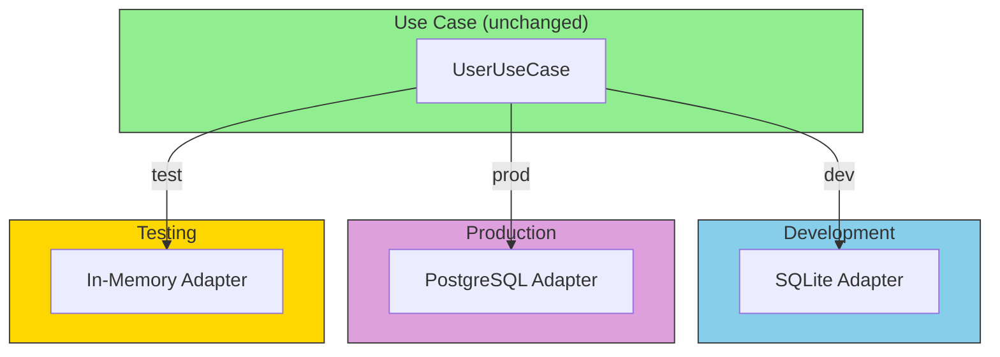

# The Power of Swappable Adapters

The magic of adapters is that they can be **swapped** without changing business logic.

## Adapter Swapping



```go
// In main.go, just swap the adapter:

// Development: SQLite
userRepo := sqlite.NewUserRepository(sqliteDB)

// Production: PostgreSQL
userRepo := postgres.NewUserRepository(pgPool)

// Testing: In-memory
userRepo := memory.NewUserRepository()

// The rest of your code doesn't change!
userService := usecases.NewUserService(userRepo)
```

## Adapter Responsibilities

| Do This | Don't Do This |
|---------|---------------|
| Translate data formats | Contain business logic |
| Handle infrastructure errors | Make business decisions |
| Map to/from domain types | Validate business rules |
| Deal with protocols | Know about other adapters |