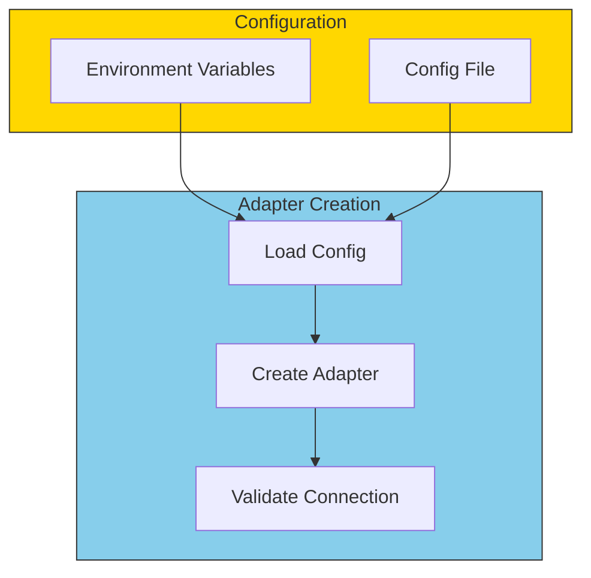
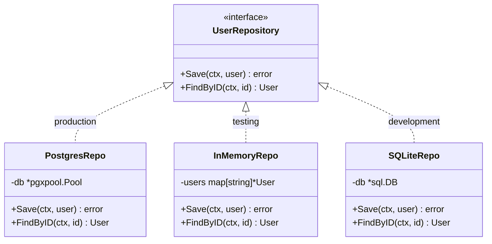

# Adapter Implementation Patterns

## Sam's Scenario: Building It Right

"Okay, I understand adapters conceptually," Sam said, "but how do I actually build them? What's the best way to structure my `SQLiteBookRepository` and `OracleBookRepository`?"

Alex pulled up some code examples. "Let me show you the common patterns. These will save you a lot of headaches and make your adapters clean, testable, and maintainable."

Let's look at common patterns for implementing adapters effectively.

## Constructor Injection Pattern

The most common and recommended pattern:

```go
// BookShelf driven adapter with constructor injection
type SQLiteBookRepository struct {
    db     *sql.DB
    logger *slog.Logger
}

func NewSQLiteBookRepository(db *sql.DB, logger *slog.Logger) *SQLiteBookRepository {
    return &SQLiteBookRepository{
        db:     db,
        logger: logger,
    }
}

// Usage in main.go for BookShelf
func main() {
    db := setupSQLiteDatabase()
    logger := slog.Default()

    bookRepo := NewSQLiteBookRepository(db, logger)
    // bookRepo implements BookRepository interface
}
```

## Adapter with Configuration



```go
type SendGridConfig struct {
    APIKey      string
    FromEmail   string
    FromName    string
    SandboxMode bool
}

type SendGridEmailSender struct {
    client *sendgrid.Client
    from   mail.Email
    config SendGridConfig
}

func NewSendGridEmailSender(config SendGridConfig) *SendGridEmailSender {
    return &SendGridEmailSender{
        client: sendgrid.NewSendClient(config.APIKey),
        from:   mail.NewEmail(config.FromName, config.FromEmail),
        config: config,
    }
}
```

## Multiple Implementations Pattern

Create different adapters for different environments:



```go
// Select BookShelf adapter based on environment
func NewBookRepository(env string, config Config) repositories.BookRepository {
    switch env {
    case "production-enterprise":
        // Chen's Oracle deployment
        return oracle.NewBookRepository(config.OracleConnectionString)
    case "production-cloud":
        // Cloud deployment with PostgreSQL
        return postgres.NewBookRepository(config.PostgresURL)
    case "development":
        // Sam's local development
        return sqlite.NewBookRepository(config.SQLitePath)
    case "testing":
        // Fast in-memory for unit tests
        return memory.NewBookRepository()
    default:
        panic("unknown environment: " + env)
    }
}
```

## Decorator Pattern for Cross-Cutting Concerns

Wrap adapters to add logging, metrics, or caching:

```go
// Base adapter
type PostgresUserRepository struct {
    db *pgxpool.Pool
}

// Logging decorator
type LoggingUserRepository struct {
    inner  repositories.UserRepository
    logger *slog.Logger
}

func NewLoggingUserRepository(inner repositories.UserRepository, logger *slog.Logger) *LoggingUserRepository {
    return &LoggingUserRepository{inner: inner, logger: logger}
}

func (r *LoggingUserRepository) Save(ctx context.Context, user *entities.User) error {
    r.logger.Info("saving user", "id", user.ID, "email", user.Email)
    err := r.inner.Save(ctx, user)
    if err != nil {
        r.logger.Error("failed to save user", "error", err)
    }
    return err
}

// Usage: wrap the real adapter
userRepo := NewLoggingUserRepository(
    postgres.NewUserRepository(db),
    logger,
)
```

## Adapter Testing Pattern

```go
// Test BookShelf adapters against real infrastructure
func TestSQLiteBookRepository_Save(t *testing.T) {
    // Setup test database
    db := setupTestDB(t)
    defer db.Close()

    repo := sqlite.NewBookRepository(db, slog.Default())

    // Test
    book := &entities.Book{
        ISBN:      "978-0134685991",
        Title:     "Effective Go",
        Author:    "The Go Team",
        Available: true,
    }
    err := repo.Save(context.Background(), book)

    // Verify
    require.NoError(t, err)

    found, err := repo.FindByISBN(context.Background(), book.ISBN)
    require.NoError(t, err)
    assert.Equal(t, book.Title, found.Title)
    assert.Equal(t, book.Author, found.Author)
}
```

## Summary: Adapter Best Practices

| Practice | Description |
|----------|-------------|
| **Constructor Injection** | Pass dependencies via constructor |
| **Configuration Objects** | Group related settings together |
| **Interface Compliance** | Verify at compile time with `var _ Interface = (*Adapter)(nil)` |
| **Decorator Pattern** | Add cross-cutting concerns without modifying adapters |
| **Integration Tests** | Test adapters against real infrastructure |

## Sam's Insight: The Complete Picture

Sam's final BookShelf adapter structure:

```
adapters/
  driven/
    sqlite/
      book_repository.go          # SQLiteBookRepository
      loan_repository.go          # SQLiteLoanRepository
    oracle/
      book_repository.go          # OracleBookRepository (for Chen)
      loan_repository.go          # OracleLoanRepository
    memory/
      book_repository.go          # InMemoryBookRepository (tests)
      loan_repository.go          # InMemoryLoanRepository (tests)
    email/
      smtp_notifier.go            # SMTPEmailNotifier (dev)
      sendgrid_notifier.go        # SendGridEmailNotifier (prod)
  driving/
    http/
      loan_handler.go             # HTTP adapter for loans
      book_handler.go             # HTTP adapter for books
    cli/
      loan_commands.go            # CLI adapter (library staff)
```

"I love how clean this is," Sam told Alex. "Each adapter has one job. The SQLite adapter knows SQLite. The HTTP adapter knows HTTP. The use cases in the middle know only business logic. And I can test each adapter independently."

Alex smiled. "Now you're ready to build real hexagonal applications. BookShelf is architected to grow with your needs—Maya's mobile app, Chen's enterprise deployment, and whatever comes next. The adapters make it all possible."
