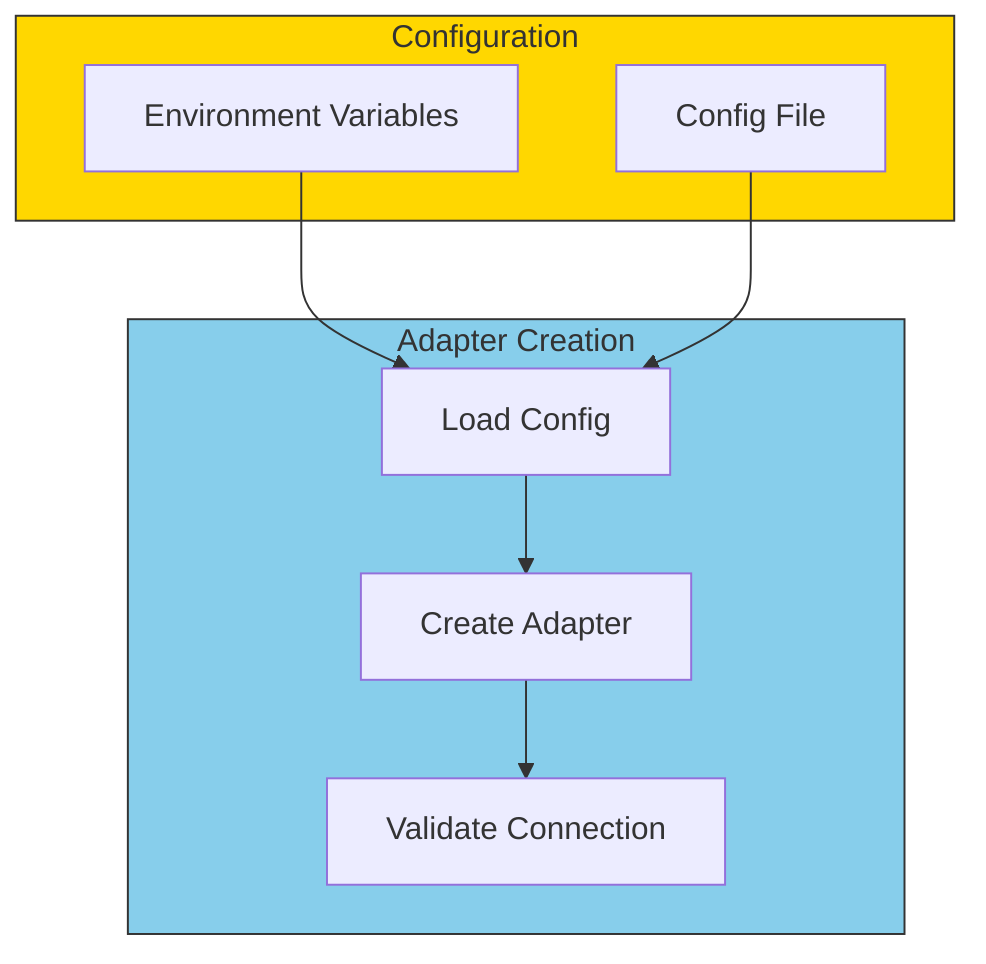
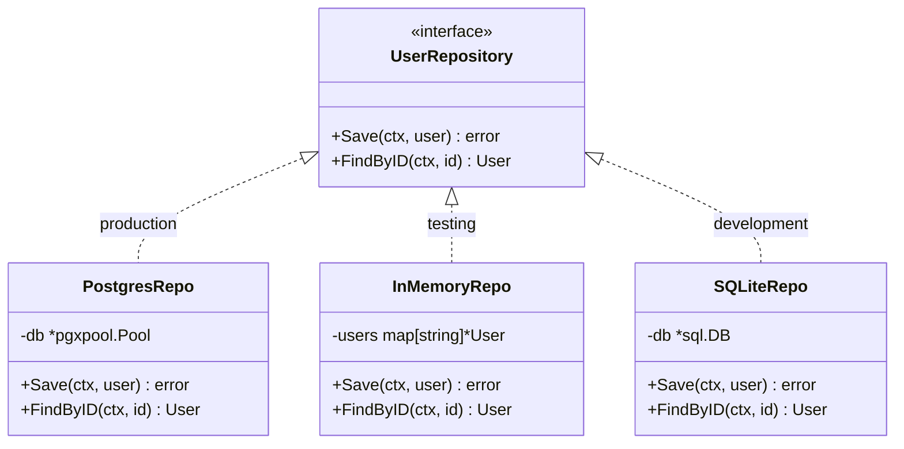

# Adapter Implementation Patterns

Let's look at common patterns for implementing adapters effectively.

## Constructor Injection Pattern

The most common and recommended pattern:

```go
// Driven Adapter with constructor injection
type PostgresUserRepository struct {
    db     *pgxpool.Pool
    logger *slog.Logger
}

func NewPostgresUserRepository(db *pgxpool.Pool, logger *slog.Logger) *PostgresUserRepository {
    return &PostgresUserRepository{
        db:     db,
        logger: logger,
    }
}

// Usage in main.go
func main() {
    db := setupDatabase()
    logger := slog.Default()

    userRepo := NewPostgresUserRepository(db, logger)
    // userRepo implements UserRepository interface
}
```

## Adapter with Configuration



```go
type SendGridConfig struct {
    APIKey      string
    FromEmail   string
    FromName    string
    SandboxMode bool
}

type SendGridEmailSender struct {
    client *sendgrid.Client
    from   mail.Email
    config SendGridConfig
}

func NewSendGridEmailSender(config SendGridConfig) *SendGridEmailSender {
    return &SendGridEmailSender{
        client: sendgrid.NewSendClient(config.APIKey),
        from:   mail.NewEmail(config.FromName, config.FromEmail),
        config: config,
    }
}
```

## Multiple Implementations Pattern

Create different adapters for different environments:



```go
// Select adapter based on environment
func NewUserRepository(env string, config Config) repositories.UserRepository {
    switch env {
    case "production":
        return postgres.NewUserRepository(config.PostgresURL)
    case "development":
        return sqlite.NewUserRepository(config.SQLitePath)
    case "testing":
        return memory.NewUserRepository()
    default:
        panic("unknown environment: " + env)
    }
}
```

## Decorator Pattern for Cross-Cutting Concerns

Wrap adapters to add logging, metrics, or caching:

```go
// Base adapter
type PostgresUserRepository struct {
    db *pgxpool.Pool
}

// Logging decorator
type LoggingUserRepository struct {
    inner  repositories.UserRepository
    logger *slog.Logger
}

func NewLoggingUserRepository(inner repositories.UserRepository, logger *slog.Logger) *LoggingUserRepository {
    return &LoggingUserRepository{inner: inner, logger: logger}
}

func (r *LoggingUserRepository) Save(ctx context.Context, user *entities.User) error {
    r.logger.Info("saving user", "id", user.ID, "email", user.Email)
    err := r.inner.Save(ctx, user)
    if err != nil {
        r.logger.Error("failed to save user", "error", err)
    }
    return err
}

// Usage: wrap the real adapter
userRepo := NewLoggingUserRepository(
    postgres.NewUserRepository(db),
    logger,
)
```

## Adapter Testing Pattern

```go
// Test adapters against real infrastructure
func TestPostgresUserRepository_Save(t *testing.T) {
    // Setup test database
    db := setupTestDB(t)
    defer db.Close()

    repo := postgres.NewUserRepository(db)

    // Test
    user, _ := entities.NewUser("Test", "test@example.com")
    err := repo.Save(context.Background(), user)

    // Verify
    require.NoError(t, err)

    found, err := repo.FindByID(context.Background(), user.ID)
    require.NoError(t, err)
    assert.Equal(t, user.Email, found.Email)
}
```

## Summary: Adapter Best Practices

| Practice | Description |
|----------|-------------|
| **Constructor Injection** | Pass dependencies via constructor |
| **Configuration Objects** | Group related settings together |
| **Interface Compliance** | Verify at compile time with `var _ Interface = (*Adapter)(nil)` |
| **Decorator Pattern** | Add cross-cutting concerns without modifying adapters |
| **Integration Tests** | Test adapters against real infrastructure |
