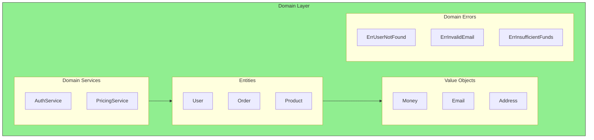

# The Domain Layer

## Sam's Challenge

"Alright, I've got ports and adapters figured out," Sam said confidently. "But where does the actual business logic go? The rules about how long someone can borrow a book, what happens when they return it late, that kind of thing?"

Alex leaned forward. "That's the **domain layer** - the heart of your application. This is where BookShelf's business rules live, completely isolated from databases, HTTP handlers, or any external concerns."

"You mean... my Book and User and Loan entities?" Sam asked.

"Exactly! But not just data structures - they should contain behavior too. Let me show you how to make your domain layer truly express your business rules."

---

The domain layer is the **most important** part of your application. It's where your business lives.

## Domain Layer Structure



This chapter covers entities, value objects, and domain services - the building blocks of your business logic.

## BookShelf Domain Entities

### The Book Entity

```go
package domain

import (
    "errors"
    "time"
)

// Book represents a physical book in the library
type Book struct {
    ID        string
    Title     string
    Author    string
    ISBN      string
    Available bool
    AddedAt   time.Time
}

// Borrow marks the book as borrowed
func (b *Book) Borrow() error {
    if !b.Available {
        return ErrBookNotAvailable
    }
    b.Available = false
    return nil
}

// Return marks the book as returned
func (b *Book) Return() {
    b.Available = true
}

// Validate checks if the book data is valid
func (b *Book) Validate() error {
    if b.Title == "" {
        return errors.New("book title is required")
    }
    if b.Author == "" {
        return errors.New("book author is required")
    }
    if len(b.ISBN) != 13 {
        return errors.New("ISBN must be 13 characters")
    }
    return nil
}
```

### The User Entity

```go
package domain

import (
    "errors"
    "regexp"
)

var emailRegex = regexp.MustCompile(`^[a-zA-Z0-9._%+-]+@[a-zA-Z0-9.-]+\.[a-zA-Z]{2,}$`)

// User represents a library member
type User struct {
    ID           string
    Email        string
    Name         string
    MemberSince  time.Time
    ActiveLoans  int
    MaxLoans     int
}

// CanBorrow checks if the user is allowed to borrow more books
func (u *User) CanBorrow() error {
    if u.ActiveLoans >= u.MaxLoans {
        return ErrUserMaxLoansReached
    }
    return nil
}

// BorrowBook increments the user's active loan count
func (u *User) BorrowBook() error {
    if err := u.CanBorrow(); err != nil {
        return err
    }
    u.ActiveLoans++
    return nil
}

// ReturnBook decrements the user's active loan count
func (u *User) ReturnBook() {
    if u.ActiveLoans > 0 {
        u.ActiveLoans--
    }
}

// Validate checks if the user data is valid
func (u *User) Validate() error {
    if u.Name == "" {
        return errors.New("user name is required")
    }
    if !emailRegex.MatchString(u.Email) {
        return errors.New("invalid email format")
    }
    if u.MaxLoans <= 0 {
        return errors.New("max loans must be positive")
    }
    return nil
}
```

### The Loan Entity

```go
package domain

import (
    "errors"
    "time"
)

const (
    DefaultLoanDuration = 14 * 24 * time.Hour // 2 weeks
    MaxLoanDuration     = 30 * 24 * time.Hour // 30 days
)

// Loan represents a book borrowing transaction
type Loan struct {
    ID         string
    UserID     string
    BookID     string
    BorrowedAt time.Time
    DueDate    time.Time
    ReturnedAt *time.Time
    Status     LoanStatus
}

type LoanStatus string

const (
    LoanStatusActive    LoanStatus = "active"
    LoanStatusReturned  LoanStatus = "returned"
    LoanStatusOverdue   LoanStatus = "overdue"
)

// NewLoan creates a new loan with proper initialization
func NewLoan(userID, bookID string) *Loan {
    now := time.Now()
    return &Loan{
        UserID:     userID,
        BookID:     bookID,
        BorrowedAt: now,
        DueDate:    now.Add(DefaultLoanDuration),
        Status:     LoanStatusActive,
    }
}

// IsOverdue checks if the loan is past its due date
func (l *Loan) IsOverdue() bool {
    if l.Status == LoanStatusReturned {
        return false
    }
    return time.Now().After(l.DueDate)
}

// DaysUntilDue returns how many days until the book is due
func (l *Loan) DaysUntilDue() int {
    if l.Status == LoanStatusReturned {
        return 0
    }
    duration := time.Until(l.DueDate)
    return int(duration.Hours() / 24)
}

// Extend extends the loan duration by the given number of days
func (l *Loan) Extend(days int) error {
    if l.Status == LoanStatusReturned {
        return errors.New("cannot extend returned loan")
    }
    if l.IsOverdue() {
        return errors.New("cannot extend overdue loan")
    }

    newDueDate := l.DueDate.Add(time.Duration(days) * 24 * time.Hour)
    maxDueDate := l.BorrowedAt.Add(MaxLoanDuration)

    if newDueDate.After(maxDueDate) {
        return errors.New("cannot extend beyond maximum loan duration")
    }

    l.DueDate = newDueDate
    return nil
}

// Return marks the loan as returned
func (l *Loan) Return() error {
    if l.Status == LoanStatusReturned {
        return errors.New("loan already returned")
    }

    now := time.Now()
    l.ReturnedAt = &now
    l.Status = LoanStatusReturned
    return nil
}

// CalculateLateFee calculates the late fee for an overdue book
func (l *Loan) CalculateLateFee() float64 {
    if !l.IsOverdue() {
        return 0.0
    }

    overdueDays := int(time.Since(l.DueDate).Hours() / 24)
    return float64(overdueDays) * 0.50 // $0.50 per day
}
```

## Value Objects

Value objects are immutable objects that represent descriptive aspects of the domain with no identity:

```go
package domain

// Email is a value object representing a validated email address
type Email struct {
    value string
}

// NewEmail creates a new Email value object with validation
func NewEmail(email string) (Email, error) {
    if !emailRegex.MatchString(email) {
        return Email{}, errors.New("invalid email format")
    }
    return Email{value: email}, nil
}

// String returns the email address
func (e Email) String() string {
    return e.value
}

// ISBN is a value object representing a validated ISBN
type ISBN struct {
    value string
}

// NewISBN creates a new ISBN value object with validation
func NewISBN(isbn string) (ISBN, error) {
    // Remove any hyphens or spaces
    cleaned := regexp.MustCompile(`[-\s]`).ReplaceAllString(isbn, "")

    if len(cleaned) != 13 {
        return ISBN{}, errors.New("ISBN must be 13 digits")
    }

    // Validate ISBN-13 checksum
    if !validateISBN13Checksum(cleaned) {
        return ISBN{}, errors.New("invalid ISBN checksum")
    }

    return ISBN{value: cleaned}, nil
}

// String returns the ISBN
func (i ISBN) String() string {
    return i.value
}

func validateISBN13Checksum(isbn string) bool {
    sum := 0
    for i, digit := range isbn[:12] {
        num := int(digit - '0')
        if i%2 == 0 {
            sum += num
        } else {
            sum += num * 3
        }
    }

    checkDigit := (10 - (sum % 10)) % 10
    return checkDigit == int(isbn[12]-'0')
}
```

## Domain Errors

Define clear, domain-specific errors:

```go
package domain

import "errors"

var (
    // Book errors
    ErrBookNotFound      = errors.New("book not found")
    ErrBookNotAvailable  = errors.New("book is not available for borrowing")

    // User errors
    ErrUserNotFound        = errors.New("user not found")
    ErrUserMaxLoansReached = errors.New("user has reached maximum loan limit")
    ErrInvalidEmail        = errors.New("invalid email address")

    // Loan errors
    ErrLoanNotFound      = errors.New("loan not found")
    ErrLoanAlreadyReturned = errors.New("loan has already been returned")
    ErrLoanOverdue       = errors.New("loan is overdue")
)
```

## Sam's Progress

Sam refactored the Book, User, and Loan structs to include business logic. "This is so much cleaner!" Sam exclaimed. "Before, I had loan duration calculations scattered across different HTTP handlers. Now it's all in the Loan entity where it belongs."

Alex nodded approvingly. "Notice how your domain layer has zero dependencies on external frameworks or libraries? You could test all of this business logic without touching a database or HTTP server."

Sam ran the tests:

```go
func TestLoan_IsOverdue(t *testing.T) {
    // Create a loan that's 15 days old with 14-day duration
    loan := &Loan{
        BorrowedAt: time.Now().Add(-15 * 24 * time.Hour),
        DueDate:    time.Now().Add(-1 * 24 * time.Hour),
        Status:     LoanStatusActive,
    }

    if !loan.IsOverdue() {
        t.Error("Expected loan to be overdue")
    }

    if fee := loan.CalculateLateFee(); fee != 0.50 {
        t.Errorf("Expected late fee of $0.50, got $%.2f", fee)
    }
}
```

"It works perfectly," Sam said with satisfaction. "And I didn't need to set up a database or start a web server to test it."

"That's the power of a pure domain layer," Alex smiled. "Your business rules are now explicit, testable, and completely independent of infrastructure concerns."