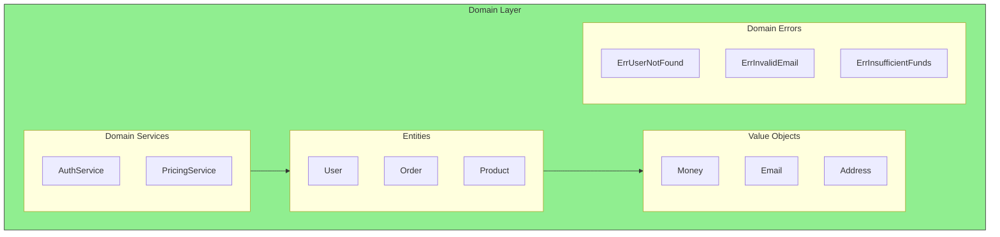

# The Domain Layer

The domain layer is the **most important** part of your application. It's where your business lives.

## Domain Layer Structure

This chapter covers entities, value objects, and domain services - the building blocks of your business logic.