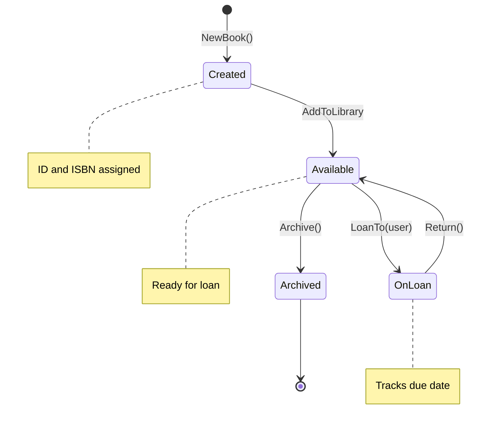

# Entities: Objects with Identity

## Sam's Scenario

After the weekend hackathon, Sam's BookShelf app was working but fragile. Every Book was just a map of strings, and Users were simple structs with no validation. When Alex reviewed the code, the first question was: "How do you prevent duplicate ISBNs?" Sam realized there was no safeguard - the domain logic was scattered across HTTP handlers.

Alex explained that entities are the heart of the domain. "A Book isn't just data - it has identity (a unique ID) and behavior (business rules). Let's make your domain speak the language of libraries."

## What are Entities?

Entities are objects with **identity** and **behavior**:

## Entity Lifecycle



```go
package entities

import (
    "errors"
    "time"
    "github.com/google/uuid"
)

// Domain errors for BookShelf
var (
    ErrInvalidISBN     = errors.New("invalid ISBN format")
    ErrTitleTooShort   = errors.New("title must be at least 2 characters")
    ErrBookNotFound    = errors.New("book not found")
    ErrBookAlreadyLoan = errors.New("book is already on loan")
    ErrBookNotOnLoan   = errors.New("book is not currently on loan")
)

// Book is a domain entity with identity and behavior
type Book struct {
    ID          string
    Title       string
    Author      string
    ISBN        ISBN        // Value object (covered next)
    Status      BookStatus
    BorrowedBy  *string     // UserID if on loan
    DueDate     *time.Time
    CreatedAt   time.Time
    UpdatedAt   time.Time
}

type BookStatus string

const (
    StatusAvailable BookStatus = "available"
    StatusOnLoan    BookStatus = "on_loan"
    StatusArchived  BookStatus = "archived"
)

// NewBook is a factory function - enforces business rules
func NewBook(title, author string, isbn ISBN) (*Book, error) {
    if len(title) < 2 {
        return nil, ErrTitleTooShort
    }
    if !isbn.IsValid() {
        return nil, ErrInvalidISBN
    }

    return &Book{
        ID:        uuid.New().String(),
        Title:     title,
        Author:    author,
        ISBN:      isbn,
        Status:    StatusAvailable,
        CreatedAt: time.Now(),
        UpdatedAt: time.Now(),
    }, nil
}

// LoanTo assigns the book to a user
func (b *Book) LoanTo(userID string, loanPeriod time.Duration) error {
    if b.Status == StatusOnLoan {
        return ErrBookAlreadyLoan
    }

    dueDate := time.Now().Add(loanPeriod)
    b.Status = StatusOnLoan
    b.BorrowedBy = &userID
    b.DueDate = &dueDate
    b.UpdatedAt = time.Now()
    return nil
}

// Return marks the book as returned
func (b *Book) Return() error {
    if b.Status != StatusOnLoan {
        return ErrBookNotOnLoan
    }

    b.Status = StatusAvailable
    b.BorrowedBy = nil
    b.DueDate = nil
    b.UpdatedAt = time.Now()
    return nil
}

// IsOverdue checks if the book loan is overdue
func (b *Book) IsOverdue() bool {
    return b.Status == StatusOnLoan &&
           b.DueDate != nil &&
           time.Now().After(*b.DueDate)
}
```

## Sam's Insight

"Now the Book entity protects its own invariants," Sam noted. "I can't accidentally loan a book that's already out, and the business rules are right here in the domain - not scattered in my HTTP handlers." Alex smiled: "Exactly. Your domain is speaking library language, not database language."